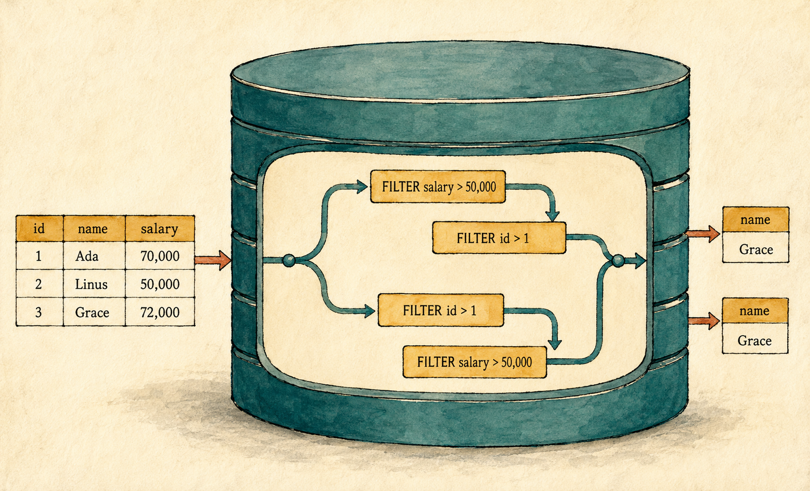
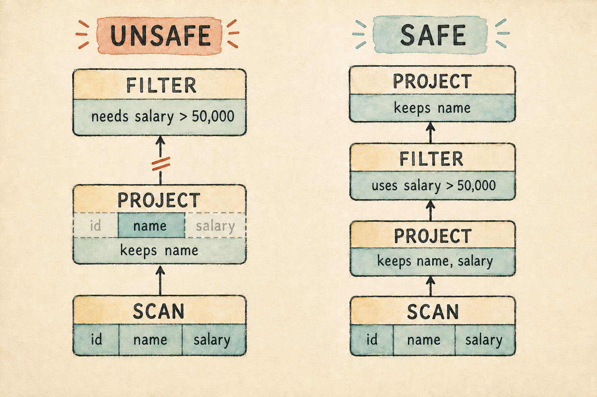

# 2. Relational Algebra Without the Math

<!--
Chapter contract

Start with the employee query that already runs. Let the reader recognize each
familiar action before giving it a formal name. The chapter should explain the
existing implementation, not introduce a new abstraction merely to make the
terminology look more formal.

Visible outcome

The reader can decide whether two small query plans mean the same thing. They
understand that equivalent plans must produce the same result for every valid
input, not merely for the example table. The real Lesson 001 implementation
provides the operations and runnable evidence.
-->

> A plan is not a pile of operations. Its shape is part of the answer.

<figure class="book-illustration">
  
  <figcaption>Different paths can preserve the same answer.</figcaption>
</figure>

Chapter 1 left us with a working query engine and an unfamiliar name for what
we had built: relational algebra. The name may sound as if we are about to
trade rows for equations. We are not. We will keep the employee table on the
screen and use it to uncover an idea already present in our program.

Our engine answers a request by connecting small operations. Each operation
receives rows, performs one kind of work, and produces rows for the operation
above it. Because every piece has the same broad shape, we can connect the
pieces into plans for many different questions. Relational algebra gives us a
precise vocabulary for describing those pieces and connections.

The connections are not arbitrary. If we remove the `salary` column before
checking it, the filter can no longer decide which employees earn more than
50,000. The same operations arranged in a different order may produce a
different answer or no answer at all. Understanding a plan therefore means
understanding both its operations and its shape.

In this chapter, we will give familiar ideas their database names, read our
plan as a tree, and compare different ways to connect its operations. We will
not build an optimizer yet. That work begins in Season 3. First, we need to
answer the correctness question every optimizer depends on: what makes two
query plans mean the same thing?

## 2.1 We already have the pieces

Return to the request our small engine can already answer: find the names of
employees who earn more than 50,000. Ada and Grace appear in the result. Linus
does not. We reach that answer without parsing SQL, reading a file, or using an
index. Three small operations are enough.

The result matters, but the way we reached it matters more. We did not write
one large function that knew everything about employees and salaries. We
connected three pieces. One read the available rows, one kept the rows that
passed a condition, and one kept the requested columns.

Here is the request again in ordinary language:

> From the employees, keep those earning more than 50,000, then show only
> their names.

Each part of that sentence corresponds to one part of the plan:

```text
Project(name)
    ↑
Filter(salary > 50000)
    ↑
Scan(employees)
```

The scan supplies all three employee rows. The filter examines those rows and
keeps Ada and Grace. The project removes `id` and `salary` from each remaining
row. Read from the bottom upward, the tree describes a sequence of small data
changes that produces the requested answer.

Nothing in this description depends on the particular names Ada, Linus, and
Grace. We could use the same three kinds of operation for products, books, or
bank accounts. Only the rows, condition, and requested columns would change.
That repeatable structure lets us compare plans instead of treating each query
as unrelated code. First, however, we need a precise name for the table-shaped
data that enters and leaves every operation.

## 2.2 A table-shaped value

We began with a table named `employees`. It has three columns, and each row
describes one employee:

| id | name  | salary |
|---:|-------|-------:|
| 1  | Ada   | 70,000 |
| 2  | Linus | 50,000 |
| 3  | Grace | 72,000 |

A stored table is not the only place where this shape appears. After the
filter runs, we still have rows and columns, even though Linus is gone. After
the project runs, we still have rows and columns, even though only `name`
remains. These intermediate results may never be stored or given permanent
names, but they have the same table-like shape.

Database theory uses the word **relation** for this kind of value. The original
employees are a relation. The two rows produced by the filter are another
relation. The one-column result produced by the project is another. A relation
can therefore be the starting data, a temporary result, or the final answer to
a query.

This shared shape is what lets operations connect. A filter accepts a relation
and produces a relation. A project does the same. The output of one operation
can become the input of the next without changing into a completely different
kind of thing. That simple rule lets a few operations form larger plans.

> **Design note: Our rows are an approximation**
>
> In the mathematical relational model, a relation does not promise a row
> order and does not contain duplicate rows. Our engine stores rows in a
> `Vec<Row>`, which preserves order and can contain duplicates. We will keep
> that simpler representation for now. Later chapters will give ordering and
> duplicates the attention they require.

For this chapter, picture a relation as rows arranged under named columns. That
picture is enough to follow data through our engine. Our `Vec<Row>` keeps rows
in a particular sequence, such as Ada before Linus before Grace. Relational
algebra itself does not promise that sequence. This is separate from the upward
flow of relations through the plan tree.

With that distinction in place, we can give each transformation a more precise
name.

## 2.3 Three operations, three names

Our plan begins with `Scan`. In this engine, a scan brings the source rows into
the plan. A future scan may read pages from a file or use an index, but this one
simply returns the rows it owns. Its role is still important: every plan needs
some **relation** to begin with.

The next operation keeps rows that answer yes to a condition. Our Rust enum
calls this operation `Filter`. Relational algebra traditionally calls the same
idea **selection** and represents it with the Greek letter `σ`, pronounced
“sigma.” The condition is written as a subscript, so
<code>σ<sub>salary &gt; 50000</sub></code> means “keep rows whose salary is
greater than 50,000.”

The terminology is slightly unfortunate because SQL uses `SELECT` to choose
output columns. Relational algebra uses selection to choose rows. Whenever this
chapter says selection, picture a yes-or-no condition applied to each row.

For the employee query, the condition is `salary > 50000`. Applying it changes
the relation like this:

| id | name  | salary |
|---:|-------|-------:|
| 1  | Ada   | 70,000 |
| 3  | Grace | 72,000 |

The last operation keeps specified columns and removes the others. Both our
Rust enum and relational algebra call this **projection**. Relational algebra
represents it with `π`, pronounced “pi,” and writes the retained columns as a
subscript. Thus <code>π<sub>name</sub></code> means “keep the name column.”
Projecting `name` from the filtered relation produces the final answer:

| name  |
|-------|
| Ada   |
| Grace |

Selection changes which rows continue. Projection changes which columns
continue. Neither operation needs to know why another operation produced its
input. Each receives one relation, applies its own rule, and returns another
relation. That independence is what allows the operations to be connected in
different ways.

We now have the three ingredients behind the chapter's title: relations,
operations that transform relations, and rules for connecting those
operations. That is enough to form a small **relational algebra**. Here is our
employee query written as a relational algebra tree:

<pre><code>Projection: π<sub>name</sub>
             ↑
Selection:  σ<sub>salary &gt; 50000</sub>
             ↑
Relation:   employees</code></pre>

Read from the bottom upward. The `employees` relation enters the selection.
Selection produces a new relation containing Ada and Grace. Projection accepts
that relation and produces another containing only their names. Each arrow
connects one table-shaped output to the next table-shaped input.

Putting the symbols together gives us the conventional compact expression:

<p class="relational-expression"><code>π<sub>name</sub>(σ<sub>salary &gt; 50000</sub>(employees))</code></p>

Read the inner operation first. Selection receives `employees`, and projection
receives the selection's result. We will occasionally use this notation, but
we do not need it to reason about plans. The tree says the same thing while
keeping every transformation visible.

This algebra tree describes **what** result the query requires without choosing
a particular algorithm for producing it. A description at this level is called
a **logical plan**. We need a logical plan because SQL syntax, equivalence
reasoning, and future optimization should not depend on whether rows eventually
come from memory, a file, or an index.

A **physical plan** describes **how** the database will perform that logical
work. One logical scan might become a full table scan or an index scan. A later
join might use one of several algorithms. Our engine has none of those choices
yet, so Chapter 10 will introduce the full logical and physical separation when
we have alternatives worth separating.

Our engine adds a practical `Scan` node beneath these algebra operations. In
the compact notation, writing `employees` is enough to name the input relation.
The executable plan must also say how that relation enters the computation.
For now, `Scan` does that by returning the rows stored inside the node.

## 2.4 The operations form a tree

The Rust plan makes the same composition concrete. A plan node records one
operation. A scan has no input plan because it already owns its source rows. A
filter has one input, and a project has one input. Those inputs point to nodes
beneath them, so the complete plan forms a tree:

```text
Project
  columns: name
       ↑
Filter
  condition: salary > 50000
       ↑
Scan
  source: employees
```

The scan is a **leaf**, a node with no child plan. The project is the **root**,
the node whose result answers the query. The filter connects them. Rows begin
at the leaf and move upward as each operation transforms the relation returned
by the node below it.

The Rust values have the same shape. Each `input: Box<Plan>` stores the child
node beneath a filter or project. `Plan::execute()` follows those links down to
the scan. Results then return through the waiting operations until the root
produces the final rows. Chapter 1 called this pattern recursion.

The algebra tree and its execution are related, but they are not the same thing.
The logical plan describes which transformations the query requires.
`execute()` is our current method for performing them. Our `Plan` enum handles
both roles for now, which keeps the first engine small. Later, separate logical
and physical plans will let the database change how it works without changing
what the query means.

That future separation depends on a promise: replacing one plan with another
must preserve the requested answer. Before we can choose a different physical
plan, or even rearrange this logical tree, we need to say exactly what “the
same” means.

## 2.5 What does “the same” mean?

Consider two plans with different trees. Running both against the employee
table may produce Ada and Grace. That is encouraging, but it is not enough to
say the plans mean the same thing. Perhaps they agree only because this table
does not contain the row that exposes their difference.

Two plans are **equivalent** when they produce the same result for every valid
input relation. Valid means that the input has the columns and value types the
plans require. For our employee examples, each input must provide integer `id`
and `salary` values and a text `name` value.

The words “every valid input” do the hard work. They prevent us from declaring
two plans equivalent after one convenient test. An equivalent plan must keep
the same rows, produce the same columns and values, and behave the same way no
matter which valid employees we supply.

Our current engine also preserves input order because it stores relations in a
`Vec<Row>`. The examples in this chapter preserve that order as well, so it
will not hide the main idea. When the course reaches sorting and duplicates, we
will separate those behaviors more carefully from the mathematical definition
of a relation.

## 2.6 A rearrangement that breaks the plan

Start with the working plan. The filter reads `salary`, and the project removes
that column only after the decision has been made:

```text
Project(name)
       ↑
Filter(salary > 50000)
       ↑
Scan(employees)
```

Now move the projection beneath the filter:

```text
Filter(salary > 50000)
       ↑
Project(name)
       ↑
Scan(employees)
```

Read the second tree from the bottom upward. The scan supplies complete rows.
The project keeps `name` and removes `id` and `salary`. The filter then asks
each smaller row for `salary`, but that column no longer exists. Our engine
stops with `unknown column: salary`.

Both trees contain a scan, filter, and project, but they do not mean the same
thing. The first produces a relation. The second cannot perform its stated
condition. A plan's meaning therefore depends on more than the names of its
operations. The information required by each operation must still be available
when that operation runs.

## 2.7 A rearrangement that preserves the answer

Removing columns early was not itself the mistake. The mistake was removing a
column that a later operation needed. We can place a projection below the
filter if it keeps both `name`, which the final result needs, and `salary`,
which the filter needs:

```text
Original                         Remove id early

Project(name)                    Project(name)
       ↑                                ↑
Filter(salary > 50000)           Filter(salary > 50000)
       ↑                                ↑
Scan(employees)                  Project(name, salary)
                                        ↑
                                 Scan(employees)
```

In the second plan, the lower project removes only `id`. The filter can still
read `salary`, so it keeps exactly the rows it kept before. The upper project
then removes `salary`, leaving the same `name` relation as the original plan.
For our familiar input, both plans return Ada and Grace.

More importantly, the reasoning does not depend on those three employees. The
filter never reads `id`, and the final project never returns it. Removing `id`
early therefore cannot change a filtering decision or a final value. For every
valid employee relation, the two plans produce the same answer.

<figure class="book-illustration book-diagram">
  
  <figcaption>An early projection is safe only when later operations retain every column they need.</figcaption>
</figure>

This is an example of a meaning-preserving transformation. We have not taught
the database to discover or apply it. We have only reasoned that these two
particular trees are equivalent. That distinction keeps this chapter focused
on correctness. Automatic plan rewriting belongs to the optimizer we will
build later.

## 2.8 Test more than one table

Tests are useful when comparing plans, but a few passing examples do not prove
equivalence. Suppose a plan contains two salary filters. A developer tests a
version that accidentally drops the stricter filter:

```text
Both filters                     Stricter filter dropped

Filter(salary > 60000)           Filter(salary > 50000)
          ↑                                ↑
Filter(salary > 50000)           Scan(employees)
          ↑
Scan(employees)
```

Against our original employees, both plans return Ada and Grace. The result
makes the removed filter look redundant. It is not. The table simply contains
no salary between 50,000 and 60,000, so both plans happen to make the same
decision for every row currently available.

Add one more employee:

| id | name  | salary |
|---:|-------|-------:|
| 4  | Edsger | 55,000 |

The plan with both filters removes Edsger because he fails the stricter
condition. The plan missing that filter keeps him. This row is a
**counterexample**: one valid input that proves the plans are not equivalent.
A counterexample is decisive because equivalence requires agreement for every
valid input. One disagreement is enough to reject the claim.

There is a redundant filter in the first plan, but it is the weaker one. Any
salary greater than 60,000 is already greater than 50,000. Removing the weaker
condition preserves the result. Removing the stricter condition changes which
rows can survive. The original data cannot tell us which transformation is
valid; the meanings of the two conditions can.

Passing tests still provide valuable evidence and catch many mistakes. The
stronger argument comes from the operations themselves. In our safe projection
example, we identified every column used above the new projection and kept all
of them. That explanation covers arbitrary valid rows, including rows we did
not think to place in a test.

Later optimizer rules will need this kind of general justification. Testing a
rule against several tables can support the implementation, but the rule must
be derived from what the operations mean. Otherwise a database may return the
right answer throughout development and fail when a user supplies the one row
we forgot to imagine.

The repository records both observations as tests. One runs the original and
early-projection plans against more than one input. The other first shows two
plan shapes agreeing on our three employees, then adds Edsger as the
counterexample that separates them.

`src/plan.rs`: tests of plan equivalence and its limits

```rust
for rows in inputs {
    let original = employee_name_plan(rows.clone());
    let remove_id_early = Plan::Project {
        columns: vec!["name".to_string()],
        input: Box::new(Plan::Filter {
            column: "salary".to_string(),
            greater_than: 50_000,
            input: Box::new(Plan::Project {
                columns: vec!["name".to_string(), "salary".to_string()],
                input: Box::new(Plan::Scan { rows }),
            }),
        }),
    };

    assert_eq!(original.execute(), remove_id_early.execute());
}
```

This is the central loop from the first test. The complete test supplies both
input relations, while the following test constructs the two salary filters
and the Edsger counterexample explicitly. Both use the same `Plan` and `Row`
types as the engine. Run all plan tests together:

```bash
cargo test plan::tests
```

The test names describe two different lessons. Matching results can support an
equivalence claim, while a counterexample can disprove one. Neither replaces
the general explanation of why a transformation preserves every valid result.

## 2.9 Why equivalent plans matter

A database often has several ways to answer the same query. One plan may remove
unneeded columns early. Another may delay that work. Future operators such as
joins will create choices with much larger consequences. Some arrangements may
process far fewer rows, use less memory, or finish much sooner than others.

The database may choose among those plans only after establishing that they
preserve the requested answer. A fast plan that returns different rows is not
an optimization. It is a bug. Equivalence supplies the safety boundary: change
the shape as much as useful, but do not change the meaning.

Season 3 will turn that freedom into a query optimizer. We will define rewrite
rules, collect information about the data, estimate costs, and choose among
equivalent plans. This chapter provides the correctness foundation for that
work. We are learning when a different tree is allowed before asking which
allowed tree is cheaper.

## 2.10 Try comparing two plans

Suppose a plan contains several filters. The database may eventually want to
run the filter that removes more rows first, leaving less work for the
operations above it. Before comparing costs, however, it must know whether
changing the filter order preserves the answer. Our next pair of plans isolates
that correctness question.

Consider a query with two filters. One keeps employees whose salary is greater
than 50,000. The other keeps employees whose `id` is greater than 1. Compare
these plans:

```text
Plan A                           Plan B

Filter(id > 1)                  Filter(salary > 50000)
       ↑                                ↑
Filter(salary > 50000)          Filter(id > 1)
       ↑                                ↑
Scan(employees)                 Scan(employees)
```

Before reading further, decide whether the plans are equivalent. Do not check
only Ada, Linus, and Grace. Imagine an arbitrary employee row and ask what must
be true for that row to reach the root of each plan.

In Plan A, a row survives only if its salary is greater than 50,000 and its
`id` is greater than 1. Plan B asks the same two questions in the opposite
order. A row that passes both reaches either root. A row that fails either is
removed by both. The plans are equivalent for every valid input.

This conclusion depends on the operations having no side effects and on both
conditions being defined for the input. Our small filters only inspect a row
and decide whether to keep it, so swapping these two filters preserves the
answer. More complicated operations will require their own reasoning rather
than borrowing this conclusion automatically.

## 2.11 A better way to write the request

We can now read a plan as transformations of relations and compare two plans by
their meaning. Yet every plan in our program is still assembled directly from
Rust enum values. A person asking a database a question should not need to
write `Box::new(Plan::Filter { ... })` merely to find two employee names.

SQL provides a more convenient way to express that request. Its words and
punctuation are not the plan itself. They are a source language from which the
database can build a plan. The plan then carries the meaning we studied here,
regardless of the text that produced it.

That separation gives us our next problem. How does a database turn characters
such as `SELECT`, `FROM`, and `WHERE` into the tree our engine already knows how
to execute? In Chapter 3, we will build the smallest SQL frontend needed to
answer that question.
