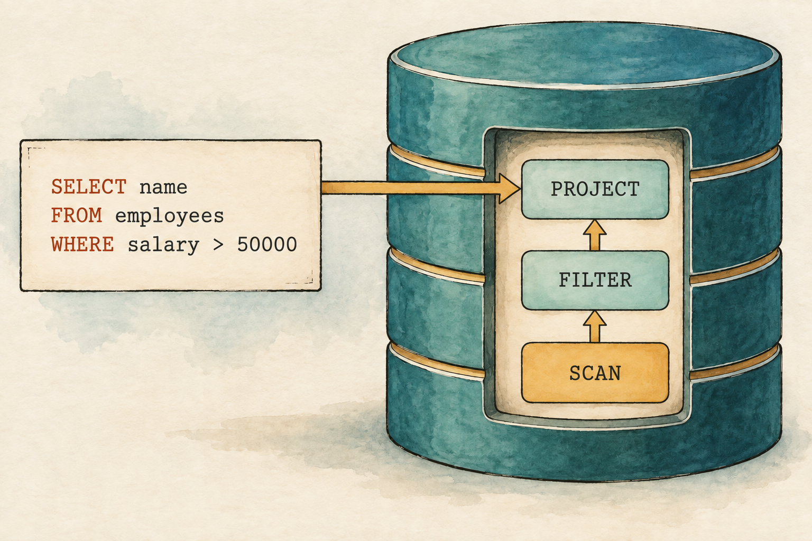
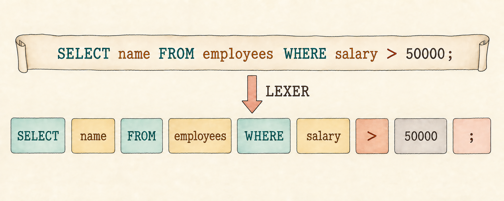
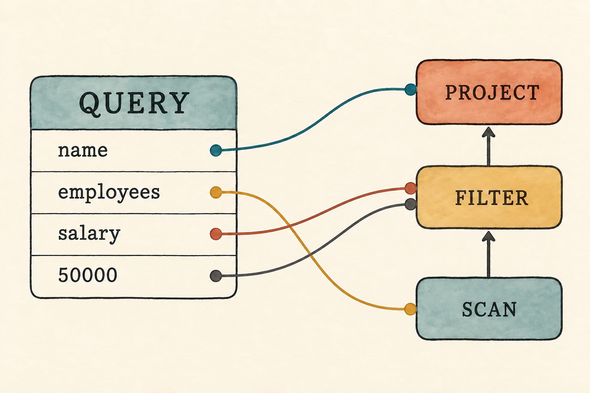

# 3. SQL Is Just a Frontend

<!--
Chapter contract

Continue directly from Chapter 2's closing need: a person should be able to
write SQL instead of constructing a logical plan by hand. Begin with the
familiar employee query, treat its text as ordinary characters, and derive the
smallest lexer, parser, AST, and plan conversion that can execute it.

Visible outcome

The reader can pass the supported SQL query to the program and receive Ada and
Grace. They can explain the separate jobs of tokens, syntax, an AST, and a
logical plan. They also understand that accepting one deliberately tiny SQL
shape is not a claim of SQL-89 compliance.
-->

> SQL lets us write a plan without drawing the tree ourselves.

<figure class="book-illustration">
  
  <figcaption>SQL is the request; the plan is the structure our engine can execute.</figcaption>
</figure>

Chapter 2 ended with a plan that our engine could inspect and execute. There
was only one inconvenience: we had to construct that plan ourselves. A person
should be able to write a request like this instead:

```sql
SELECT name
FROM employees
WHERE salary > 50000;
```

To us, the request already looks meaningful. To the program, it begins as a
sequence of characters. Before the existing engine can run it, a new frontend
must recognize the words and punctuation, discover how they fit together, and
turn that structure into the logical plan we already understand.

This chapter follows that journey:

```text
SQL
 ↓
Tokens
 ↓
Syntax tree
 ↓
Logical plan
 ↓
Rows
```

The downward arrows follow source text as the frontend turns it into
successively more useful representations. This differs from the plan diagrams
in Chapters 1 and 2, where upward arrows show rows moving from a scan toward
the plan root.

We will support only the query shown above and other queries with the same
shape. That narrow boundary lets us see every stage without hiding parsing
inside a library. Appendix B records the complete planned grammar. Later
chapters will implement more of it when aliases, expressions, joins,
aggregation, sorting, and subqueries give us a reason.

## 3.1 SQL begins as characters

Place the query in a Rust string and it loses the structure that we see:

```text
SELECT name FROM employees WHERE salary > 50000;
```

The computer receives an `S`, followed by an `E`, followed by an `L`, and
so on. It does not begin with a `SELECT` clause, a table name, or a predicate.
Those are interpretations that we bring to the text. The frontend must recover
them before it can construct a plan.

Trying to find each clause with string splitting would work for this one
example, but small changes would quickly expose the trick. Extra spaces,
newlines, and lowercase keywords should not change the query. Names also have
different roles depending on where they occur. We need a representation that
is more useful than individual characters but simpler than a complete query.

## 3.2 Turn characters into tokens

Read the query from left to right and collect characters that belong together.
`SELECT` is one meaningful unit. So are `name`, `>`, `50000`, and `;`.
Such a unit is called a **token**. The component that produces tokens is a
**lexer**, sometimes called a scanner.

Our query becomes this sequence:

```text
Select
Identifier("name")
From
Identifier("employees")
Where
Identifier("salary")
GreaterThan
Integer(50000)
Semicolon
```

<figure class="book-illustration book-diagram">
  
  <figcaption>The lexer turns one stream of characters into meaningful units.</figcaption>
</figure>

Whitespace has disappeared because it separates units but does not affect this
query's meaning. Keywords receive their own token variants. User-chosen names
share `Identifier`, which retains their spelling. The number becomes an
integer now, rather than remaining five unrelated digit characters.

`src/lexer.rs`: create the token vocabulary

```rust
#[derive(Clone, Debug, PartialEq, Eq)]
pub enum Token {
    Select,
    From,
    Where,
    Identifier(String),
    GreaterThan,
    Integer(i64),
    Semicolon,
}
```

The lexer has one cursor named `current`. Whitespace advances it without
producing a token. A letter begins a word, and a digit begins an integer.
Everything else in this lesson must be either `>` or `;`. An unfamiliar
character produces an error at the position where the lexer found it.

Chapter 1 displayed each small file in full. The lexer and parser are longer,
so this chapter shows every type and operation that establishes the pattern,
with placement labels for assembling them. Repetitive character-scanning and
test setup remain in the repository rather than appearing as unexplained gaps.

`src/lexer.rs`: inside `tokenize()`, recognize a completed word

```rust
let word: String = characters[start..current].iter().collect();
let token = if word.eq_ignore_ascii_case("SELECT") {
    Token::Select
} else if word.eq_ignore_ascii_case("FROM") {
    Token::From
} else if word.eq_ignore_ascii_case("WHERE") {
    Token::Where
} else {
    Token::Identifier(word)
};
tokens.push(token);
```

Keywords ignore ASCII letter case, so `select` and `SELECT` produce the same
token. Identifiers keep their original spelling because the next chapter must
decide how names correspond to tables and columns. The lexer recognizes units;
it does not decide whether a name exists or whether the sequence makes sense.

A focused test makes that boundary visible.

`src/lexer.rs`: inside `mod tests`

```rust
#[test]
fn keywords_ignore_case_but_identifiers_keep_their_spelling() {
    assert_eq!(
        tokenize("select Name FrOm Employees WhErE Salary > 50000;").unwrap(),
        vec![
            Token::Select,
            Token::Identifier("Name".to_string()),
            Token::From,
            Token::Identifier("Employees".to_string()),
            Token::Where,
            Token::Identifier("Salary".to_string()),
            Token::GreaterThan,
            Token::Integer(50_000),
            Token::Semicolon,
        ]
    );
}
```

The tokens are correct, but they are still only a flat list. Nothing in that
list says that `name` belongs after `SELECT`, or that `50000` must follow
`>`. To recover those relationships, we need to describe which token
sequences form a query.

## 3.3 Give the tokens a shape

A **grammar** is a set of rules describing valid structure. The complete
planned course grammar lives in Appendix B, but our first parser needs only
four productions:

```text
query          = select_clause from_clause where_clause ";" ;
select_clause  = "SELECT" identifier ;
from_clause    = "FROM" identifier ;
where_clause   = "WHERE" identifier ">" integer ;
```

Read the first rule as a recipe. A query contains a select clause, followed by
a from clause, followed by a where clause and a semicolon. The other rules say
what each clause contains. The quoted words and symbols must appear literally;
`identifier` and `integer` refer to token categories.

This grammar deliberately rejects useful SQL. It cannot select two columns,
omit `WHERE`, compare text, or use another comparison operator. That is not a
parser defect. It is the language boundary for this lesson, and an unsupported
query should fail clearly instead of being interpreted approximately.

The component that checks tokens against these rules is a **parser**. A parser
plays the grammar from the outer `query` rule inward, consuming one expected
token at a time. When the next token cannot satisfy the current rule, parsing
stops with a syntax error.

## 3.4 Keep the parsed query as data

Successfully checking the grammar is not enough. Later stages need the names
and number found in the query. We store them in an **abstract syntax tree**,
usually shortened to **AST**. An AST preserves the meaningful structure while
discarding details, such as whitespace and keyword capitalization, that no
longer matter.

Our grammar has no nesting yet, so its first AST looks more like a record than
a branching tree:

`src/parser.rs`: create the parsed-query representation

```rust
#[derive(Debug, PartialEq, Eq)]
pub struct Query {
    pub selected_column: String,
    pub table: String,
    pub filter_column: String,
    pub greater_than: i64,
}
```

For the employee query, the four fields contain `name`, `employees`,
`salary`, and `50000`. This value describes what the text said. It has not
read a table, filtered a row, or chosen a column. An AST represents source
language structure; the logical plan represents relational work.

That distinction will become more obvious as SQL grows. Parentheses, aliases,
and different spellings may produce different source structures while still
leading to equivalent plans. Keeping the AST separate gives the frontend a
place to understand SQL before the execution engine needs to care about it.

## 3.5 Parse one complete query

The public parsing function first asks the lexer for tokens. If tokenization
succeeds, it creates a parser positioned at the first token and asks for one
complete query. Both lexical and syntax failures reach the caller through the
same small error type.

`src/parser.rs`: add after `Query`

```rust
#[derive(Debug, PartialEq, Eq)]
pub struct ParseError(String);

impl fmt::Display for ParseError {
    fn fmt(&self, formatter: &mut fmt::Formatter<'_>) -> fmt::Result {
        formatter.write_str(&self.0)
    }
}

pub fn parse(sql: &str) -> Result<Query, ParseError> {
    let tokens = tokenize(sql).map_err(|error| ParseError(error.to_string()))?;
    let mut parser = Parser { tokens, current: 0 };
    parser.query()
}
```

The parser stores the token list and the position of the next token. Its
`query()` method follows the grammar in order. Helper methods consume a fixed
token, an identifier, or an integer. Each successful step advances the cursor,
so the next step sees exactly what remains.

`src/parser.rs`: add after `parse()`

```rust
struct Parser {
    tokens: Vec<Token>,
    current: usize,
}
```

`src/parser.rs`: the grammar translated into parser operations

```rust
fn query(&mut self) -> Result<Query, ParseError> {
    self.expect(Token::Select, "expected SELECT")?;
    let selected_column = self.identifier("expected a column name after SELECT")?;
    self.expect(Token::From, "expected FROM after selected column")?;
    let table = self.identifier("expected a table name after FROM")?;
    self.expect(Token::Where, "expected WHERE after table name")?;
    let filter_column = self.identifier("expected a column name after WHERE")?;
    self.expect(Token::GreaterThan, "expected > after filter column")?;
    let greater_than = self.integer("expected an integer after >")?;
    self.expect(Token::Semicolon, "expected ; after query")?;

    if self.current != self.tokens.len() {
        return Err(ParseError("unexpected token after ;".to_string()));
    }

    Ok(Query {
        selected_column,
        table,
        filter_column,
        greater_than,
    })
}
```

The three helpers contain the cursor movement used above. `expect()` compares
a fixed token such as `SELECT`. The other two recover the value stored inside
an identifier or integer token.

`src/parser.rs`: add after `query()`

```rust
fn expect(&mut self, expected: Token, message: &str) -> Result<(), ParseError> {
    if self.tokens.get(self.current) == Some(&expected) {
        self.current += 1;
        Ok(())
    } else {
        Err(ParseError(message.to_string()))
    }
}

fn identifier(&mut self, message: &str) -> Result<String, ParseError> {
    match self.tokens.get(self.current) {
        Some(Token::Identifier(value)) => {
            self.current += 1;
            Ok(value.clone())
        }
        _ => Err(ParseError(message.to_string())),
    }
}

fn integer(&mut self, message: &str) -> Result<i64, ParseError> {
    match self.tokens.get(self.current) {
        Some(Token::Integer(value)) => {
            self.current += 1;
            Ok(*value)
        }
        _ => Err(ParseError(message.to_string())),
    }
}
```

The order of these calls mirrors the four grammar rules. After consuming the
semicolon, the parser also checks that no token remains. Without that final
check, it could accept one valid query followed by arbitrary text and silently
ignore the unwanted part.

Errors describe the expectation that failed:

```text
SELECT name FROM employees WHERE salary > 50000
expected ; after query
```

This error does not attempt recovery because our program accepts only one
statement. A later multi-statement interface may need to find the next safe
boundary after an error. Today, stopping at the first precise failure keeps
both the implementation and its behavior easy to inspect.

## 3.6 Build the logical plan

Parsing gives us a `Query`, but the executor from Chapter 1 accepts a `Plan`.
The conversion is direct: the table supplies a scan, the `WHERE` clause
supplies a filter, and the selected column supplies a project at the root.

```text
Query AST                         Logical plan

selected_column: name             Project(name)
table: employees                       |
filter_column: salary             Filter(salary > 50000)
greater_than: 50000                    |
                                  Scan(employee rows)
```

<figure class="book-illustration book-diagram">
  
  <figcaption>The parsed fields supply the information stored by each plan node.</figcaption>
</figure>

`src/parser.rs`: inside `impl Query`

```rust
pub fn into_plan(self, rows: Vec<Row>) -> Plan {
    // The parser records the table name, but cannot resolve it yet.
    // Lesson 004 introduces binding. For now the caller supplies the rows.

    Plan::Project {
        columns: vec![self.selected_column],
        input: Box::new(Plan::Filter {
            column: self.filter_column,
            greater_than: self.greater_than,
            input: Box::new(Plan::Scan { rows }),
        }),
    }
}
```

One missing action deserves attention. The AST records `employees`, but
`into_plan()` does not use that field to find data. Our database has no
catalog of named tables. The caller supplies the employee rows directly, and
the table name remains unresolved. We keep that gap visible instead of
pretending that parsing has solved name lookup.

## 3.7 Run a query written as SQL

The executable can finally replace its hand-built plan with a query string.
The employee rows remain the same because storage is not this lesson's
problem.

`src/main.rs`: replace the hand-built plan

```rust
let sql = "SELECT name FROM employees WHERE salary > 50000;";
let plan = parse(sql)
    .expect("the lesson query should parse")
    .into_plan(employees);
```

Run the complete program:

```bash
cargo run --quiet
```

It prints:

```text
Employees earning more than 50,000:
{name: "Ada"}
{name: "Grace"}
```

The executor has not changed. The same scan, filter, and project still produce
the rows. We added a frontend that turns one human-facing representation into
the logical representation the engine already knew. SQL is not the execution
engine; it is one way to describe work to it.

The end-to-end test follows that entire path. It parses SQL, converts the AST,
executes the resulting plan, and compares the returned rows with Ada and Grace.
The older operator tests remain useful because they can locate a failure below
the frontend when the full-path test reports the wrong answer.

## 3.8 What we deliberately did not parse

Our first frontend is intentionally narrow:

- It accepts exactly one selected column, one table, and one `WHERE`
  comparison.
- The comparison must use `>` with a non-negative integer.
- A semicolon is required, and no second statement may follow it.
- It has no aliases, qualified names, Boolean expressions, joins, functions,
  aggregation, ordering, or subqueries.
- It recognizes only ASCII letters, digits, and underscores in identifiers.
- It stops at the first lexical or syntax error.
- It records names but does not resolve them against tables or columns.

Appendix B shows where the language is heading, not what this checkpoint
already implements. Each later chapter will move a small group of rules into
the executable language. Accepting syntax before we can give it correct
database meaning would make the grammar look impressive while making the
system less trustworthy.

> **Production note: Real SQL parsers**
>
> Production systems accept much larger dialects, preserve source locations,
> report richer diagnostics, and often recover far enough to find several
> errors in one input. Our handwritten parser is useful because every token and
> rule is visible. We can replace or extend it when maintaining syntax begins
> to distract from the database concepts it serves.

## 3.9 Try it

Use the current lexer, parser, and employee rows for these experiments. Predict
which stage will accept or reject each input before running a test.

1. Change every keyword to lowercase. Does the result change?
2. Add several spaces and newlines between tokens. Which tokens record them?
3. Replace `>` with `@`. Does the lexer or parser report the error?
4. Remove `WHERE salary > 50000`. What token does the parser expect next?
5. Change `employees` to `missing_table`. Does parsing succeed? What happens
   if the caller still supplies the employee rows?

<details>
<summary>Check your reasoning</summary>

1. The result does not change because keywords are case-insensitive.
2. No token records whitespace. The lexer uses it only as a separator.
3. The lexer rejects `@` because it cannot form any token in this lesson.
4. After the table name, the parser reports that it expected `WHERE`.
5. Parsing succeeds, and the current conversion still executes the supplied
   employee rows. The parser knows that a table name belongs there, but it
   cannot decide what that name refers to.

</details>

The fifth result is the important one. Our frontend can recognize valid syntax
without understanding whether its names make sense. That is not merely another
missing token. It is a different kind of work.

## 3.10 Parsing is not understanding

Consider two queries:

```sql
SELECT name FROM employees WHERE salary > 50000;
SELECT name FROM missing_table WHERE salary > 50000;
```

Both follow the grammar, so both produce a `Query` AST. Yet only the first
table name should lead to our employee rows. The same problem appears with an
unknown column, and a subtler version appears when a query compares text with
an integer. Grammar alone cannot answer any of those questions.

The database needs a step that connects names in the AST to actual tables and
columns, then checks whether operations make sense for their types. That step
is called binding. The next chapter gives the unresolved names in our AST
something real to refer to.
