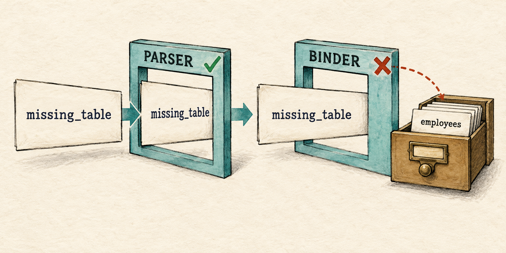
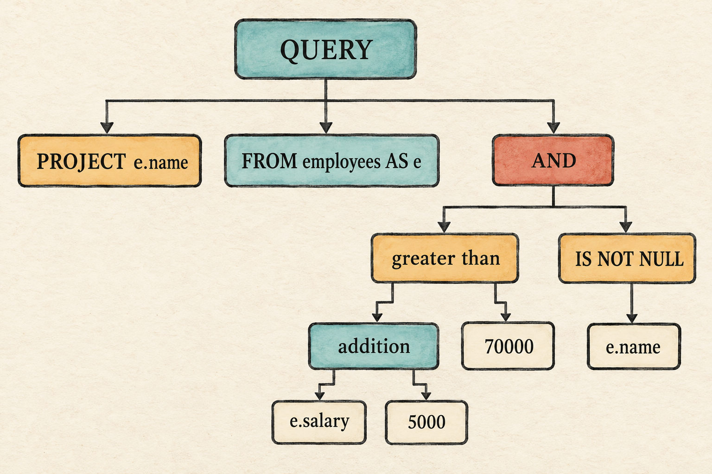
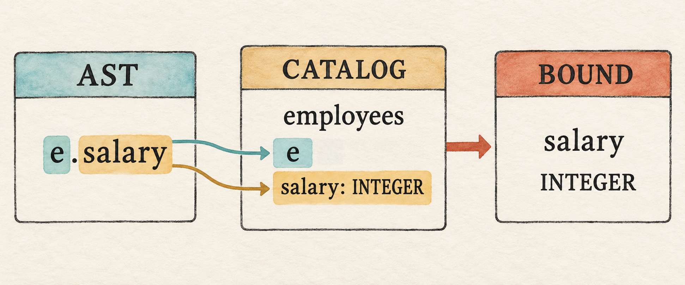

# 4. Binding Gives Names Meaning

<!--
Chapter contract

Continue from Chapter 3's unresolved table name. Add a minimal catalog,
expression trees, binding, type checking, and SQL three-valued logic.

Visible outcome

A qualified expression query returns Ada and Grace. Unknown tables, columns,
qualifiers, and invalid operand types fail before execution.
-->

> A parser can recognize a name. A database must decide what it names.

<figure class="book-illustration">
  
  <figcaption>Valid structure does not guarantee that the names in a query exist.</figcaption>
</figure>

Chapter 3 deliberately accepted this query:

```sql
SELECT name FROM missing_table WHERE salary > 50000;
```

It even ran the employee rows supplied by the caller. The text followed our
grammar, so parsing succeeded. But Chapter 3 had no binding step to check
whether `missing_table` referred to a table in the database.

This chapter adds **binding**, the step that connects names in the AST to
database objects and checks whether their use makes sense:

```text
SQL → tokens → AST → binding → bound plan → rows
                         ↑
                       catalog
```

We will use this query to exercise the complete path:

```sql
SELECT e.name
FROM employees AS e
WHERE e.salary + 5000 > 70000 AND e.name IS NOT NULL;
```

Ada and Grace satisfy the condition. Linus does not.

Compared with Chapter 3, accepting this query requires table aliases,
qualified columns, arithmetic, Boolean operators, and null tests. The frontend
must preserve that structure so binding can resolve the names and check their
types. Here is the expanded grammar:

```text
query          = "SELECT" expression
                 "FROM" identifier alias?
                 "WHERE" expression ";" ;
alias          = "AS"? identifier ;

expression     = or_expression ;
or_expression  = and_expression ("OR" and_expression)* ;
and_expression = not_expression ("AND" not_expression)* ;
not_expression = "NOT" not_expression | predicate ;

predicate      = additive comparison_operator additive
               | additive "IS" "NOT"? "NULL"
               | additive ;
additive       = term (("+" | "-") term)* ;
term           = factor (("*" | "/") factor)* ;
factor         = ("+" | "-") factor | primary ;

primary        = column_reference | integer | string | "NULL"
               | "(" expression ")" ;
column_reference = (identifier ".")? identifier ;
comparison_operator = "=" | "<>" | "<" | "<=" | ">" | ">=" ;
```

This block describes how tokens form a query. Chapter 3 described character
recognition directly in prose and lexer code. We can now record those rules
more compactly as a **lexical grammar**, which describes how characters form
the identifiers and literals used above:

```text
identifier       = (letter | "_") (letter | digit | "_")* ;
integer          = digit+ ;
string           = "'" string_character* "'" ;
string_character = non_quote | "''" ;

letter           = ? ASCII letter A-Z or a-z ? ;
digit            = ? ASCII digit 0-9 ? ;
non_quote        = ? any character except "'" ? ;
whitespace       = ? Unicode whitespace character ? ;
```

Text between `?` delimiters describes a character class recognized by the
lexer rather than a literal sequence. Whitespace is a skipped lexical
category: it may separate tokens, but the lexer does not emit it, so it does
not appear in the query productions. Decimal literals do not appear because
this chapter's lexer accepts integers only.

The grammar describes valid structure. Binding will provide the missing
meaning by resolving its table, alias, and column names and checking the types
used by its operators.

Before changing the program, begin from the completed Chapter 3 checkpoint:

```bash
git switch --create chapter-004 lesson-003
```

## 4.1 Reproduce the false success

Run the Chapter 3 prompt:

```bash
cargo run --quiet -- --prompt
```

Enter the `missing_table` query. It returns Ada and Grace because
`Query::into_plan()` ignores the parsed table name and accepts rows directly
from its caller.

The lexer can decide whether characters form tokens. The parser can decide
whether those tokens have a valid shape. Neither can decide whether a name
refers to something in this database. We need a new stage for that question.

## 4.2 Introduce the catalog types

Binding needs a description of the objects it can resolve. A database calls
that description a **catalog**. Our first catalog is only an in-memory list of
tables.

The catalog must record what kind of values each column may contain. Begin
with those type categories:

`src/expression.rs`: create this file

```rust
#[derive(Clone, Debug, PartialEq, Eq)]
pub enum DataType {
    Integer,
    Text,
    Boolean,
    Null,
}
```

`DataType` describes a category such as integers or text. This differs from
the `Value` enum introduced in Chapter 1, which stores one actual piece of row
data such as `Value::Integer(70000)` or `Value::Text("Ada")`. A column
describes every value allowed in that position, so using `Value` in the
catalog would require a meaningless placeholder such as `Value::Integer(0)`
merely to say that the column contains integers.

Now combine a column name with its type.

`src/catalog.rs`: create this file

```rust
use crate::expression::DataType;
use crate::row::Row;

#[derive(Clone)]
pub struct Column {
    pub name: String,
    pub data_type: DataType,
}
```

A table combines those columns with the rows they describe.

`src/catalog.rs`: add after `Column`

```rust
#[derive(Clone)]
pub struct Table {
    pub name: String,
    pub columns: Vec<Column>,
    pub rows: Vec<Row>,
}

pub struct Catalog {
    tables: Vec<Table>,
}

impl Catalog {
    pub fn new(tables: Vec<Table>) -> Self {
        Self { tables }
    }
}
```

This catalog describes tables, columns, and rows in memory. We will connect
the module to the program in Section 4.12, after the binder is complete.
Persisting catalog information to storage comes later.

## 4.3 Extend `Value`

Expressions can produce truth values, and SQL also needs a value for missing
or unknown information. `Boolean` lets comparisons and Boolean operators
return values; `Null` represents SQL's unknown value rather than an empty
string or zero.

`src/row.rs`: add two variants to `Value`

```rust
pub enum Value {
    Integer(i64),
    Text(String),
    Boolean(bool),
    Null,
}
```

`Value::Null` represents SQL `NULL` while a query is running. It is a distinct
value rather than an empty string, zero, or `false`.

`Row::new()` accepts borrowed column names, which is convenient when
constructing rows from string literals. Projection will produce column names
as owned `String` values. Add a second constructor that stores those names
directly.

`src/row.rs`: add to the first `impl Row`

```rust
pub fn from_owned(values: Vec<(String, Value)>) -> Self {
    Self { values }
}
```

Finally, make the two new values printable.

`src/row.rs`: add arms to `impl fmt::Display for Value`

```rust
Value::Boolean(value) => write!(formatter, "{value}"),
Value::Null => write!(formatter, "NULL"),
```

Adding variants makes the old `Plan::Filter` match temporarily
non-exhaustive. The filter still understands only integers, so change its text
arm into a catch-all to keep each intermediate checkpoint compiling. Section
4.11 will replace this temporary compatibility edit with expression-based
filtering.

`src/plan.rs`: replace the non-integer arm in `Plan::Filter`

```rust
Some(_) => panic!("column is not an integer: {column}"),
```

That temporary edit keeps the Chapter 3 plan compiling while the new
expression representation is still under construction.

## 4.4 Define expression operators and the AST

Extend `expression.rs` with the rest of the expression vocabulary. The
operator enums name the available operations, and `Expr` records their
unresolved tree structure. The `DataType` already in this file will later let
binding report what each expression produces.

`src/expression.rs`: add after `DataType`

```rust
use crate::row::Value;

#[derive(Clone, Debug, PartialEq, Eq)]
pub enum UnaryOp {
    Plus,
    Minus,
    Not,
}

#[derive(Clone, Debug, PartialEq, Eq)]
pub enum BinaryOp {
    Add,
    Subtract,
    Multiply,
    Divide,
    Equal,
    NotEqual,
    Less,
    LessOrEqual,
    Greater,
    GreaterOrEqual,
    And,
    Or,
}

#[derive(Clone, Debug, PartialEq, Eq)]
pub enum Expr {
    Column {
        qualifier: Option<String>,
        name: String,
    },
    Literal(Value),
    Unary {
        op: UnaryOp,
        expression: Box<Expr>,
    },
    Binary {
        left: Box<Expr>,
        op: BinaryOp,
        right: Box<Expr>,
    },
    IsNull {
        expression: Box<Expr>,
        negated: bool,
    },
}
```

The qualifier in `e.name` is stored as text. The parser has not yet proved
that `e` is a valid alias.

## 4.5 Extend the lexer

The representative query needs more vocabulary than Chapter 3:

| Tokens | Purpose |
| --- | --- |
| `As` | introduce a table alias |
| `And`, `Or`, `Not` | combine or negate conditions |
| `Is`, `Null` | form null tests and null literals |
| `String` | preserve text inside single quotes |
| `Plus`, `Minus`, `Star`, `Slash` | form arithmetic expressions |
| comparison variants | compare two expressions |
| `Dot` | separate a qualifier from a column |
| parentheses | group an expression explicitly |

`src/lexer.rs`: replace `Token`

```rust
#[derive(Clone, Debug, PartialEq, Eq)]
pub enum Token {
    Select, From, Where, As, And, Or, Not, Is, Null,
    Identifier(String), Integer(i64), String(String),
    Plus, Minus, Star, Slash, Equal, NotEqual,
    Less, LessOrEqual, Greater, GreaterOrEqual,
    Dot, LeftParen, RightParen, Semicolon,
}
```

Strings need their own branch before punctuation. A doubled quote represents
one quote inside the value.

`src/lexer.rs`: add after the integer branch in `tokenize()`

```rust
} else if character == '\'' {
    let start = current;
    current += 1;
    let mut value = String::new();

    loop {
        if current >= characters.len() {
            return Err(LexError {
                position: start + 1,
                message: "unterminated string".to_string(),
            });
        }
        if characters[current] == '\'' {
            if characters.get(current + 1) == Some(&'\'') {
                value.push('\'');
                current += 2;
            } else {
                current += 1;
                break;
            }
        } else {
            value.push(characters[current]);
            current += 1;
        }
    }
    tokens.push(Token::String(value));
```

Replace the old two-character punctuation match with a helper call.

`src/lexer.rs`: replace the final `else` branch in `tokenize()`

```rust
} else {
    let (token, consumed) = punctuation(&characters, current)
        .ok_or_else(|| LexError {
            position: current + 1,
            message: format!("unexpected character '{character}'"),
        })?;

    tokens.push(token);
    current += consumed;
}
```

The helper recognizes two-character operators before their one-character
prefixes.

`src/lexer.rs`: add after `tokenize()`

```rust
fn punctuation(characters: &[char], current: usize) -> Option<(Token, usize)> {
    match (characters[current], characters.get(current + 1)) {
        ('<', Some('=')) => Some((Token::LessOrEqual, 2)),
        ('<', Some('>')) => Some((Token::NotEqual, 2)),
        ('>', Some('=')) => Some((Token::GreaterOrEqual, 2)),
        ('+', _) => Some((Token::Plus, 1)),
        ('-', _) => Some((Token::Minus, 1)),
        ('*', _) => Some((Token::Star, 1)),
        ('/', _) => Some((Token::Slash, 1)),
        ('=', _) => Some((Token::Equal, 1)),
        ('<', _) => Some((Token::Less, 1)),
        ('>', _) => Some((Token::Greater, 1)),
        ('.', _) => Some((Token::Dot, 1)),
        ('(', _) => Some((Token::LeftParen, 1)),
        (')', _) => Some((Token::RightParen, 1)),
        (';', _) => Some((Token::Semicolon, 1)),
        _ => None,
    }
}
```

The first three arms inspect the following character because `<` and `>` may
begin a two-character operator. For punctuation with no two-character form,
`_` ignores whatever follows and only the first character matters.

Classify the new fixed words alongside the original keywords.

`src/lexer.rs`: replace `word_token()`

```rust
fn word_token(word: String) -> Token {
    match word.to_ascii_uppercase().as_str() {
        "SELECT" => Token::Select,
        "FROM" => Token::From,
        "WHERE" => Token::Where,
        "AS" => Token::As,
        "AND" => Token::And,
        "OR" => Token::Or,
        "NOT" => Token::Not,
        "IS" => Token::Is,
        "NULL" => Token::Null,
        _ => Token::Identifier(word),
    }
}
```

The lexer recognizes vocabulary. It still does not know whether `e` is an
alias or whether `name + 1` is meaningful.

## 4.6 Parse columns, literals, and precedence

Now implement the expression rules shown at the beginning of the chapter.
Read them from top to bottom as precedence levels. `OR` is the weakest,
followed by `AND`, `NOT`, predicates, addition and subtraction, and then
multiplication and division. Primary expressions form the leaves. Each parser
method calls the next tighter level before looking for its own operators, so
the tighter operator captures its operands first. That is why
`salary + 2 * 3` becomes `salary + (2 * 3)` without a special case.

Replace the flat query fields with expressions in the places SQL can nest.

`src/parser.rs`: replace the imports and `Query`

```rust
use std::fmt;

use crate::expression::{BinaryOp, Expr, UnaryOp};
use crate::lexer::{Token, tokenize};
use crate::row::Value;

#[derive(Debug, PartialEq, Eq)]
pub struct Query {
    pub projection: Expr,
    pub table: String,
    pub table_alias: Option<String>,
    pub filter: Expr,
}
```

Keep `ParseError`, `parse()`, and `Parser`, but change `parse()` to call the
new outer method:

`src/parser.rs`: replace the body of `parse()`

```rust
let tokens = tokenize(sql).map_err(|error| ParseError(error.to_string()))?;
Parser { tokens, current: 0 }.parse_query()
```

### 4.6.1 Parse the query and its alias

Replace the old `impl Parser` in the following steps. Begin with the complete
query shape and its optional alias.

`src/parser.rs`: begin the new `impl Parser`

```rust
impl Parser {
    fn parse_query(&mut self) -> Result<Query, ParseError> {
        self.expect(Token::Select, "expected SELECT at start of query")?;
        let projection = self.expression()?;
        self.expect(Token::From, "expected FROM after selected expression")?;
        let table = self.identifier("expected a table name after FROM")?;

        let table_alias = if self.consume(&Token::As) {
            Some(self.identifier("expected an alias after AS")?)
        } else if matches!(self.peek(), Some(Token::Identifier(_))) {
            Some(self.identifier("expected a table alias")?)
        } else {
            None
        };
        self.expect(Token::Where, "expected WHERE after table name")?;
        let filter = self.expression()?;
        self.expect(Token::Semicolon, "expected ; after query")?;

        if self.current != self.tokens.len() {
            return Err(ParseError("unexpected token after ;".to_string()));
        }

        Ok(Query { projection, table, table_alias, filter })
    }
```

`consume()` will return `true` and advance when the next token is `AS`.
Without `AS`, `matches!` checks whether the next token contains an identifier;
if it does, `identifier()` takes that name as the alias. Otherwise the query
has no alias.

### 4.6.2 Parse Boolean operators

Precedence begins with `OR`, the weakest operator, and descends toward tighter
operators. Because `or_expression()` asks `and_expression()` for each operand,
an entire `AND` expression is assembled before `OR` can combine it.

`src/parser.rs`: continue `impl Parser`

```rust
    fn expression(&mut self) -> Result<Expr, ParseError> {
        self.or_expression()
    }

    fn or_expression(&mut self) -> Result<Expr, ParseError> {
        let mut expression = self.and_expression()?;
        while self.consume(&Token::Or) {
            expression = binary(expression, BinaryOp::Or,
                self.and_expression()?);
        }
        Ok(expression)
    }

    fn and_expression(&mut self) -> Result<Expr, ParseError> {
        let mut expression = self.not_expression()?;
        while self.consume(&Token::And) {
            expression = binary(expression, BinaryOp::And,
                self.not_expression()?);
        }
        Ok(expression)
    }
```

`NOT` binds more tightly than `AND`. It calls itself, allowing chains such as
`NOT NOT condition`, and stops recursing when the next token is not `NOT`.

`src/parser.rs`: continue `impl Parser`

```rust
    fn not_expression(&mut self) -> Result<Expr, ParseError> {
        if self.consume(&Token::Not) {
            return Ok(Expr::Unary {
                op: UnaryOp::Not,
                expression: Box::new(self.not_expression()?),
            });
        }
        self.predicate()
    }
```

### 4.6.3 Parse comparisons and null tests

Comparisons and null tests bind more tightly than `NOT`. The complete
predicate method first reads the left arithmetic expression, then decides
whether a predicate operator follows.

`src/parser.rs`: continue `impl Parser`

```rust
    fn predicate(&mut self) -> Result<Expr, ParseError> {
        let left = self.additive()?;
        if self.consume(&Token::Is) {
            let negated = self.consume(&Token::Not);
            self.expect(Token::Null, "expected NULL after IS")?;
            return Ok(Expr::IsNull {
                expression: Box::new(left),
                negated,
            });
        }
        let op = if self.consume(&Token::Equal) { Some(BinaryOp::Equal) }
        else if self.consume(&Token::NotEqual) { Some(BinaryOp::NotEqual) }
        else if self.consume(&Token::Less) { Some(BinaryOp::Less) }
        else if self.consume(&Token::LessOrEqual) { Some(BinaryOp::LessOrEqual) }
        else if self.consume(&Token::Greater) { Some(BinaryOp::Greater) }
        else if self.consume(&Token::GreaterOrEqual) { Some(BinaryOp::GreaterOrEqual) }
        else { None };

        match op {
            Some(op) => Ok(binary(left, op, self.additive()?)),
            None => Ok(left),
        }
    }
```

If there is no comparison or null test, the arithmetic expression itself is
returned. Binding will later reject it in `WHERE` unless it produces a Boolean
or null result.

### 4.6.4 Parse arithmetic

Addition calls the multiplication level, so multiplication becomes the deeper
part of the tree.

`src/parser.rs`: continue `impl Parser`

```rust
    fn additive(&mut self) -> Result<Expr, ParseError> {
        let mut expression = self.term()?;
        loop {
            let op = if self.consume(&Token::Plus) { Some(BinaryOp::Add) }
            else if self.consume(&Token::Minus) { Some(BinaryOp::Subtract) }
            else { None };
            match op {
                Some(op) => expression = binary(expression, op, self.term()?),
                None => break,
            }
        }
        Ok(expression)
    }

    fn term(&mut self) -> Result<Expr, ParseError> {
        let mut expression = self.factor()?;
        loop {
            let op = if self.consume(&Token::Star) { Some(BinaryOp::Multiply) }
            else if self.consume(&Token::Slash) { Some(BinaryOp::Divide) }
            else { None };
            match op {
                Some(op) => expression = binary(expression, op, self.factor()?),
                None => break,
            }
        }
        Ok(expression)
    }
```

Unary signs call themselves so `--salary` nests correctly. The recursion
accepts any chain of leading signs and ends when the parser reaches a primary
expression.

`src/parser.rs`: continue `impl Parser`

```rust
    fn factor(&mut self) -> Result<Expr, ParseError> {
        if self.consume(&Token::Plus) {
            return Ok(Expr::Unary {
                op: UnaryOp::Plus,
                expression: Box::new(self.factor()?),
            });
        }
        if self.consume(&Token::Minus) {
            return Ok(Expr::Unary {
                op: UnaryOp::Minus,
                expression: Box::new(self.factor()?),
            });
        }
        self.primary()
    }
```

### 4.6.5 Parse primary expressions

A primary is a complete leaf or a parenthesized expression. Keep the entire
match together so every possible leaf is visible in one place.

`src/parser.rs`: add `primary()`

```rust
    fn primary(&mut self) -> Result<Expr, ParseError> {
        match self.peek().cloned() {
            Some(Token::Identifier(first)) => {
                self.current += 1;
                if self.consume(&Token::Dot) {
                    let name = self.identifier(
                        "expected a column name after .")?;
                    Ok(Expr::Column {
                        qualifier: Some(first), name,
                    })
                } else {
                    Ok(Expr::Column { qualifier: None, name: first })
                }
            }
            Some(Token::Integer(value)) => {
                self.current += 1;
                Ok(Expr::Literal(Value::Integer(value)))
            }
            Some(Token::String(value)) => {
                self.current += 1;
                Ok(Expr::Literal(Value::Text(value)))
            }
            Some(Token::Null) => {
                self.current += 1;
                Ok(Expr::Literal(Value::Null))
            }
            Some(Token::LeftParen) => {
                self.current += 1;
                let expression = self.expression()?;
                self.expect(Token::RightParen,
                    "expected ) after expression")?;
                Ok(expression)
            }
            _ => Err(ParseError("expected an expression".to_string())),
        }
    }
```

`peek().cloned()` gives this method an owned token before it advances the
cursor. The resulting AST can therefore own identifier and string contents
instead of borrowing them from the parser's token list.

### 4.6.6 Move through the token list

Three cursor helpers replace the old fixed-token helpers.

`src/parser.rs`: finish `impl Parser`

```rust
    fn peek(&self) -> Option<&Token> {
        self.tokens.get(self.current)
    }

    fn consume(&mut self, token: &Token) -> bool {
        if self.peek() == Some(token) {
            self.current += 1;
            true
        } else {
            false
        }
    }

    fn expect(&mut self, token: Token,
        message: &str) -> Result<(), ParseError> {
        if self.consume(&token) { Ok(()) }
        else { Err(ParseError(message.to_string())) }
    }

    fn identifier(&mut self, message: &str)
        -> Result<String, ParseError> {
        match self.peek().cloned() {
            Some(Token::Identifier(value)) => {
                self.current += 1;
                Ok(value)
            }
            _ => Err(ParseError(message.to_string())),
        }
    }
}
```

One constructor keeps binary-node creation out of every precedence method.

`src/parser.rs`: add after `impl Parser`

```rust
fn binary(left: Expr, op: BinaryOp, right: Expr) -> Expr {
    Expr::Binary {
        left: Box::new(left),
        op,
        right: Box::new(right),
    }
}
```

## 4.7 Run an AST checkpoint

Before binding names, make the recovered expression tree visible. Temporarily
use the Chapter 3 prompt as an AST inspector.

`src/main.rs`: temporarily replace the file

```rust
mod expression;
mod lexer;
mod parser;
mod row;

use std::io::{self, Write};
use parser::parse;

fn main() -> io::Result<()> {
    run_prompt()
}

fn inspect_sql(sql: &str) {
    match parse(sql) {
        Ok(query) => println!("{query:#?}"),
        Err(error) => eprintln!("error: {error}"),
    }
}
```

`src/main.rs`: add the prompt after `inspect_sql()`

```rust
fn run_prompt() -> io::Result<()> {
    loop {
        print!("sql> ");
        io::stdout().flush()?;
        let mut sql = String::new();
        if io::stdin().read_line(&mut sql)? == 0 {
            println!();
            return Ok(());
        }
        if !sql.trim().is_empty() {
            inspect_sql(&sql);
        }
    }
}
```

Run the prompt and enter the representative query:

```bash
cargo run --quiet
```

The printed tree places multiplication beneath addition and retains `e` as the
qualifier on both column references. This proves that parsing recovered the
intended structure. It does not prove that `employees`, `e`, or either column
exists.

<figure class="book-illustration book-diagram">
  
  <figcaption>The complete AST records the query structure, including expression precedence, but its names are still unresolved.</figcaption>
</figure>

## 4.8 Bind the table and alias

Return to `catalog.rs`. Binding begins by finding the named table. If no table
matches, planning stops before a scan is created.

`src/catalog.rs`: replace the imports

```rust
use crate::expression::{BinaryOp, BoundExpr, DataType, Expr, UnaryOp};
use crate::parser::Query;
use crate::plan::{Plan, ProjectExpression};
use crate::row::Row;
```

The scope collects the names visible while binding one query. Passing one
shared scope by reference lets every recursive call inherit the same table,
alias, and columns without copying them or threading three separate arguments
through the expression tree.

`src/catalog.rs`: add after `impl Catalog`

```rust
struct Scope<'a> {
    table_name: &'a str,
    alias: Option<&'a str>,
    columns: &'a [Column],
}
```

Add the outer binding method. The calls to `bind_expression()` will be filled
in next.

`src/catalog.rs`: add to `impl Catalog`

```rust
pub fn bind(&self, query: Query) -> Result<Plan, String> {
    let table = self.tables.iter()
        .find(|table| table.name == query.table)
        .ok_or_else(|| format!("unknown table: {}", query.table))?;

    let scope = Scope {
        table_name: &table.name,
        alias: query.table_alias.as_deref(),
        columns: &table.columns,
    };

    let (projection, _) = bind_expression(query.projection, &scope)?;
    let projection_name = match &projection {
        BoundExpr::Column(name) => name.clone(),
        _ => "expression".to_string(),
    };
    let (predicate, predicate_type) =
        bind_expression(query.filter, &scope)?;
    if predicate_type != DataType::Boolean
        && predicate_type != DataType::Null
    {
        return Err("WHERE expression must be Boolean".to_string());
    }

    Ok(Plan::Project {
        expressions: vec![ProjectExpression {
            name: projection_name,
            expression: projection,
        }],
        input: Box::new(Plan::Filter {
            predicate,
            input: Box::new(Plan::Scan { rows: table.rows.clone() }),
        }),
    })
}
```

This function gives the complete query its database meaning. It resolves the
table, binds both expressions in the same scope, requires a Boolean `WHERE`
result, and builds the familiar scan-filter-project plan. The executor will
receive checked expressions and concrete rows rather than unresolved SQL
names.

If an alias exists, it is the qualifier accepted by this scope. Chapter 5 will
extend this one-table rule when two inputs can contain the same column name.

## 4.9 Bind columns and check types

Binding walks the AST and returns two results: an expression safe for execution
and the type of its result. The match below handles four questions in one
recursive walk: whether a column exists in the current scope, what type a
literal has, which operand types an operator accepts, and what type the
resulting expression produces.

`src/catalog.rs`: add after `Scope`

```rust
fn bind_expression(expression: Expr, scope: &Scope<'_>)
    -> Result<(BoundExpr, DataType), String>
{
    match expression {
        Expr::Column { qualifier, name } => {
            if let Some(qualifier) = qualifier {
                let expected = scope.alias.unwrap_or(scope.table_name);
                if qualifier != expected {
                    return Err(format!(
                        "unknown table or alias: {qualifier}"));
                }
            }

            let column = scope.columns.iter()
                .find(|column| column.name == name)
                .ok_or_else(|| format!("unknown column: {name}"))?;
            Ok((BoundExpr::Column(name), column.data_type.clone()))
        }
        Expr::Literal(value) => {
            let data_type = match &value {
                crate::row::Value::Integer(_) => DataType::Integer,
                crate::row::Value::Text(_) => DataType::Text,
                crate::row::Value::Boolean(_) => DataType::Boolean,
                crate::row::Value::Null => DataType::Null,
            };
            Ok((BoundExpr::Literal(value), data_type))
        }
        Expr::Unary { op, expression } => {
            let (expression, data_type) =
                bind_expression(*expression, scope)?;
            let expected = match op {
                UnaryOp::Not => DataType::Boolean,
                _ => DataType::Integer,
            };
            require_type(&data_type, &expected,
                "invalid unary operand")?;
            Ok((BoundExpr::Unary {
                op,
                expression: Box::new(expression),
            }, expected))
        }
        Expr::Binary { left, op, right } => {
            let (left, left_type) = bind_expression(*left, scope)?;
            let (right, right_type) = bind_expression(*right, scope)?;
            let result_type = match op {
                BinaryOp::Add | BinaryOp::Subtract
                | BinaryOp::Multiply | BinaryOp::Divide => {
                    require_type(&left_type, &DataType::Integer,
                        "arithmetic requires integers")?;
                    require_type(&right_type, &DataType::Integer,
                        "arithmetic requires integers")?;
                    DataType::Integer
                }
                BinaryOp::And | BinaryOp::Or => {
                    require_type(&left_type, &DataType::Boolean,
                        "AND and OR require Boolean expressions")?;
                    require_type(&right_type, &DataType::Boolean,
                        "AND and OR require Boolean expressions")?;
                    DataType::Boolean
                }
                _ => {
                    if left_type != DataType::Null
                        && right_type != DataType::Null
                        && left_type != right_type
                    {
                        return Err(format!(
                            "cannot compare {left_type:?} with {right_type:?}"));
                    }
                    DataType::Boolean
                }
            };
            Ok((BoundExpr::Binary {
                left: Box::new(left),
                op,
                right: Box::new(right),
            }, result_type))
        }
        Expr::IsNull { expression, negated } => {
            let (expression, _) = bind_expression(*expression, scope)?;
            Ok((BoundExpr::IsNull {
                expression: Box::new(expression),
                negated,
            }, DataType::Boolean))
        }
    }
}
```

Unary arithmetic requires an integer, `NOT` requires a Boolean, and binary
operators fall into arithmetic, Boolean, and comparison groups. A null test
accepts any operand and always produces a Boolean result.

`src/catalog.rs`: add the type helper after `bind_expression()`

```rust
fn require_type(actual: &DataType, expected: &DataType,
    message: &str) -> Result<(), String>
{
    if actual == expected || actual == &DataType::Null {
        Ok(())
    } else {
        Err(format!("{message}: found {actual:?}"))
    }
}
```

A bare `NULL` expression receives the temporary type `DataType::Null`.
`require_type()` accepts it wherever a typed operand is expected because
evaluating an operation on it normally produces `Value::Null`. The execution
rules below preserve that unknown result instead of treating it as a type
error.

`name + 1` now fails during binding because `name` is text. Execution will not
discover that mistake halfway through a scan.

<figure class="book-illustration book-diagram">
  
  <figcaption>Binding checks the qualifier and column, recovers the type, and produces a simpler expression for execution.</figcaption>
</figure>

## 4.10 Introduce `BoundExpr`

The binder should not return the same unresolved tree it received. A bound
column no longer needs a qualifier because its table and column have already
been checked. Keeping a separate type makes that guarantee visible: code that
receives `BoundExpr` knows name and type checks have already succeeded, while
the original `Expr` remains an honest record of what the user wrote. Later
optimizer and execution stages therefore cannot accidentally accept an
unresolved expression.

`src/expression.rs`: add after `Expr`

```rust
#[derive(Clone, Debug, PartialEq, Eq)]
pub enum BoundExpr {
    Column(String),
    Literal(Value),
    Unary {
        op: UnaryOp,
        expression: Box<BoundExpr>,
    },
    Binary {
        left: Box<BoundExpr>,
        op: BinaryOp,
        right: Box<BoundExpr>,
    },
    IsNull {
        expression: Box<BoundExpr>,
        negated: bool,
    },
}
```

Import `Row` alongside `Value`, then let a bound tree evaluate one row.

`src/expression.rs`: replace the first import

```rust
use crate::row::{Row, Value};
```

`src/expression.rs`: add after `BoundExpr`

```rust
impl BoundExpr {
    pub fn evaluate(&self, row: &Row) -> Result<Value, String> {
        match self {
            BoundExpr::Column(name) => row.get(name).cloned()
                .ok_or_else(|| format!(
                    "bound column is missing at execution: {name}")),
            BoundExpr::Literal(value) => Ok(value.clone()),
            BoundExpr::Unary { op, expression } => {
                evaluate_unary(op, expression.evaluate(row)?)
            }
            BoundExpr::Binary { left, op, right } => {
                evaluate_binary(left.evaluate(row)?, op,
                    right.evaluate(row)?)
            }
            BoundExpr::IsNull { expression, negated } => {
                let is_null = expression.evaluate(row)? == Value::Null;
                Ok(Value::Boolean(if *negated {
                    !is_null
                } else {
                    is_null
                }))
            }
        }
    }
}
```

Unary evaluation is small because binding has already checked the operand
type.

`src/expression.rs`: add after `impl BoundExpr`

```rust
fn evaluate_unary(op: &UnaryOp, value: Value) -> Result<Value, String> {
    match (op, value) {
        (_, Value::Null) => Ok(Value::Null),
        (UnaryOp::Plus, Value::Integer(value)) =>
            Ok(Value::Integer(value)),
        (UnaryOp::Minus, Value::Integer(value)) =>
            Ok(Value::Integer(-value)),
        (UnaryOp::Not, Value::Boolean(value)) =>
            Ok(Value::Boolean(!value)),
        _ => Err("bound unary expression received an invalid value".into()),
    }
}
```

Arithmetic handles division by zero as an execution error. Comparisons and
Boolean operations continue below it.

`src/expression.rs`: add after `evaluate_unary()`

```rust
fn evaluate_binary(left: Value, op: &BinaryOp, right: Value)
    -> Result<Value, String>
{
    if left == Value::Null || right == Value::Null {
        return match op {
            BinaryOp::And => and(left, right),
            BinaryOp::Or => or(left, right),
            _ => Ok(Value::Null),
        };
    }

    match (left, op, right) {
        (Value::Integer(left), BinaryOp::Add,
            Value::Integer(right)) => Ok(Value::Integer(left + right)),
        (Value::Integer(left), BinaryOp::Subtract,
            Value::Integer(right)) => Ok(Value::Integer(left - right)),
        (Value::Integer(left), BinaryOp::Multiply,
            Value::Integer(right)) => Ok(Value::Integer(left * right)),
        (Value::Integer(_), BinaryOp::Divide,
            Value::Integer(0)) => Err("division by zero".to_string()),
        (Value::Integer(left), BinaryOp::Divide,
            Value::Integer(right)) => Ok(Value::Integer(left / right)),
        (Value::Integer(left), op, Value::Integer(right)) =>
            compare(left, op, right),
        (Value::Text(left), op, Value::Text(right)) =>
            compare(left, op, right),
        (Value::Boolean(left), BinaryOp::And,
            Value::Boolean(right)) => Ok(Value::Boolean(left && right)),
        (Value::Boolean(left), BinaryOp::Or,
            Value::Boolean(right)) => Ok(Value::Boolean(left || right)),
        _ => Err("bound binary expression received invalid values".into()),
    }
}
```

`src/expression.rs`: add the comparison helper

```rust
fn compare<T: PartialEq + PartialOrd>(left: T,
    op: &BinaryOp, right: T) -> Result<Value, String>
{
    let result = match op {
        BinaryOp::Equal => left == right,
        BinaryOp::NotEqual => left != right,
        BinaryOp::Less => left < right,
        BinaryOp::LessOrEqual => left <= right,
        BinaryOp::Greater => left > right,
        BinaryOp::GreaterOrEqual => left >= right,
        _ => return Err(
            "bound comparison received an invalid operator".into()),
    };
    Ok(Value::Boolean(result))
}
```

SQL Boolean logic has three possible results:

| `AND` | `TRUE` | `FALSE` | `NULL` |
| --- | --- | --- | --- |
| `TRUE` | `TRUE` | `FALSE` | `NULL` |
| `FALSE` | `FALSE` | `FALSE` | `FALSE` |
| `NULL` | `NULL` | `FALSE` | `NULL` |

| `OR` | `TRUE` | `FALSE` | `NULL` |
| --- | --- | --- | --- |
| `TRUE` | `TRUE` | `TRUE` | `TRUE` |
| `FALSE` | `TRUE` | `FALSE` | `NULL` |
| `NULL` | `TRUE` | `NULL` | `NULL` |

A false value decides `AND` even when the other side is unknown. A true value
similarly decides `OR`. The helpers encode those tables directly.

`src/expression.rs`: add the three-valued Boolean helpers

```rust
fn and(left: Value, right: Value) -> Result<Value, String> {
    match (left, right) {
        (Value::Boolean(false), _) | (_, Value::Boolean(false)) =>
            Ok(Value::Boolean(false)),
        (Value::Boolean(true), Value::Boolean(true)) =>
            Ok(Value::Boolean(true)),
        (Value::Boolean(true), Value::Null)
        | (Value::Null, Value::Boolean(true))
        | (Value::Null, Value::Null) => Ok(Value::Null),
        _ => Err("AND received a non-Boolean value".into()),
    }
}

fn or(left: Value, right: Value) -> Result<Value, String> {
    match (left, right) {
        (Value::Boolean(true), _) | (_, Value::Boolean(true)) =>
            Ok(Value::Boolean(true)),
        (Value::Boolean(false), Value::Boolean(false)) =>
            Ok(Value::Boolean(false)),
        (Value::Boolean(false), Value::Null)
        | (Value::Null, Value::Boolean(false))
        | (Value::Null, Value::Null) => Ok(Value::Null),
        _ => Err("OR received a non-Boolean value".into()),
    }
}
```

## 4.11 Update plan execution

The Chapter 3 plan stored one filter column, one integer boundary, and a list
of projected column names. That representation could execute only the query
shape it described. Replace those fixed fields with bound expression trees so
the same filter and project nodes can execute every expression this chapter
accepts.

`src/plan.rs`: replace the file

```rust
use crate::expression::BoundExpr;
use crate::row::{Row, Value};

#[derive(Debug)]
pub struct ProjectExpression {
    pub name: String,
    pub expression: BoundExpr,
}

#[derive(Debug)]
pub enum Plan {
    Scan { rows: Vec<Row> },
    Filter { predicate: BoundExpr, input: Box<Plan> },
    Project {
        expressions: Vec<ProjectExpression>,
        input: Box<Plan>,
    },
}
```

A filter retains only `TRUE`. `FALSE` and `NULL` both remove the row, which is
how SQL treats an unknown `WHERE` condition. Execution does not search the
catalog or reinterpret SQL because binding has already settled those
questions.

`src/plan.rs`: add `Plan::execute()`

```rust
impl Plan {
    pub fn execute(&self) -> Result<Vec<Row>, String> {
        match self {
            Plan::Scan { rows } => Ok(rows.clone()),
            Plan::Filter { predicate, input } => {
                let mut output = Vec::new();
                for row in input.execute()? {
                    match predicate.evaluate(&row)? {
                        Value::Boolean(true) => output.push(row),
                        Value::Boolean(false) | Value::Null => {}
                        _ => return Err(
                            "WHERE expression did not produce a Boolean".into()),
                    }
                }
                Ok(output)
            }
            Plan::Project { expressions, input } => {
                let mut output = Vec::new();
                for row in input.execute()? {
                    let mut values = Vec::new();
                    for expression in expressions {
                        values.push((expression.name.clone(),
                            expression.expression.evaluate(&row)?));
                    }
                    output.push(Row::from_owned(values));
                }
                Ok(output)
            }
        }
    }
}
```

## 4.12 Connect the application

### 4.12.1 Restore the fixed demonstration

Replace the AST-only shell with the complete database modules and catalog.

`src/main.rs`: replace the module declarations and imports

```rust
mod catalog;
mod expression;
mod lexer;
mod parser;
mod plan;
mod row;

use std::io::{self, Write};
use catalog::{Catalog, Column, Table};
use expression::DataType;
use parser::parse;
use row::{Row, Value};
```

Restore the employee helper and register a typed table.

`src/main.rs`: add after the imports

```rust
fn employee(id: i64, name: &str, salary: i64) -> Row {
    Row::new(vec![
        ("id", Value::Integer(id)),
        ("name", Value::Text(name.to_string())),
        ("salary", Value::Integer(salary)),
    ])
}

fn employee_catalog() -> Catalog {
    Catalog::new(vec![Table {
        name: "employees".to_string(),
        columns: vec![
            Column { name: "id".to_string(),
                data_type: DataType::Integer },
            Column { name: "name".to_string(),
                data_type: DataType::Text },
            Column { name: "salary".to_string(),
                data_type: DataType::Integer },
        ],
        rows: vec![
            employee(1, "Ada", 70_000),
            employee(2, "Linus", 50_000),
            employee(3, "Grace", 72_000),
        ],
    }])
}
```

The column list is the schema for the rows below it. Nothing in this small
catalog forces that schema and `employee()` to agree, so adding or changing a
column requires updating both. A later storage representation will remove
this manually maintained duplication.

The shared SQL entry point now parses, binds, and executes.

`src/main.rs`: add after `employee_catalog()`

```rust
fn execute_sql(sql: &str, catalog: &Catalog)
    -> Result<Vec<Row>, String>
{
    let query = parse(sql).map_err(|error| error.to_string())?;
    catalog.bind(query)?.execute()
}
```

Restore the fixed demonstration first.

`src/main.rs`: replace the temporary `main()` and remove `inspect_sql()`

```rust
fn main() {
    let catalog = employee_catalog();
    run_demo(&catalog);
}

fn run_demo(catalog: &Catalog) {
    let sql = "SELECT e.name FROM employees AS e \
        WHERE e.salary + 5000 > 70000 AND e.name IS NOT NULL;";
    let rows = execute_sql(sql, catalog)
        .expect("the lesson query should execute");

    println!("Employees matching the bound expression:");
    for row in rows {
        println!("{row}");
    }
}
```

### 4.12.2 Connect the prompt

Now let `main()` choose between the fixed demonstration and the prompt.

`src/main.rs`: replace `main()`

```rust
fn main() {
    let catalog = employee_catalog();
    if std::env::args().nth(1).as_deref() == Some("--prompt") {
        run_prompt(&catalog)
            .expect("failed to read SQL from the terminal");
    } else {
        run_demo(&catalog);
    }
}
```

The final prompt has the same loop as before, but it carries the catalog and
prints binding errors as ordinary query errors.

`src/main.rs`: replace the temporary `run_prompt()`

```rust
fn run_prompt(catalog: &Catalog) -> io::Result<()> {
    loop {
        print!("sql> ");
        io::stdout().flush()?;
        let mut sql = String::new();
        if io::stdin().read_line(&mut sql)? == 0 {
            println!();
            return Ok(());
        }
        if !sql.trim().is_empty() {
            print_query_result(&sql, catalog);
        }
    }
}

fn print_query_result(sql: &str, catalog: &Catalog) {
    match execute_sql(sql, catalog) {
        Ok(rows) => for row in rows { println!("{row}"); },
        Err(error) => eprintln!("error: {error}"),
    }
}
```

Remove the now-unused `Row::project()` method from `row.rs`. Projection lives
in the plan and evaluates expressions instead of copying a fixed list of
columns.

This second phase changes expressions, binding, plans, and the application as
one connected representation. Compile after all four pieces are present.

```bash
cargo fmt
cargo check
```

## 4.13 Run the fixed demonstration

Run the completed path:

```bash
cargo run --quiet
```

```text
Employees matching the bound expression:
{name: "Ada"}
{name: "Grace"}
```

The source text now becomes an unresolved AST, then a checked bound plan, and
only then rows. The executor itself never sees an alias or table name.

## 4.14 Run the prompt and its errors

Start the interactive path:

```bash
cargo run --quiet -- --prompt
```

The old false success now stops during binding:

```text
sql> SELECT name FROM missing_table WHERE salary > 50000;
error: unknown table: missing_table
```

An invalid qualifier and invalid operand type fail just as clearly:

```text
sql> SELECT x.name FROM employees AS e WHERE e.salary > 50000;
error: unknown table or alias: x
sql> SELECT name FROM employees WHERE name + 1 > 0;
error: arithmetic requires integers: found Text
```

The prompt remains ready after each failure. A bad query no longer becomes a
process panic or silently reads an unrelated table.

## 4.15 Verify the tests

Run the complete suite:

```bash
cargo test
```

The lesson source tests tokenization, precedence, aliases, missing names, type
errors, three-valued logic, filtering unknown predicates, the representative
query, and reuse of the catalog after an error.

Finish with the repository checks:

```bash
cargo fmt --check
cargo clippy -- -D warnings
```

## 4.16 What we deliberately did not build

The new frontend remains intentionally bounded:

- A query has one input table and one selected expression.
- The catalog exists only in memory and is assembled by the application.
- Names use exact spelling; quoted identifiers are absent.
- Arithmetic uses integers only.
- Division by zero is an execution error.
- There are no functions, `BETWEEN`, `LIKE`, `IN`, `CASE`, `CAST`, dates, or
  intervals.
- There is no optimizer or separate physical plan.
- Bound columns use names rather than stable catalog identifiers.

These limits keep the chapter focused on the boundary between syntax and
meaning. Appendix B records where the remaining expression forms belong.

## 4.17 Try it

Run the prompt, predict the stage that will accept or reject each query, and
then test it.

1. Replace `employees` with `missing_table`.
2. Replace `e.name` with `x.name`.
3. Replace `e.salary` with `e.missing`.
4. Try `name + 1 > 0`.
5. Try `NULL = NULL`, then `NULL IS NULL` in the filter.
6. Remove the alias and use unqualified column names.
7. Compare `salary + 2 * 3` with `(salary + 2) * 3`.

<details>
<summary>Check your reasoning</summary>

1. Parsing succeeds, but binding reports `unknown table: missing_table`.
2. Binding reports `unknown table or alias: x`.
3. Binding reports `unknown column: missing`.
4. Binding rejects arithmetic on the text column `name`.
5. `NULL = NULL` is unknown, so the filter removes every row. `NULL IS NULL`
   is true, so it retains every row.
6. Unqualified names bind because there is only one input table.
7. Multiplication happens first in the first expression. Parentheses make
   addition happen first in the second.

</details>

## 4.18 A second table changes the question

The parser can now describe expressions, and the binder can prove that their
names and types make sense for one table. A single-table scope makes an
unqualified column easy to resolve because only one input could own it.

Chapter 5 introduces a second table. That gives us joins, but it also creates
a new problem: when both inputs contain a column named `id`, which one did the
query mean?
