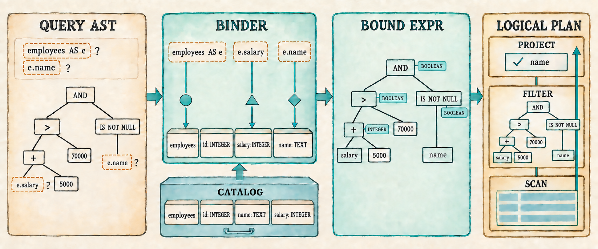
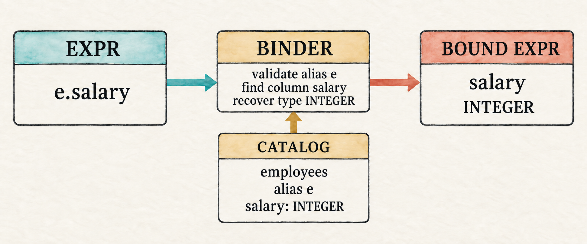

# 5. Binding Gives Names Meaning

<!--
Chapter contract

Continue from Chapter 4's unresolved expression AST. Add a minimal catalog,
binding, type checking, bound expressions, SQL three-valued evaluation, and
plan conversion without expanding the SQL grammar again.

Visible outcome

A qualified expression query returns Ada and Grace. Unknown tables, columns,
qualifiers, and invalid operand types fail before execution.
-->

> A parser can recognize a name. A database must decide what it names.

<figure class="book-illustration">
  
  <figcaption>Chapter 4 supplied the Query AST. This chapter resolves its names, checks its types, and carries the resulting expressions into the logical plan.</figcaption>
</figure>

Chapter 4 can now parse this request into an expression tree:

```sql
SELECT e.name
FROM employees AS e
WHERE e.salary + 5000 > 70000 AND e.name IS NOT NULL;
```

The tree preserves the important structure. It knows that addition happens
before comparison, that the two predicates are joined by `AND`, and that
`IS NOT NULL` is one operation.

But several parts of that tree are still only text:

- Does `employees` name a real table?
- Does `e` refer to that table?
- Do `name` and `salary` exist?
- Is `salary` an integer that can be added to `5000`?
- Does the complete `WHERE` expression produce a Boolean value?

The parser cannot answer those questions from grammar alone. This chapter
inserts a **binding** stage between parsing and planning. The binder performs
three jobs:

1. It resolves tables, aliases, and columns against the catalog.
2. It checks that each operator receives compatible operand types.
3. It converts each `Expr` into a `BoundExpr` and places those checked trees
   in the logical plan.

We will make that progression visible at three checkpoints:

- **Checkpoint 1, Sections 5.2–5.5:** complete all three binding jobs and print
  the checked logical plan. Valid names and types appear as `BoundExpr` trees;
  invalid queries stop with binding errors.
- **Checkpoint 2, Sections 5.6–5.7:** evaluate each bound expression for a row,
  apply SQL's Boolean and null rules, and make `Filter` and `Project` execute
  those expressions to produce rows.
- **Checkpoint 3, Sections 5.8–5.9:** put parsing, binding, and execution behind
  one application function, reconnect the fixed demonstration and interactive
  prompt, and verify the complete path with tests.

Once the binder is in place, planning and execution will be able to trust those
expressions. `Filter` and `Project` will carry complete checked trees, allowing
the same logical plan shape to support many non-trivial single-table queries
instead of one fixed comparison.

With that checked path complete, the representative query will return Ada and
Grace but not Linus. The same path will reject missing tables, unknown columns,
invalid qualifiers, and incompatible operand types before scanning any rows.

Before changing the program, begin from the completed Chapter 4 checkpoint:

```bash
git switch --create chapter-005 lesson-004
```

## 5.1 Names are still unresolved

Run the Chapter 4 AST prompt and enter:

```sql
SELECT name FROM missing_table WHERE salary > 50000;
```

The parser produces a `Query` because the tokens follow the grammar. Its
`table` field contains `missing_table`, but nothing has compared that text
with the database's available tables. The same is true of `name` and
`salary`.

Lexing answered which tokens were present. Parsing answered how those tokens
fit together. Binding must now connect the names in that structure to real
database objects. It needs a place to look them up.

## 5.2 Introduce the catalog

The AST checkpoint leaves names such as `employees`, `e`, and `salary`
unresolved. Binding needs a description of the objects those names may refer
to. A database calls that description a **catalog**. Our first catalog is only
an in-memory list of tables.

The catalog structures themselves live in `catalog.rs`. `DataType`, however,
is also expression vocabulary because the binder uses it to describe the type
produced by an expression. We therefore add it to `expression.rs` beside the
operator and expression types.

Begin with the type categories that the catalog and binder need.

`src/expression.rs`: add before `UnaryOp`

```rust
#[derive(Clone, Debug, PartialEq, Eq)]
pub enum DataType {
    Integer,
    Text,
    Boolean,
    Null,
}
```

`DataType` describes a category such as integers or text, while `Value` stores
one actual piece of row data such as `Value::Integer(70000)` or
`Value::Text("Ada")`. A catalog column must describe every value allowed in
that position, not hold one representative value. Using `Value` there would
require a meaningless placeholder such as `Value::Integer(0)` merely to say
that a column contains integers. We therefore pair the column name with its
`DataType`.

`src/catalog.rs`: create this file

```rust
use crate::expression::DataType;
use crate::row::Row;

#[derive(Clone)]
pub struct Column {
    pub name: String,
    pub data_type: DataType,
}
```

A table combines those columns with the rows they describe. The catalog then
holds the tables available to this database.

`src/catalog.rs`: add after `Column`

```rust
#[derive(Clone)]
pub struct Table {
    pub name: String,
    pub columns: Vec<Column>,
    pub rows: Vec<Row>,
}

pub struct Catalog {
    tables: Vec<Table>,
}

impl Catalog {
    pub fn new(tables: Vec<Table>) -> Self {
        Self { tables }
    }
}
```

This catalog describes tables, columns, and rows in memory. Persisting catalog
information to storage comes later. We now know where binding can look up a
name; next we define what it produces after a lookup succeeds.

## 5.3 Represent a checked expression

The AST checkpoint showed an unresolved tree: `e.name` still contains two
strings whose meaning has not been checked. Binding needs to produce a second
tree for the executable form that remains after those checks succeed.

In this single-table engine, a bound column no longer needs its qualifier. The
binder has already checked the qualifier, found the column in the selected
table, and recovered its type. It can therefore discard the qualifier and
retain only the column name used to read the row.

Keeping `Expr` and `BoundExpr` as separate Rust enums makes that completed
validation step visible. Code that accepts `Expr` must still resolve its names
and check its operators. Code reached through the binder can accept
`BoundExpr` knowing those checks have already succeeded.

`src/expression.rs`: add after `Expr`

```rust
#[derive(Clone, Debug, PartialEq, Eq)]
pub enum BoundExpr {
    Column(String),
    Literal(Value),
    Unary {
        op: UnaryOp,
        expression: Box<BoundExpr>,
    },
    Binary {
        left: Box<BoundExpr>,
        op: BinaryOp,
        right: Box<BoundExpr>,
    },
    IsNull {
        expression: Box<BoundExpr>,
        negated: bool,
    },
}
```

The two trees have similar shapes but different promises:

```text
Expr::Column { qualifier: Some("e"), name: "salary" }
                         ↓ binding
BoundExpr::Column("salary")
```

The two trees represent different stages. `Expr` records what the user wrote;
`BoundExpr` is the executable form produced after validation. In this
chapter's one-table plans, a checked column can be represented by its name
alone. Plans with multiple inputs will eventually need a less ambiguous
column identity.

Writing the binder starts with the names available for a lookup, which we will
collect in a scope.

## 5.4 Bind a whole query

Binding the complete query follows the three steps shown in the opening
illustration. It resolves the input table and column references, checks
operand types while converting `Expr` into `BoundExpr`, and places the checked
projection and filter in a logical plan. The recursive expression walk handles
the middle of that path; the final subsection connects it to the whole query.

### 5.4.1 Establish the scope

This step begins after parsing has produced a `Query`. That value supplies the
input table name, its optional alias, and the projection and filter expression
trees. A column in either tree can be resolved only among the names visible
from that input.

The whole-query binder will use `query.table` to find the corresponding
catalog table, then create one `Scope`. The scope borrows the verified table
name and column definitions from that catalog entry and the optional alias
from the parsed query. We will pass it through every recursive expression
binding call.

`src/catalog.rs`: add after `impl Catalog`

```rust
struct Scope<'a> {
    table_name: &'a str,
    alias: Option<&'a str>,
    columns: &'a [Column],
}
```

`table_name` and `alias` determine which qualifier is valid. `columns` is the
selected table's catalog schema, not its row data; the binder searches it to
verify a column name and recover its type. The whole-query binder will pass the
same shared `&Scope` to the projection and filter:

```text
catalog table + query alias
           ↓
       one Scope
        ↙     ↘
projection   filter
    ↓          ↓
recursive calls reuse &scope
```

Binding changes the expression as it walks the tree, but it never changes the
scope. If an alias exists, that alias is the accepted qualifier. Otherwise the
table name itself may qualify a column.

### 5.4.2 Resolve column references

`bind_expression()` handles one expression tree rather than a complete
`Query`. It returns two results for every AST node: a checked expression and
the type that expression produces. Its column arm first checks an optional
qualifier against the table name or alias, then looks up the column in the
scope. Either lookup can stop binding with an error.

The complete walk consumes `Expr`, inspects its unary and binary operators,
produces `BoundExpr`, and returns `DataType`. Add those expression types in one
import edit.

`src/catalog.rs`: replace the `DataType` import

```rust
use crate::expression::{BinaryOp, BoundExpr, DataType, Expr, UnaryOp};
```

`src/catalog.rs`: begin `bind_expression()` after `Scope`

```rust
fn bind_expression(expression: Expr, scope: &Scope<'_>)
    -> Result<(BoundExpr, DataType), String>
{
    match expression {
        Expr::Column { qualifier, name } => {
            if let Some(qualifier) = qualifier {
                let expected = scope.alias.unwrap_or(scope.table_name);
                if qualifier != expected {
                    return Err(format!(
                        "unknown table or alias: {qualifier}"));
                }
            }

            let column = scope.columns.iter()
                .find(|column| column.name == name)
                .ok_or_else(|| format!("unknown column: {name}"))?;
            Ok((BoundExpr::Column(name), column.data_type.clone()))
        }
```

Once the column exists, the binder no longer needs its qualifier. It produces
`BoundExpr::Column(name)` and returns the column type recorded by the catalog.
Literal and operator nodes do not require name lookup, but they do require
type information.

### 5.4.3 Check operator types

A literal's `Value` determines its type. Unary and binary nodes recursively
bind their children, then check the returned types before constructing the
parent node.

A bare `NULL` receives the temporary type `DataType::Null`. The type helpers
accept it where another operand type is expected because evaluation normally
propagates the unknown value as `Value::Null` rather than treating it as a type
error.

`src/catalog.rs`: continue the `match` in `bind_expression()`

```rust
        Expr::Literal(value) => {
            let data_type = match &value {
                crate::row::Value::Integer(_) => DataType::Integer,
                crate::row::Value::Text(_) => DataType::Text,
                crate::row::Value::Boolean(_) => DataType::Boolean,
                crate::row::Value::Null => DataType::Null,
            };
            Ok((BoundExpr::Literal(value), data_type))
        }
        Expr::Unary { op, expression } => {
            let (expression, data_type) =
                bind_expression(*expression, scope)?;
            let expected = match op {
                UnaryOp::Not => DataType::Boolean,
                _ => DataType::Integer,
            };
            require_type(&data_type, &expected,
                "invalid unary operand")?;
            Ok((BoundExpr::Unary {
                op,
                expression: Box::new(expression),
            }, expected))
        }
```

Unary arithmetic requires an integer, while `NOT` requires a Boolean. Binary
operators fall into four groups with distinct operand rules:

| Operator group | Operand rule |
| --- | --- |
| `+`, `-`, `*`, `/` | integers on both sides |
| `AND`, `OR` | Booleans on both sides |
| `=`, `<>` | matching integer, text, or Boolean types; either side may be `NULL` |
| `<`, `<=`, `>`, `>=` | matching integer or text types; either side may be `NULL` |

`src/catalog.rs`: continue the `match`

```rust
        Expr::Binary { left, op, right } => {
            let (left, left_type) = bind_expression(*left, scope)?;
            let (right, right_type) = bind_expression(*right, scope)?;
            let result_type = match op {
                BinaryOp::Add | BinaryOp::Subtract
                | BinaryOp::Multiply | BinaryOp::Divide => {
                    require_type(&left_type, &DataType::Integer,
                        "arithmetic requires integers")?;
                    require_type(&right_type, &DataType::Integer,
                        "arithmetic requires integers")?;
                    DataType::Integer
                }
                BinaryOp::And | BinaryOp::Or => {
                    require_type(&left_type, &DataType::Boolean,
                        "AND and OR require Boolean expressions")?;
                    require_type(&right_type, &DataType::Boolean,
                        "AND and OR require Boolean expressions")?;
                    DataType::Boolean
                }
                BinaryOp::Equal | BinaryOp::NotEqual => {
                    require_matching_types(&left_type, &right_type)?;
                    DataType::Boolean
                }
                BinaryOp::Less | BinaryOp::LessOrEqual
                | BinaryOp::Greater | BinaryOp::GreaterOrEqual => {
                    require_matching_types(&left_type, &right_type)?;
                    require_ordered_type(&left_type)?;
                    require_ordered_type(&right_type)?;
                    DataType::Boolean
                }
            };
            Ok((BoundExpr::Binary {
                left: Box::new(left),
                op,
                right: Box::new(right),
            }, result_type))
        }
```

A null test accepts any operand and always produces a Boolean result. This arm
also closes the `match` and the function.

`src/catalog.rs`: finish `bind_expression()`

```rust
        Expr::IsNull { expression, negated } => {
            let (expression, _) = bind_expression(*expression, scope)?;
            Ok((BoundExpr::IsNull {
                expression: Box::new(expression),
                negated,
            }, DataType::Boolean))
        }
    }
}
```

`src/catalog.rs`: add the type helper after `bind_expression()`

```rust
fn require_type(actual: &DataType, expected: &DataType,
    message: &str) -> Result<(), String>
{
    if actual == expected || actual == &DataType::Null {
        Ok(())
    } else {
        Err(format!("{message}: found {actual:?}"))
    }
}
```

Comparisons share two more checks. Their operand types must match unless one
side is the temporarily untyped `NULL`. Ordered comparisons then reject types,
such as Boolean, that have no ordering in this chapter's SQL dialect.

`src/catalog.rs`: add after `require_type()`

```rust
fn require_matching_types(left: &DataType, right: &DataType)
    -> Result<(), String>
{
    if left == &DataType::Null || right == &DataType::Null
        || left == right
    {
        Ok(())
    } else {
        Err(format!("cannot compare {left:?} with {right:?}"))
    }
}

fn require_ordered_type(data_type: &DataType) -> Result<(), String> {
    match data_type {
        DataType::Integer | DataType::Text | DataType::Null => Ok(()),
        _ => Err(format!(
            "ordered comparison requires integers or text: found {data_type:?}"
        )),
    }
}
```

Equality therefore accepts matching integer, text, or Boolean operands.
Ordered comparisons accept matching integers or text. `name + 1` fails during
binding because `name` is text, so execution does not discover that mistake
halfway through a scan.

### 5.4.4 Assemble the bound plan

`bind_expression()` handles one tree. A complete `Query` has two of them—the
projection and the filter—plus an input table that must be resolved first. The
whole-query binder will find that table, construct the scope, bind both trees,
check the filter's result type, and assemble a logical plan.

That plan needs to carry bound expressions before it can be constructed.
Replace the Chapter 4 plan shape now, but leave execution for the second
checkpoint.

`src/plan.rs`: replace the file

```rust
use crate::expression::BoundExpr;
use crate::row::Row;

#[derive(Debug)]
pub struct ProjectExpression {
    pub name: String,
    pub expression: BoundExpr,
}

#[derive(Debug)]
pub enum Plan {
    Scan { rows: Vec<Row> },
    Filter { predicate: BoundExpr, input: Box<Plan> },
    Project {
        expressions: Vec<ProjectExpression>,
        input: Box<Plan>,
    },
}
```

`ProjectExpression` stores both a checked expression and the name printed for
its result. A bare column retains its column name. Until aliases for selected
expressions arrive, a computed value uses the placeholder `"expression"`.

The catalog binder consumes the parsed query and produces this plan.

`src/catalog.rs`: add with the imports

```rust
use crate::parser::Query;
use crate::plan::{Plan, ProjectExpression};
```

`src/catalog.rs`: add to `impl Catalog`

```rust
pub fn bind(&self, query: Query) -> Result<Plan, String> {
    let table = self.tables.iter()
        .find(|table| table.name == query.table)
        .ok_or_else(|| format!("unknown table: {}", query.table))?;

    let scope = Scope {
        table_name: &table.name,
        alias: query.table_alias.as_deref(),
        columns: &table.columns,
    };

    let (projection, _) = bind_expression(query.projection, &scope)?;
    let projection_name = match &projection {
        BoundExpr::Column(name) => name.clone(),
        _ => "expression".to_string(),
    };
    let (predicate, predicate_type) =
        bind_expression(query.filter, &scope)?;
    if predicate_type != DataType::Boolean
        && predicate_type != DataType::Null
    {
        return Err("WHERE expression must be Boolean".to_string());
    }

    Ok(Plan::Project {
        expressions: vec![ProjectExpression {
            name: projection_name,
            expression: projection,
        }],
        input: Box::new(Plan::Filter {
            predicate,
            input: Box::new(Plan::Scan { rows: table.rows.clone() }),
        }),
    })
}
```

The `Scope` introduced at the start of this section is now concrete. Its table
name and columns come from the catalog entry found through `query.table`; its
alias comes from the parsed query. Both expression walks receive a shared
reference to that same scope.

Type checking does not happen in a separate pass. Each successful expression
match arm constructs the checked node that corresponds to the AST node it just
validated:

| AST node | Bound result | Result type |
| --- | --- | --- |
| `Expr::Column` | verified column name | catalog column type |
| `Expr::Literal` | literal value | type of the value |
| `Expr::Unary` | checked operator and child | operator's result type |
| `Expr::Binary` | checked operator and children | operator's result type |
| `Expr::IsNull` | checked child and null test | Boolean |

Because the recursive calls return `BoundExpr`, a parent can be produced only
after all of its children have resolved names and passed their type checks.
The resulting plan contains two checked trees but has no execution method yet.

<figure class="book-illustration book-diagram">
  
  <figcaption>Binding checks the qualifier and column, recovers the type, and produces a simpler expression for execution.</figcaption>
</figure>

## 5.5 Inspect the bound plan

The first checkpoint makes binding visible before evaluation is added. We will
populate the catalog, parse each entered query, bind it, and print the checked
plan. The temporary shell allows dead code in modules whose execution methods
will arrive in the next two sections.

`src/main.rs`: temporarily replace the file

```rust
mod catalog;
#[allow(dead_code)]
mod expression;
mod lexer;
mod parser;
#[allow(dead_code)]
mod plan;
#[allow(dead_code)]
mod row;

use std::io::{self, Write};
use catalog::{Catalog, Column, Table};
use expression::DataType;
use parser::parse;
use row::{Row, Value};

fn main() -> io::Result<()> {
    let catalog = employee_catalog();
    run_binding_prompt(&catalog)
}
```

Add the employee table that gives the catalog real names and types to resolve.

`src/main.rs`: add after `main()`

```rust
fn employee(id: i64, name: &str, salary: i64) -> Row {
    Row::new(vec![
        ("id", Value::Integer(id)),
        ("name", Value::Text(name.to_string())),
        ("salary", Value::Integer(salary)),
    ])
}

fn employee_catalog() -> Catalog {
    Catalog::new(vec![Table {
        name: "employees".to_string(),
        columns: vec![
            Column { name: "id".to_string(),
                data_type: DataType::Integer },
            Column { name: "name".to_string(),
                data_type: DataType::Text },
            Column { name: "salary".to_string(),
                data_type: DataType::Integer },
        ],
        rows: vec![
            employee(1, "Ada", 70_000),
            employee(2, "Linus", 50_000),
            employee(3, "Grace", 72_000),
        ],
    }])
}
```

The column list is the schema for the rows below it. Nothing in this small
catalog forces that schema and `employee()` to agree, so adding or changing a
column requires updating both. A later storage representation will remove
this manually maintained duplication.

The prompt stops after binding and prints the plan rather than executing it.

`src/main.rs`: add after `employee_catalog()`

```rust
fn run_binding_prompt(catalog: &Catalog) -> io::Result<()> {
    loop {
        print!("sql> ");
        io::stdout().flush()?;
        let mut sql = String::new();
        if io::stdin().read_line(&mut sql)? == 0 {
            println!();
            return Ok(());
        }
        if !sql.trim().is_empty() {
            let result = parse(&sql)
                .map_err(|error| error.to_string())
                .and_then(|query| catalog.bind(query));
            match result {
                Ok(plan) => println!("{plan:#?}"),
                Err(error) => eprintln!("error: {error}"),
            }
        }
    }
}
```

Run the prompt and enter the representative query:

```bash
cargo run --quiet
```

The output is a `Project` containing a bound `Column("name")`, above a
`Filter` containing the checked Boolean expression, above a `Scan` containing
the employee rows. No alias or unresolved column reference remains in the
plan.

Binding errors are visible at the same checkpoint:

```text
sql> SELECT name FROM missing_table WHERE salary > 50000;
error: unknown table: missing_table
sql> SELECT x.name FROM employees AS e WHERE e.salary > 50000;
error: unknown table or alias: x
sql> SELECT name FROM employees WHERE name + 1 > 0;
error: arithmetic requires integers: found Text
```

The binder has now completed the three jobs shown at the beginning of the
chapter: it resolved names, checked types, and placed checked expressions in a
logical plan. The plan is printable but not executable. That limitation gives
us the next task: evaluate its bound expressions.

## 5.6 Evaluate the bound expression

Binding has removed unresolved names and rejected invalid operand types. That
lets evaluation focus on one question: what value does this checked expression
produce for the current row? We will import `Row` alongside `Value` and give
the bound tree an evaluation method.

### 5.6.1 Evaluate the bound tree

`src/expression.rs`: replace the first import

```rust
use crate::row::{Row, Value};
```

`src/expression.rs`: add after `BoundExpr`

```rust
impl BoundExpr {
    pub fn evaluate(&self, row: &Row) -> Result<Value, String> {
        match self {
            BoundExpr::Column(name) => row.get(name).cloned()
                .ok_or_else(|| format!(
                    "bound column is missing at execution: {name}")),
            BoundExpr::Literal(value) => Ok(value.clone()),
            BoundExpr::Unary { op, expression } => {
                evaluate_unary(op, expression.evaluate(row)?)
            }
            BoundExpr::Binary { left, op, right } => {
                evaluate_binary(left.evaluate(row)?, op,
                    right.evaluate(row)?)
            }
            BoundExpr::IsNull { expression, negated } => {
                let is_null = expression.evaluate(row)? == Value::Null;
                Ok(Value::Boolean(if *negated {
                    !is_null
                } else {
                    is_null
                }))
            }
        }
    }
}
```

Unary evaluation is small because binding has already checked the operand
type.

`src/expression.rs`: add after `impl BoundExpr`

```rust
fn evaluate_unary(op: &UnaryOp, value: Value) -> Result<Value, String> {
    match (op, value) {
        (_, Value::Null) => Ok(Value::Null),
        (UnaryOp::Plus, Value::Integer(value)) =>
            Ok(Value::Integer(value)),
        (UnaryOp::Minus, Value::Integer(value)) =>
            Ok(Value::Integer(-value)),
        (UnaryOp::Not, Value::Boolean(value)) =>
            Ok(Value::Boolean(!value)),
        _ => Err("bound unary expression received an invalid value".into()),
    }
}
```

Columns and literals produce values directly. Unary nodes evaluate their one
child before applying their operator. Binary nodes need an additional rule:
SQL can produce an unknown result represented by `NULL`.

### 5.6.2 Define three-valued Boolean logic

Binary evaluation must account for SQL's unknown value. `NULL` propagates
through arithmetic and comparisons: for example, both `1 + NULL` and
`1 = NULL` produce `NULL`. `AND` and `OR` are different because one known
operand can sometimes decide the result. They follow these truth tables:

<table class="truth-table">
  <thead>
    <tr><th><code>AND</code></th><th><code>TRUE</code></th><th><code>FALSE</code></th><th><code>NULL</code></th></tr>
  </thead>
  <tbody>
    <tr><th scope="row"><code>TRUE</code></th><td><code>TRUE</code></td><td><code>FALSE</code></td><td><code>NULL</code></td></tr>
    <tr><th scope="row"><code>FALSE</code></th><td><code>FALSE</code></td><td><code>FALSE</code></td><td><code>FALSE</code></td></tr>
    <tr><th scope="row"><code>NULL</code></th><td><code>NULL</code></td><td><code>FALSE</code></td><td><code>NULL</code></td></tr>
  </tbody>
</table>

<table class="truth-table">
  <thead>
    <tr><th><code>OR</code></th><th><code>TRUE</code></th><th><code>FALSE</code></th><th><code>NULL</code></th></tr>
  </thead>
  <tbody>
    <tr><th scope="row"><code>TRUE</code></th><td><code>TRUE</code></td><td><code>TRUE</code></td><td><code>TRUE</code></td></tr>
    <tr><th scope="row"><code>FALSE</code></th><td><code>TRUE</code></td><td><code>FALSE</code></td><td><code>NULL</code></td></tr>
    <tr><th scope="row"><code>NULL</code></th><td><code>TRUE</code></td><td><code>NULL</code></td><td><code>NULL</code></td></tr>
  </tbody>
</table>

A false value decides `AND` even when the other side is unknown. A true value
similarly decides `OR`. Encode those two tables before adding the binary
evaluator that calls them.

`src/expression.rs`: add the three-valued Boolean helpers after
`evaluate_unary()`

```rust
fn and(left: Value, right: Value) -> Result<Value, String> {
    match (left, right) {
        (Value::Boolean(false), _) | (_, Value::Boolean(false)) =>
            Ok(Value::Boolean(false)),
        (Value::Boolean(true), Value::Boolean(true)) =>
            Ok(Value::Boolean(true)),
        (Value::Boolean(true), Value::Null)
        | (Value::Null, Value::Boolean(true))
        | (Value::Null, Value::Null) => Ok(Value::Null),
        _ => Err("AND received a non-Boolean value".into()),
    }
}

fn or(left: Value, right: Value) -> Result<Value, String> {
    match (left, right) {
        (Value::Boolean(true), _) | (_, Value::Boolean(true)) =>
            Ok(Value::Boolean(true)),
        (Value::Boolean(false), Value::Boolean(false)) =>
            Ok(Value::Boolean(false)),
        (Value::Boolean(false), Value::Null)
        | (Value::Null, Value::Boolean(false))
        | (Value::Null, Value::Null) => Ok(Value::Null),
        _ => Err("OR received a non-Boolean value".into()),
    }
}
```

### 5.6.3 Evaluate binary operations

With the Boolean helpers in place, binary evaluation can handle nulls before
dispatching ordinary arithmetic, comparison, and Boolean operations. Division
by zero remains an execution error.

`src/expression.rs`: add after `evaluate_unary()`

```rust
fn evaluate_binary(left: Value, op: &BinaryOp, right: Value)
    -> Result<Value, String>
{
    if left == Value::Null || right == Value::Null {
        return match op {
            BinaryOp::And => and(left, right),
            BinaryOp::Or => or(left, right),
            _ => Ok(Value::Null),
        };
    }

    match (left, op, right) {
        (Value::Integer(left), BinaryOp::Add,
            Value::Integer(right)) => Ok(Value::Integer(left + right)),
        (Value::Integer(left), BinaryOp::Subtract,
            Value::Integer(right)) => Ok(Value::Integer(left - right)),
        (Value::Integer(left), BinaryOp::Multiply,
            Value::Integer(right)) => Ok(Value::Integer(left * right)),
        (Value::Integer(_), BinaryOp::Divide,
            Value::Integer(0)) => Err("division by zero".to_string()),
        (Value::Integer(left), BinaryOp::Divide,
            Value::Integer(right)) => Ok(Value::Integer(left / right)),
        (Value::Integer(left), op, Value::Integer(right)) =>
            compare(left, op, right),
        (Value::Text(left), op, Value::Text(right)) =>
            compare(left, op, right),
        (Value::Boolean(left), BinaryOp::Equal,
            Value::Boolean(right)) => Ok(Value::Boolean(left == right)),
        (Value::Boolean(left), BinaryOp::NotEqual,
            Value::Boolean(right)) => Ok(Value::Boolean(left != right)),
        (Value::Boolean(left), BinaryOp::And,
            Value::Boolean(right)) => Ok(Value::Boolean(left && right)),
        (Value::Boolean(left), BinaryOp::Or,
            Value::Boolean(right)) => Ok(Value::Boolean(left || right)),
        _ => Err("bound binary expression received invalid values".into()),
    }
}
```

`src/expression.rs`: add the comparison helper

```rust
fn compare<T: PartialEq + PartialOrd>(left: T,
    op: &BinaryOp, right: T) -> Result<Value, String>
{
    let result = match op {
        BinaryOp::Equal => left == right,
        BinaryOp::NotEqual => left != right,
        BinaryOp::Less => left < right,
        BinaryOp::LessOrEqual => left <= right,
        BinaryOp::Greater => left > right,
        BinaryOp::GreaterOrEqual => left >= right,
        _ => return Err(
            "bound comparison received an invalid operator".into()),
    };
    Ok(Value::Boolean(result))
}
```

Binding guarantees that `compare()` receives a comparison operator. Its error
arm remains because the Rust type `BinaryOp` also contains non-comparison
variants and cannot express that narrower guarantee by itself.

A bound expression can now evaluate one row. The checked plan from the first
checkpoint must next call that evaluator for every row it filters or projects.

## 5.7 Execute the bound plan

The first checkpoint produced a plan containing bound expression trees, but
that plan had no `execute()` method. We can now make its filter and project
nodes evaluate those trees.

### 5.7.1 Construct projected rows

Projection will produce a `Vec<(String, Value)>` whose column names are already
owned. `Row::new()` accepts borrowed names and converts each one into a new
`String`; this second constructor can instead move the completed vector into
the row directly. The project node added below will use this constructor after
it evaluates its expressions.

`src/row.rs`: add to the first `impl Row`

```rust
pub fn from_owned(values: Vec<(String, Value)>) -> Self {
    Self { values }
}
```

### 5.7.2 Execute the plan

`plan.rs` already imports `Row`. Execution also inspects Boolean and null
values, so extend that import.

`src/plan.rs`: replace the `Row` import

```rust
use crate::row::{Row, Value};
```

A filter retains only `TRUE`. `FALSE` and `NULL` both remove the row, which is
how SQL treats an unknown `WHERE` condition. The whole-query binder accepted a
`WHERE` expression with a Boolean or temporary null type; this match defines
what those results do during execution. Execution does not search the catalog
or reinterpret SQL because binding has already settled those questions.

`src/plan.rs`: add `Plan::execute()`

```rust
impl Plan {
    pub fn execute(&self) -> Result<Vec<Row>, String> {
        match self {
            Plan::Scan { rows } => Ok(rows.clone()),
            Plan::Filter { predicate, input } => {
                let mut output = Vec::new();
                for row in input.execute()? {
                    match predicate.evaluate(&row)? {
                        Value::Boolean(true) => output.push(row),
                        Value::Boolean(false) | Value::Null => {}
                        _ => return Err(
                            "WHERE expression did not produce a Boolean".into()),
                    }
                }
                Ok(output)
            }
            Plan::Project { expressions, input } => {
                let mut output = Vec::new();
                for row in input.execute()? {
                    let mut values = Vec::new();
                    for expression in expressions {
                        values.push((expression.name.clone(),
                            expression.expression.evaluate(&row)?));
                    }
                    output.push(Row::from_owned(values));
                }
                Ok(output)
            }
        }
    }
}
```

The second checkpoint executes the plan that the binding prompt previously
printed. Extend its result pipeline through `Plan::execute()` and print the
returned rows.

`src/main.rs`: replace the result and `match` inside `run_binding_prompt()`

```rust
let result = parse(&sql)
    .map_err(|error| error.to_string())
    .and_then(|query| catalog.bind(query))
    .and_then(|plan| plan.execute());
match result {
    Ok(rows) => for row in rows { println!("{row}"); },
    Err(error) => eprintln!("error: {error}"),
}
```

Run the prompt and enter the representative query again:

```bash
cargo run --quiet
```

```text
sql> SELECT e.name FROM employees AS e WHERE e.salary + 5000 > 70000 AND e.name IS NOT NULL;
{name: "Ada"}
{name: "Grace"}
```

The same bound plan that was visible at the first checkpoint can now produce
rows. The final checkpoint will give this path a shared application function,
a fixed demonstration, error-preserving prompt behavior, and tests.

## 5.8 Connect the application

Parsing, binding, and execution now work together in the temporary prompt. We
will extract that pipeline into one application function, restore the fixed
demonstration, and then reconnect the final prompt.

### 5.8.1 Complete the application path

The two temporary prompts repeated parsing, binding, and eventually execution
inside their loops. Move that pipeline into the shared SQL entry point that
both final application paths will call.

`src/main.rs`: add after `employee_catalog()`

```rust
fn execute_sql(sql: &str, catalog: &Catalog)
    -> Result<Vec<Row>, String>
{
    let query = parse(sql).map_err(|error| error.to_string())?;
    catalog.bind(query)?.execute()
}
```

The expression, plan, and row modules are no longer partial checkpoint code.
Remove the temporary `#[allow(dead_code)]` attributes from their module
declarations.

### 5.8.2 Restore the fixed demonstration

The catalog and employee rows already exist from the first checkpoint. Replace
the temporary execution prompt with a fixed demonstration that calls the new
shared function.

`src/main.rs`: replace `main()` and remove `run_binding_prompt()`

```rust
fn main() {
    let catalog = employee_catalog();
    run_demo(&catalog);
}

fn run_demo(catalog: &Catalog) {
    let sql = "SELECT e.name FROM employees AS e \
        WHERE e.salary + 5000 > 70000 AND e.name IS NOT NULL;";
    let rows = execute_sql(sql, catalog)
        .expect("the lesson query should execute");

    println!("Employees matching the bound expression:");
    for row in rows {
        println!("{row}");
    }
}
```

### 5.8.3 Connect the prompt

With the fixed demonstration working, `main()` can choose between it and the
prompt.

`src/main.rs`: replace `main()`

```rust
fn main() {
    let catalog = employee_catalog();
    if std::env::args().nth(1).as_deref() == Some("--prompt") {
        run_prompt(&catalog)
            .expect("failed to read SQL from the terminal");
    } else {
        run_demo(&catalog);
    }
}
```

The final prompt has the same loop as before, but it carries the catalog and
prints binding errors as ordinary query errors.

`src/main.rs`: add after `run_demo()`

```rust
fn run_prompt(catalog: &Catalog) -> io::Result<()> {
    loop {
        print!("sql> ");
        io::stdout().flush()?;
        let mut sql = String::new();
        if io::stdin().read_line(&mut sql)? == 0 {
            println!();
            return Ok(());
        }
        if !sql.trim().is_empty() {
            print_query_result(&sql, catalog);
        }
    }
}

fn print_query_result(sql: &str, catalog: &Catalog) {
    match execute_sql(sql, catalog) {
        Ok(rows) => for row in rows { println!("{row}"); },
        Err(error) => eprintln!("error: {error}"),
    }
}
```

`Row::project()` is now unused because projection lives in the plan and
evaluates expressions instead of copying a fixed list of columns. Remove the
old method from `row.rs`.

### 5.8.4 Verify that the code compiles

The application now connects the parser, catalog and binder, plan, and
executor. Compile it before running queries so missing modules, stale imports,
or mismatched plan fields fail at this checkpoint.

```bash
cargo fmt
cargo check
```

## 5.9 Run and verify

The complete path is now connected. We will verify it at three levels: the
fixed demonstration, interactive failures at the prompt, and the automated
test suite.

### 5.9.1 Run the fixed demonstration

Run the completed path:

```bash
cargo run --quiet
```

```text
Employees matching the bound expression:
{name: "Ada"}
{name: "Grace"}
```

The source text now becomes an unresolved AST, then a checked bound plan, and
only then rows. The executor itself never sees an alias or table name.

### 5.9.2 Run the prompt and its errors

Start the interactive path:

```bash
cargo run --quiet -- --prompt
```

The old false success now stops during binding:

```text
sql> SELECT name FROM missing_table WHERE salary > 50000;
error: unknown table: missing_table
```

An invalid qualifier and invalid operand type fail just as clearly:

```text
sql> SELECT x.name FROM employees AS e WHERE e.salary > 50000;
error: unknown table or alias: x
sql> SELECT name FROM employees WHERE name + 1 > 0;
error: arithmetic requires integers: found Text
```

The prompt remains ready after each failure. A bad query no longer becomes a
process panic or silently reads an unrelated table.

### 5.9.3 Verify the tests

Run the complete suite:

```bash
cargo test
```

The lesson source tests tokenization, precedence, aliases, missing names, type
errors, three-valued logic, filtering unknown predicates, the representative
query, and reuse of the catalog after an error.

Finish with the repository checks:

```bash
cargo fmt --check
cargo clippy -- -D warnings
```

## 5.10 What we deliberately did not build

With the complete path verified, we can state the boundaries that remain.
The new frontend remains intentionally bounded:

- A query has one input table and one selected expression.
- The catalog exists only in memory and is assembled by the application.
- Names use exact spelling; quoted identifiers are absent.
- Arithmetic uses integers only.
- Division by zero is an execution error.
- There are no functions, `BETWEEN`, `LIKE`, `IN`, `CASE`, `CAST`, dates, or
  intervals.
- There is no optimizer or separate physical plan.
- Bound columns use names rather than stable catalog identifiers.

These limits keep the chapter focused on the boundary between syntax and
meaning. Appendix B records where the remaining expression forms belong.

## 5.11 Try it

Run the prompt, predict the stage that will accept or reject each query, and
then test it.

1. Replace `employees` with `missing_table`.
2. Replace `e.name` with `x.name`.
3. Replace `e.salary` with `e.missing`.
4. Try `name + 1 > 0`.
5. Compare `salary + 2 * 3` with `(salary + 2) * 3`.
6. Try `NULL = NULL`, then `NULL IS NULL` in the filter.
7. Remove the alias and use unqualified column names.

<details>
<summary>Check your reasoning</summary>

1. Parsing succeeds, but binding reports `unknown table: missing_table`.
2. Binding reports `unknown table or alias: x`.
3. Binding reports `unknown column: missing`.
4. Binding rejects arithmetic on the text column `name`.
5. Multiplication happens first in the first expression. Parentheses make
   addition happen first in the second.
6. `NULL = NULL` is unknown, so the filter removes every row. `NULL IS NULL`
   is true, so it retains every row.
7. Unqualified names bind because there is only one input table.

</details>

## 5.12 One scope is no longer enough

The frontend can now preserve expression structure, and the binder can reject
unknown names and incompatible types before execution. The last exercise
worked because every query still had exactly one input table. An unqualified
column such as `name` could belong to only that table, and a bound column could
be stored by name alone.

Consider what changes when the database has two tables:

```text
employees(id, name, department_id)
departments(id, name)
```

A useful query needs values from both:

```sql
SELECT name
FROM employees AS e, departments AS d
WHERE e.department_id = d.id;
```

This query creates two related problems. The binder must track both table
aliases and decide which input owns each column. The selected `name` is
ambiguous because both tables contain one. After binding resolves qualified
references, the executor must also combine an employee row with the matching
department row.

That row-combining operation is a **join**. In the next chapter we will first
make the simplest join work, then ask what its straightforward execution
strategy costs.

