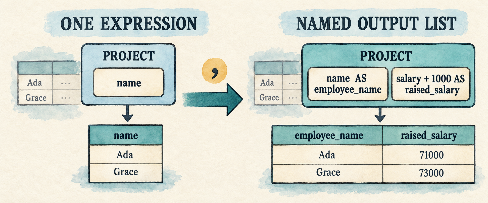
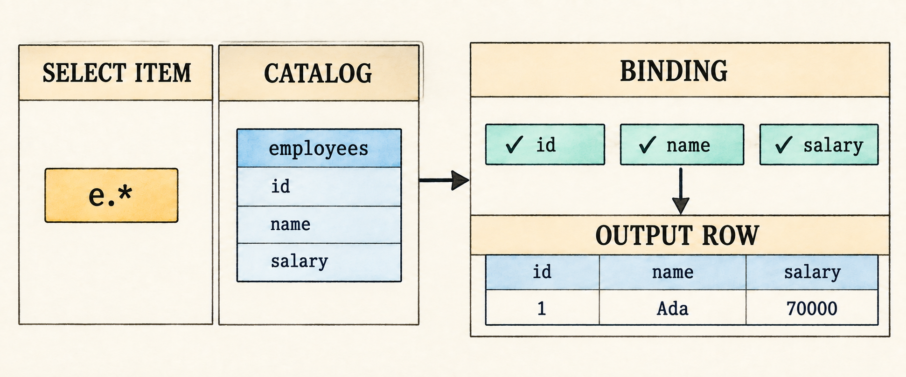
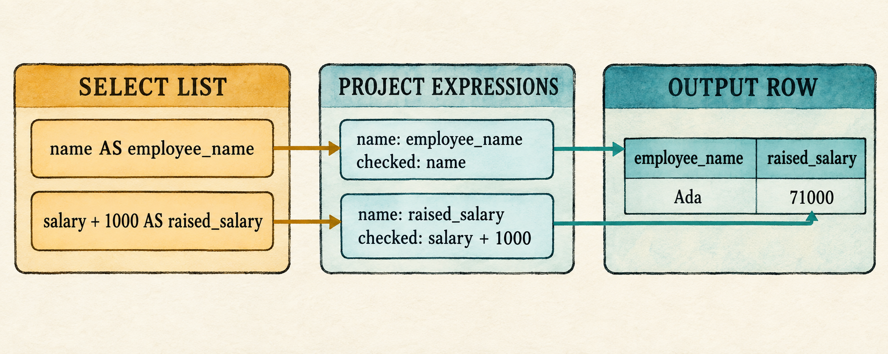

# 6. Multiple Outputs

<!--
Chapter contract

Continue from Chapter 5's one selected expression. Add a list of selected
items: expressions with output aliases, `*`, and qualified wildcards. Retain
one input table and the existing one-table binding scope.

Visible outcome

A query can project deliberately named expressions or expand the selected
table's columns in catalog order.
-->

> A result row can contain more than one answer.

<figure class="book-illustration">
  
  <figcaption>Projection becomes an output list, so one input row can produce a wider output row.</figcaption>
</figure>

Chapter 5 can evaluate a complete expression tree, but its `Query` still stores
only one projection expression. That prevents a query from returning a column
and a computed value together:

```sql
SELECT e.name AS employee_name,
       e.salary + 1000 AS raised_salary
FROM employees AS e
WHERE e.salary > 50000;
```

This chapter changes projection from one expression into a list of selected
items. Most items are expressions with optional output aliases. A wildcard is
different: `*` asks the binder to produce one output for every column visible
from the selected table. The input side remains unchanged, so binding still
uses one table and the logical plan remains `Project -> Filter -> Scan`.

This chapter carries its select list through the frontend:

```text
comma-separated select items
        ↓ parse
Vec<SelectItem>
        ↓ bind in one Scope
Vec<ProjectExpression>
        ↓ evaluate for each surviving row
one wider Row
```

Multiple selected items do not require a new plan node. Chapter 5 already made
`Project` hold a vector of checked expressions. This chapter teaches the parser
and binder to fill that vector from explicit expressions and catalog-expanded
wildcards.

Before changing the program, begin from the completed Chapter 5 checkpoint:

```bash
git switch --create chapter-006 lesson-005
```

## 6.1 Represent a select list

The query grammar currently accepts one expression after `SELECT`. Replace that
single position with a comma-separated list of selected items:

```text
query             = "SELECT" select_list
                    "FROM" identifier alias?
                    "WHERE" expression ";" ;

select_list       = select_item ("," select_item)* ;
select_item       = "*" | qualified_star | expression alias? ;
qualified_star    = identifier "." "*" ;
alias             = "AS"? identifier ;
```

`select_list` must contain at least one item. The parenthesized group may then
repeat zero or more times, so every additional item begins with a comma.
`SELECT FROM ...` remains invalid, while one item remains valid.

The grammar gives a `select_item` two distinct shapes. An expression item stores
the `Expr` to compute and its optional output alias. A wildcard is not an
expression to evaluate; it stores only an optional qualifier until binding
validates that qualifier and expands the matching catalog columns. Represent
the distinction with `SelectItem`, then let `Query` hold a vector of those
items instead of one projection expression.

`src/parser.rs`: replace `Query` and add `SelectItem`

```rust
#[derive(Debug, PartialEq, Eq)]
pub struct Query {
    pub projections: Vec<SelectItem>,
    pub table: String,
    pub table_alias: Option<String>,
    pub filter: Expr,
}

#[derive(Debug, PartialEq, Eq)]
pub enum SelectItem {
    Wildcard {
        qualifier: Option<String>,
    },
    Expression {
        expression: Expr,
        alias: Option<String>,
    },
}
```

For the representative query, the vector will contain two entries:

```text
SelectItem::Expression {
    expression: Column(e.name),
    alias: Some("employee_name"),
}

SelectItem::Expression {
    expression: Add(Column(e.salary), Integer(1000)),
    alias: Some("raised_salary"),
}
```

These are still unresolved AST expressions. The aliases name their eventual
outputs; they do not participate in resolving `e.name` or `e.salary`.

The two wildcard forms become:

```text
*    → SelectItem::Wildcard { qualifier: None }
e.*  → SelectItem::Wildcard { qualifier: Some("e") }
```

The parser records the request but does not expand it. Only the binder knows
which catalog table `e` names and which columns that table contains.

Together, expression items and wildcard forms complete the planned
`select_list` alternatives in
[Appendix B](appendix-b-sql-grammar.md).

## 6.2 Recognize the comma

The new grammar contains only one token that the lexer does not already know:
the comma separating selected items. `Star` already represents `*` because the
expression grammar uses the same character for multiplication. Add the comma
beside the other punctuation tokens.

`src/lexer.rs`: add `Comma` after `Dot` in `Token`

```rust
Dot,
Comma,
LeftParen,
```

Then recognize its one-character spelling in the punctuation helper.

`src/lexer.rs`: add the comma arm after the dot arm in `punctuation()`

```rust
('.', _) => Some((Token::Dot, 1)),
(',', _) => Some((Token::Comma, 1)),
('(', _) => Some((Token::LeftParen, 1)),
```

`AS`, identifiers, dots, and stars already have tokens, so aliases and
wildcards need no other lexer change. The parser can now distinguish the
boundary between one selected item and the next.

## 6.3 Parse every selected item

We will implement the three new grammar productions directly:

```text
select_list       = select_item ("," select_item)* ;
select_item       = "*" | qualified_star | expression alias? ;
qualified_star    = identifier "." "*" ;
```

At a select-item boundary, a leading `*` is an unqualified wildcard. The three
tokens `identifier`, `.`, and `*` form a qualified wildcard. These checks must
happen before expression parsing because the expression parser would otherwise
treat `*` as multiplication or expect a column name after the dot.

The `peek_at()` helper used by `parse_select_item()` below looks as far as two
tokens ahead, making the qualified form visible without consuming the beginning
of an ordinary expression.

`src/parser.rs`: add after `peek()`

```rust
fn peek_at(&self, offset: usize) -> Option<&Token> {
    self.tokens.get(self.current + offset)
}
```

If neither wildcard form matches, `parse_select_item()` delegates to the
precedence parser from Chapter 4. That parser naturally stops at `AS`, a direct
alias, or a comma because none is an expression operator. The existing
`parse_alias()` method then consumes the optional output alias.

`src/parser.rs`: add before `parse_alias()`

```rust
fn parse_select_list(&mut self) -> Result<Vec<SelectItem>, ParseError> {
    let mut expressions = vec![self.parse_select_item()?];
    while self.consume(&Token::Comma) {
        expressions.push(self.parse_select_item()?);
    }
    Ok(expressions)
}

fn parse_select_item(&mut self) -> Result<SelectItem, ParseError> {
    if self.consume(&Token::Star) {
        return Ok(SelectItem::Wildcard { qualifier: None });
    }
    if let (Some(Token::Identifier(qualifier)),
        Some(Token::Dot), Some(Token::Star)) =
        (self.peek_at(0), self.peek_at(1), self.peek_at(2))
    {
        let qualifier = qualifier.clone();
        self.current += 3;
        return Ok(SelectItem::Wildcard {
            qualifier: Some(qualifier),
        });
    }
    Ok(SelectItem::Expression {
        expression: self.parse_expression()?,
        alias: self.parse_alias()?,
    })
}
```

The first call before the loop implements the required first `select_item`.
Each successful comma consumption implements one repetition of
`("," select_item)*`. If there is no comma, the loop ends without consuming
`FROM`.

The outer query parser should now ask for the complete list rather than one
expression.

`src/parser.rs`: replace `parse_query()`

```rust
fn parse_query(&mut self) -> Result<Query, ParseError> {
    self.expect(Token::Select, "expected SELECT at start of query")?;
    let projections = self.parse_select_list()?;
    self.expect(Token::From, "expected FROM after select list")?;
    let table = self.identifier("expected a table name after FROM")?;
    let table_alias = self.parse_alias()?;
    self.expect(Token::Where, "expected WHERE after table name")?;
    let filter = self.parse_expression()?;
    self.expect(Token::Semicolon, "expected ; after query")?;
    if self.current != self.tokens.len() {
        return Err(ParseError("unexpected token after ;".into()));
    }
    Ok(Query {
        projections,
        table,
        table_alias,
        filter,
    })
}
```

The same `parse_alias()` now serves two positions. Immediately after a selected
expression it records an output alias; immediately after the table identifier
it records a table alias. The grammar determines which meaning the returned
text has.

Two existing parser tests still inspect the removed `query.projection` field.
Remove `multiplication_binds_more_tightly_than_addition()` and
`parses_boolean_literals()` from `src/parser.rs` before compiling this
checkpoint. Then remove `BinaryOp` from the test module's expression import,
because none of its remaining tests uses that operator type. Their parser
behavior remains valid; the completed lesson source contains updated versions
that inspect an expression item in `query.projections`.

Changing `Query` makes Chapter 5's binder temporarily stale because it still
reads `query.projection`. Before reconnecting it, inspect exactly what the
frontend now produces.

## 6.4 Inspect the expanded AST

Temporarily use the program as an AST inspector. This isolates the completed
lexer and parser from the binder that we have not updated yet.

`src/main.rs`: temporarily replace the file

```rust
#[allow(dead_code)] // Binding and execution reconnect later in this chapter.
mod expression;
mod lexer;
mod parser;
#[allow(dead_code)] // Row execution reconnects later in this chapter.
mod row;

use std::io::{self, Write};

use parser::parse;

fn main() -> io::Result<()> {
    run_prompt()
}

fn inspect_sql(sql: &str) {
    match parse(sql) {
        Ok(query) => println!("{query:#?}"),
        Err(error) => eprintln!("error: {error}"),
    }
}

fn run_prompt() -> io::Result<()> {
    loop {
        let mut sql = String::new();

        loop {
            if sql.is_empty() {
                print!("sql> ");
            } else {
                print!("...> ");
            }
            io::stdout().flush()?;

            let mut line = String::new();
            if io::stdin().read_line(&mut line)? == 0 {
                println!();
                if !sql.trim().is_empty() {
                    eprintln!("error: incomplete query at end of input");
                }
                return Ok(());
            }
            if sql.is_empty() && line.trim().is_empty() {
                break;
            }
            if append_sql_line(&mut sql, &line) {
                break;
            }
        }

        if !sql.trim().is_empty() {
            inspect_sql(&sql);
        }
    }
}

fn append_sql_line(sql: &mut String, line: &str) -> bool {
    sql.push_str(line);
    line.trim_end().ends_with(';')
}
```

Run it and enter the representative query:

```bash
cargo run --quiet
```

The relevant portion of the output contains two expression items and both
aliases:

```text
projections: [
    Expression {
        expression: Column { qualifier: Some("e"), name: "name" },
        alias: Some("employee_name"),
    },
    Expression {
        expression: Binary { ... },
        alias: Some("raised_salary"),
    },
]
```

The parser has preserved the list and its names, but it has not checked either
expression. Enter a second query to inspect the other item shape:

```sql
SELECT *, e.* FROM employees AS e WHERE TRUE;
```

Its two entries are `Wildcard { qualifier: None }` and
`Wildcard { qualifier: Some("e") }`. The AST still does not contain the three
employee columns because parsing has no catalog. We now send every item through
the one-table scope built in Chapter 5.

## 6.5 Bind and expand every output

Table lookup and scope construction do not change. For the representative
query, the binder creates the same one-table scope introduced in Chapter 5:

```text
Scope {
    table_name: "employees",
    alias: Some("e"),
    columns: [
        id: Integer,
        name: Text,
        salary: Integer,
    ],
}
```

The binder reuses this scope for every selected item. It validates `e.name`
and `e.salary + 1000` against the scope, then uses the same catalog columns to
expand `e.*`.

Import the new select-item type before changing the binder.

`src/catalog.rs`: replace the parser import

```rust
use crate::parser::{Query, SelectItem};
```

Recall the Chapter 5 qualifier rule: if an alias exists, it is accepted;
otherwise the table name is accepted. The `Expr::Column` arm currently checks
that rule inline:

```rust
if let Some(qualifier) = qualifier {
    let expected = scope.alias.unwrap_or(scope.table_name);
    if qualifier != expected {
        return Err(format!(
            "unknown table or alias: {qualifier}"));
    }
}
```

Column references and qualified wildcards now need the same check. Move it
into a function that both paths can call.

`src/catalog.rs`: add after `Scope`

```rust
fn require_qualifier(qualifier: Option<&str>, scope: &Scope<'_>)
    -> Result<(), String>
{
    if let Some(qualifier) = qualifier {
        let expected = scope.alias.unwrap_or(scope.table_name);
        if qualifier != expected {
            return Err(format!("unknown table or alias: {qualifier}"));
        }
    }
    Ok(())
}
```

`src/catalog.rs`: replace the inline qualifier check in the `Expr::Column` arm

```rust
require_qualifier(qualifier.as_deref(), scope)?;
```

Both expression items and wildcard expansion can introduce duplicate output
names. Keep that rule in one function which appends an output only after its
name is known to be unique.

`src/catalog.rs`: add after `bind_expression()`

```rust
fn push_output(expressions: &mut Vec<ProjectExpression>,
    name: String, expression: BoundExpr) -> Result<(), String>
{
    if expressions.iter().any(|existing| existing.name == name) {
        return Err(format!("duplicate output column: {name}"));
    }
    expressions.push(ProjectExpression { name, expression });
    Ok(())
}
```

The whole-query binder can now process the complete select list. Replace the
`impl Catalog` block that contains `bind()` with the version below. Table
lookup, scope construction, filter checking, and plan assembly remain the
same. The projection code in the middle now loops over `query.projections`
and expands wildcards from `scope.columns`.

`src/catalog.rs`: replace the `impl Catalog` block that contains `bind()`

```rust
impl Catalog {
    pub fn bind(&self, query: Query) -> Result<Plan, String> {
        let table = self.tables.iter()
            .find(|table| table.name == query.table)
            .ok_or_else(|| format!("unknown table: {}", query.table))?;

        let scope = Scope {
            table_name: &table.name,
            alias: query.table_alias.as_deref(),
            columns: &table.columns,
        };

        let mut expressions = Vec::new();
        for selected in query.projections {
            match selected {
                SelectItem::Expression { expression, alias } => {
                    let (expression, _) =
                        bind_expression(expression, &scope)?;
                    let name = alias.unwrap_or_else(|| match &expression {
                        BoundExpr::Column(name) => name.clone(),
                        _ => "expression".into(),
                    });
                    push_output(&mut expressions, name, expression)?;
                }
                SelectItem::Wildcard { qualifier } => {
                    require_qualifier(qualifier.as_deref(), &scope)?;
                    for column in scope.columns {
                        push_output(
                            &mut expressions,
                            column.name.clone(),
                            BoundExpr::Column(column.name.clone()),
                        )?;
                    }
                }
            }
        }

        let (predicate, predicate_type) =
            bind_expression(query.filter, &scope)?;
        if !matches!(predicate_type, DataType::Boolean | DataType::Null) {
            return Err("WHERE expression must be Boolean".to_string());
        }

        Ok(Plan::Project {
            expressions,
            input: Box::new(Plan::Filter {
                predicate,
                input: Box::new(Plan::Scan {
                    rows: table.rows.clone(),
                }),
            }),
        })
    }
}
```

For an expression item, each iteration does three things in order:

1. `bind_expression()` resolves and type-checks the selected expression.
2. The binder chooses its output name. An explicit alias wins, a bare column
   keeps its column name, and an unnamed computation still uses `expression`.
3. `push_output()` pairs that name with the checked tree after rejecting a
   duplicate.

For a wildcard, the qualifier is checked once and the catalog columns are
visited in their stored order. Each column becomes a bound column expression
with the same output name. The three-column employee schema therefore expands
`e.*` into `id`, `name`, and `salary` without creating a new plan node.

<figure class="book-illustration book-diagram">
  
  <figcaption>Binding consults the catalog to expand one wildcard into an ordered list of checked column expressions.</figcaption>
</figure>

The duplicate-name check reflects the current `Row` representation. A row
stores each value beside a name, and later name-based lookup should not have to
choose between two fields with the same name. For example, `SELECT name, name`
fails during binding with `duplicate output column: name`; `SELECT *, name`
fails for the same reason after `*` has already introduced `name`.

The resulting plan keeps its existing shape:

```text
Project [employee_name, raised_salary]
  Filter salary > 50000
    Scan employees
```

There is no change to `Plan` or `Plan::execute()`. Chapter 5 already defined
`Project` with `Vec<ProjectExpression>` and made it evaluate every entry for
each input row. Previously the binder always created a vector of length one;
now it can fill the same vector from the complete select list.

<figure class="book-illustration book-diagram">
  
  <figcaption>Each selected expression carries its output name and checked computation into one field of the projected row.</figcaption>
</figure>

## 6.6 Reconnect the application

The AST checkpoint has served its purpose. Restore the complete application
and update the fixed demonstration to use both outputs. The catalog, prompt,
and shared parse-bind-execute path remain unchanged; only the demonstration
query and its projected rows change.

`src/main.rs`: replace the file

```rust
mod catalog;
mod expression;
mod lexer;
mod parser;
mod plan;
mod row;

use std::io::{self, Write};

use catalog::{Catalog, Column, Table};
use expression::DataType;
use parser::parse;
use row::{Row, Value};

fn main() {
    let catalog = employee_catalog();
    if std::env::args().nth(1).as_deref() == Some("--prompt") {
        run_prompt(&catalog).expect("failed to read SQL from the terminal");
    } else {
        run_demo(&catalog);
    }
}

fn employee(id: i64, name: &str, salary: i64) -> Row {
    Row::new(vec![
        ("id", Value::Integer(id)),
        ("name", Value::Text(name.into())),
        ("salary", Value::Integer(salary)),
    ])
}

fn employee_catalog() -> Catalog {
    Catalog::new(vec![Table {
        name: "employees".into(),
        columns: vec![
            Column {
                name: "id".into(),
                data_type: DataType::Integer,
            },
            Column {
                name: "name".into(),
                data_type: DataType::Text,
            },
            Column {
                name: "salary".into(),
                data_type: DataType::Integer,
            },
        ],
        rows: vec![
            employee(1, "Ada", 70_000),
            employee(2, "Linus", 50_000),
            employee(3, "Grace", 72_000),
        ],
    }])
}

fn execute_sql(sql: &str, catalog: &Catalog) -> Result<Vec<Row>, String> {
    let query = parse(sql).map_err(|error| error.to_string())?;
    catalog.bind(query)?.execute()
}

fn run_demo(catalog: &Catalog) {
    let sql = "SELECT e.name AS employee_name, \
        e.salary + 1000 AS raised_salary \
        FROM employees AS e \
        WHERE e.salary > 50000;";
    let rows = execute_sql(sql, catalog).expect("the lesson query should execute");
    println!("Employees with projected raises:");
    for row in rows {
        println!("{row}");
    }
}

fn run_prompt(catalog: &Catalog) -> io::Result<()> {
    loop {
        let mut sql = String::new();

        loop {
            if sql.is_empty() {
                print!("sql> ");
            } else {
                print!("...> ");
            }
            io::stdout().flush()?;

            let mut line = String::new();
            if io::stdin().read_line(&mut line)? == 0 {
                println!();
                if !sql.trim().is_empty() {
                    eprintln!("error: incomplete query at end of input");
                }
                return Ok(());
            }
            if sql.is_empty() && line.trim().is_empty() {
                break;
            }
            if append_sql_line(&mut sql, &line) {
                break;
            }
        }

        if !sql.trim().is_empty() {
            print_query_result(&sql, catalog);
        }
    }
}

fn append_sql_line(sql: &mut String, line: &str) -> bool {
    sql.push_str(line);
    line.trim_end().ends_with(';')
}

fn print_query_result(sql: &str, catalog: &Catalog) {
    match execute_sql(sql, catalog) {
        Ok(rows) => {
            for row in rows {
                println!("{row}");
            }
        }
        Err(error) => eprintln!("error: {error}"),
    }
}
```

Compile the reconnected application:

```bash
cargo check
```

## 6.7 Run the wider projection

Run the fixed demonstration:

```bash
cargo run --quiet
```

```text
Employees with projected raises:
{employee_name: "Ada", raised_salary: 71000}
{employee_name: "Grace", raised_salary: 73000}
```

The filter retains Ada and Grace exactly as before. For each surviving input
row, `Project` evaluates both checked expressions and passes their two names
and values to `Row::from_owned()`. One input row therefore produces one output
row with two fields.

Start the prompt and enter the same query in its readable form:

```bash
cargo run --quiet -- --prompt
```

```sql
SELECT e.name AS employee_name,
       e.salary + 1000 AS raised_salary
FROM employees AS e
WHERE e.salary > 50000;
```

```text
{employee_name: "Ada", raised_salary: 71000}
{employee_name: "Grace", raised_salary: 73000}
```

After the inherited prompt receives the semicolon, parsing produces two
expression-shaped `SelectItem` nodes, binding produces two checked
`ProjectExpression` nodes, and the existing executor constructs the wider
rows.

A qualified wildcard can also appear beside another select item. This query
expands every `employees` column, then appends the computed salary:

```sql
SELECT e.*, e.salary + 1000 AS raised_salary
FROM employees AS e
WHERE e.id = 1;
```

```text
{id: 1, name: "Ada", salary: 70000, raised_salary: 71000}
```

Parsing records one qualified wildcard followed by one expression item.
Binding validates `e`, expands the employee columns in catalog order, and
then appends the checked computation named `raised_salary`. `Project` still
receives an ordinary list of checked expressions.

An unknown qualifier stops during binding:

```sql
SELECT x.* FROM employees AS e WHERE TRUE;
```

```text
error: unknown table or alias: x
```

Output-name errors also occur before any rows are scanned:

```sql
SELECT name, name FROM employees WHERE TRUE;
```

```text
error: duplicate output column: name
```

An alias resolves the conflict:

```sql
SELECT name, name AS copied_name FROM employees WHERE id = 1;
```

```text
{name: "Ada", copied_name: "Ada"}
```

## 6.8 What we deliberately did not build

This chapter changes projection only. The catalog, expression, type, and
planning limits from Chapter 5 still apply. The expanded select list remains
bounded in these ways:

- A query still has exactly one input table.
- Every query still requires `WHERE`.
- Wildcards expand only the one table in the current scope; Chapter 7 will
  define their behavior when several inputs are visible.
- `DISTINCT` and `ALL` remain in Chapter 10, where duplicate handling becomes
  observable.
- A computed expression without an alias still receives the temporary name
  `expression`.
- Duplicate output names are rejected instead of introducing a richer result
  schema representation.

These limits keep the chapter focused on widening projection. The next chapter
changes the other side of the query by allowing more than one input table.

## 6.9 Try it

Run the prompt, predict the output names or error, and then try each query.

1. Select `name, salary` without aliases.
2. Select `name, salary + 1000 AS raised_salary`.
3. Remove `AS` from both aliases in the representative query.
4. Select `salary + 1000, salary - 1000` without aliases.
5. Select `name AS result, salary AS result`.
6. Select `name AS employee_name, salary, salary + 1000 AS raised_salary`.
7. Select `*` and predict the output order from `employee_catalog()`.

<details>
<summary>Check your reasoning</summary>

1. Both bare columns retain their names, producing `name` and `salary`.
2. The bare column is named `name`; the computation uses its explicit
   `raised_salary` alias.
3. Direct aliases are accepted, so the result is unchanged.
4. Both computations receive the fallback name `expression`, so binding
   rejects the duplicate output name.
5. Binding reports `duplicate output column: result`.
6. The result contains three fields in select-list order: `employee_name`,
   `salary`, and `raised_salary`.
7. The wildcard expands to `id`, `name`, and `salary` in catalog order.

</details>

## 6.10 One output list, one input scope

Projection can now compute and name several values or expand a table wildcard,
but every column still comes from the same table. That makes an unqualified
name such as `name` unambiguous and gives `*` only one possible input.

Consider what changes when the database has two tables:

```text
employees(id, name, department_id)
departments(id, name)
```

A useful query needs values from both:

```sql
SELECT e.name AS employee_name, d.name AS department_name
FROM employees AS e, departments AS d
WHERE e.department_id = d.id;
```

The projection list and its output aliases are no longer a problem. The
remaining difficulty is on the input side. The binder must track both table
aliases, decide which table owns each column, reject an unqualified `name`
because both inputs define one, and decide which schemas an unqualified `*`
should expand.

After those names are resolved, execution must combine an employee row with a
department row before the existing filter can test their identifiers and the
project node can produce the two named outputs. That row-combining operation is
a **join**.

The next chapter expands the binding scope from one table to several, adds the first
logical `Join` node, and makes its straightforward nested-loop execution
visible.
