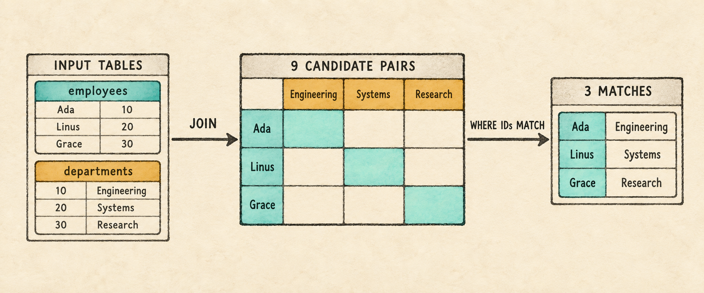
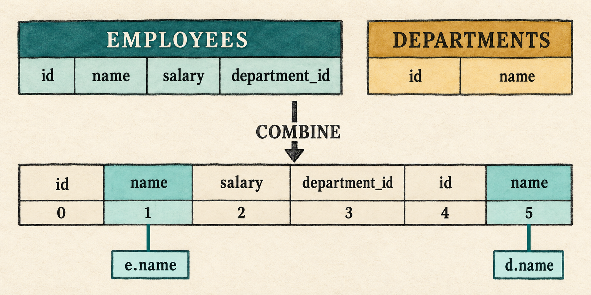
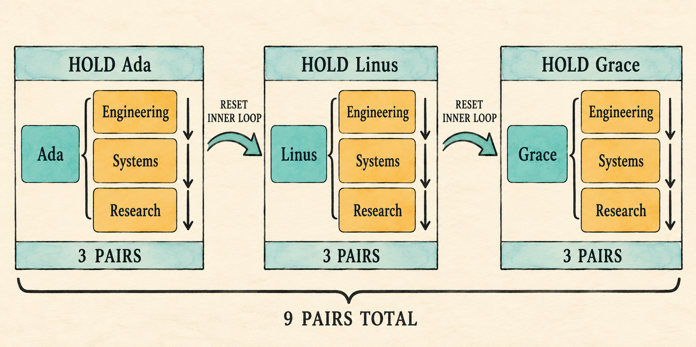

# 7. The First Join

<!--
Chapter contract

Continue from Chapter 6's named projection list. Accept multiple input tables,
resolve ambiguous names, bind columns to slots in the combined row, and execute
one logical Join with visible nested loops. Make `WHERE` optional so the same
join can expose its Cartesian product before a predicate filters it.

Visible outcome

Without `WHERE`, three employees and three departments produce nine named row
pairs. Adding the join predicate retains the three matching pairs. An
unqualified name shared by both tables fails as ambiguous before execution.
-->

> A join begins by asking which rows belong together.

<figure class="book-illustration">
  
  <figcaption>Three employee rows and three department rows create nine candidate pairs; matching identifiers retain three rows.</figcaption>
</figure>

Chapter 6 can return several named expressions from one table. It cannot yet
answer a question whose columns come from two tables:

```sql
SELECT e.name AS employee_name, d.name AS department_name
FROM employees AS e, departments AS d
WHERE e.department_id = d.id;
```

The parser must now preserve a list of input tables rather than one table. The
binder must decide whether each column belongs to `employees` or `departments`,
and the executor must place one row from each table together before it can
evaluate `e.department_id = d.id`.

This chapter makes those changes in three steps:

1. Extend the query AST and binding scope from one input table to several.
2. Bind each column to a stable position in the combined row and reject an
   unqualified name when more than one input table contains it.
3. Add a logical `Join` whose first execution strategy pairs every left row
   with every right row using visible nested loops.

The output aliases give the two source columns called `name` distinct labels
in the result. They improve readability rather than make the query valid,
because Chapter 6 already permits repeated output labels.

With a predicate, the completed plan keeps the familiar filter and project
operations:

```text
Project(employee_name, department_name)
                 |
Filter(e.department_id = d.id)
                 |
                Join
               /    \
 Scan(employees)    Scan(departments)
```

`Join` expresses the request to combine the two inputs; it does not yet choose
among several physical join algorithms. Its first implementation pairs every
employee with every department. Making `WHERE` optional lets us observe that
nine-row Cartesian product directly. Adding the predicate places `Filter`
above the join and retains the three pairs whose department identifiers match.

By the end of the chapter, the query above returns Ada with Engineering, Linus
with Systems, and Grace with Research.

Before changing the program, begin from the completed Chapter 6 checkpoint:

```bash
git switch --create chapter-007 lesson-006
```

## 7.1 Expand the `FROM` grammar

The existing expression and projection grammars do not change. The outer query
now gives `FROM` a comma-separated list:

```text
query             = "SELECT" select_list
                    "FROM" table_list
                    ("WHERE" expression)? ";" ;

table_list        = table_reference ("," table_reference)* ;
table_reference   = identifier alias? ;
alias             = "AS"? identifier ;
```

Table references store input aliases. Those differ from Chapter 6's output
aliases: `e` identifies an input inside expressions, while `employee_name`
labels a value in the result row. Parentheses followed by `?` make the complete
`WHERE` clause optional. Either the keyword and expression are both present,
or neither is.

## 7.2 Preserve the input list in the AST

`Query` already stores a collection of selected expressions. Replace its
single table fields with a vector of table references. The filter becomes
`Option<Expr>`: `Some` preserves the parsed predicate, while `None` records
that the query ended after its input list.

`src/parser.rs`: replace `Query` and add `TableReference`

```rust
#[derive(Debug, PartialEq, Eq)]
pub struct Query {
    pub projections: Vec<SelectItem>,
    pub tables: Vec<TableReference>,
    pub filter: Option<Expr>,
}

#[derive(Debug, PartialEq, Eq)]
pub struct TableReference {
    pub name: String,
    pub alias: Option<String>,
}
```

The parser reads the complete input list before deciding whether a `WHERE`
clause follows. Consuming `WHERE` selects the `Some` branch. Reaching the
semicolon selects `None`.

`src/parser.rs`: replace `parse_query()`

```rust
fn parse_query(&mut self) -> Result<Query, ParseError> {
    self.expect(Token::Select, "expected SELECT at start of query")?;
    let projections = self.parse_select_list()?;
    self.expect(Token::From, "expected FROM after select list")?;
    let tables = self.parse_table_list()?;
    let filter = if self.consume(&Token::Where) {
        Some(self.parse_expression()?)
    } else {
        None
    };
    self.expect(Token::Semicolon, "expected ; after query")?;

    if self.current != self.tokens.len() {
        return Err(ParseError("unexpected token after ;".to_string()));
    }

    Ok(Query {
        projections,
        tables,
        filter,
    })
}
```

The table list uses the same comma-separated shape as the select list. It
parses one required item, then consumes each comma followed by another item.
Requiring the first table keeps `FROM ;` invalid.

`src/parser.rs`: add before `parse_alias()`

```rust
fn parse_table_list(&mut self) -> Result<Vec<TableReference>, ParseError> {
    let mut tables = vec![self.parse_table_reference()?];
    while self.consume(&Token::Comma) {
        tables.push(self.parse_table_reference()?);
    }
    Ok(tables)
}

fn parse_table_reference(&mut self) -> Result<TableReference, ParseError> {
    Ok(TableReference {
        name: self.identifier("expected a table name")?,
        alias: self.parse_alias()?,
    })
}
```

The same `parse_alias()` method now serves two grammar positions. After a
selected expression it records an output alias; after a table name it records
the qualifier accepted for that input.

The existing parser tests inspect Chapter 6's singular `table`, `table_alias`,
and required `filter` fields. Remove the `#[cfg(test)] mod tests` block from
`parser.rs` before continuing. The lesson source keeps the rewritten parser
tests, but reproducing test code in the chapter would not add to the parsing
intuition.

Changing `Query` temporarily makes the Chapter 6 binder stale. Isolate the
frontend before updating the remaining stages.

## 7.3 Run a parser checkpoint

Temporarily replace `main.rs` with a small fixed-query inspector. The
`allow(dead_code)` attributes suppress warnings for expression and row code
that this checkpoint does not execute.

`src/main.rs`: temporarily replace the file

```rust
#[allow(dead_code)]
mod expression;
mod lexer;
mod parser;
#[allow(dead_code)]
mod row;

use parser::parse;

fn main() {
    let sql = "SELECT e.name AS employee_name, d.name AS department_name \
        FROM employees AS e, departments AS d;";
    println!("{:#?}", parse(sql).expect("the checkpoint query should parse"));
}
```

Run the checkpoint:

```bash
cargo run --quiet
```

The relevant fields show two table references and no filter:

```text
tables: [
    TableReference { name: "employees", alias: Some("e") },
    TableReference { name: "departments", alias: Some("d") },
],
filter: None,
```

Add `WHERE e.department_id = d.id` before the semicolon and run it again. The
same input list remains, while `filter` becomes `Some(Binary { ... })`. The AST
now distinguishes an omitted predicate from one the binder must validate.

## 7.4 Build a multi-table scope

A database may contain many tables, but this query makes only `employees` and
`departments` visible. The binder will create one scope entry per input,
recording its accepted qualifier, columns, and starting position in the row
that the join will produce.

```text
database catalog
├── employees   ← visible as e, starts at slot 0
├── departments ← visible as d, starts at slot 4
└── other tables remain outside this query's scope
```

Each input needs its own scope entry. `qualifier` is the alias when one was
written and otherwise the table name. `offset` is the number of columns
contributed by earlier inputs.

`src/catalog.rs`: replace `Scope`

```rust
struct ScopeTable<'a> {
    qualifier: String,
    columns: &'a [Column],
    offset: usize,
}

struct Scope<'a> {
    tables: Vec<ScopeTable<'a>>,
}
```

Unqualified lookup now has three possible outcomes:

- no visible table contains the name, so the column is unknown;
- exactly one table contains it, so binding succeeds;
- more than one table contains it, so the name is ambiguous.

For example, both inputs contain `name`. The binder must reject unqualified
`name` rather than choose one silently.

## 7.5 Bind columns to slots

Chapter 5 stored a bound column by name. That was sufficient while a row could
contain only one column with that name. A joined row may contain both
`employees.name` and `departments.name`.

The binder will therefore replace each resolved name with a **column slot**,
its zero-based position in the combined row. It retains the original name for
readable diagnostics:

```text
employees row                 departments row
[id, name, salary, department_id] + [id, name]
                ↓
[id, name, salary, department_id, id, name]
  0    1      2          3         4    5
```

In this layout, `e.name` binds to slot 1 and `d.name` binds to slot 5. The two
labels may be identical because execution reads the checked slots.

<figure class="book-illustration book-diagram">
  
  <figcaption>Binding replaces each qualified name with a stable position in the combined row.</figcaption>
</figure>

`src/expression.rs`: replace the `BoundExpr::Column` variant

```rust
Column {
    index: usize,
    name: String,
},
```

Qualified lookup searches one scope entry. Unqualified lookup searches every
visible entry and succeeds only when exactly one contains the name.

`src/catalog.rs`: replace `require_qualifier()` with `bind_column()`

```rust
fn bind_column(
    qualifier: Option<String>,
    name: String,
    scope: &Scope<'_>,
) -> Result<(BoundExpr, DataType), String> {
    if let Some(qualifier) = qualifier {
        let table = scope.tables.iter()
            .find(|table| table.qualifier == qualifier)
            .ok_or_else(|| format!("unknown table or alias: {qualifier}"))?;
        let (index, column) = table.columns.iter().enumerate()
            .find(|(_, column)| column.name == name)
            .ok_or_else(|| format!("unknown column: {name}"))?;
        return Ok((BoundExpr::Column {
            index: table.offset + index,
            name,
        }, column.data_type.clone()));
    }

    let mut matched = None;
    for table in &scope.tables {
        if let Some((index, column)) = table.columns.iter().enumerate()
            .find(|(_, column)| column.name == name)
        {
            if matched.is_some() {
                return Err(format!("ambiguous column: {name}"));
            }
            matched = Some((table.offset + index, column));
        }
    }

    let (index, column) = matched
        .ok_or_else(|| format!("unknown column: {name}"))?;
    Ok((BoundExpr::Column { index, name }, column.data_type.clone()))
}
```

Delegate the column arm of the recursive binder to that lookup.

`src/catalog.rs`: replace the `Expr::Column` arm in `bind_expression()`

```rust
Expr::Column { qualifier, name } => bind_column(qualifier, name, scope),
```

Execution now needs positional access. It also needs to concatenate the left
and right rows in exactly the order used to calculate the offsets.

`src/row.rs`: replace the second `impl Row`

```rust
impl Row {
    pub fn value_at(&self, index: usize,
        expected_name: &str) -> Result<&Value, String>
    {
        let (name, value) = self.values.get(index)
            .ok_or_else(|| format!(
                "bound column is missing at execution: {expected_name}"))?;

        if name != expected_name {
            return Err(format!(
                "bound column mismatch at position {index}: \
                 expected {expected_name}, found {name}"));
        }
        Ok(value)
    }

    pub fn combine(&self, right: &Row) -> Row {
        let mut values = self.values.clone();
        values.extend(right.values.iter().cloned());
        Row { values }
    }
}
```

The name check does not resolve the column again. It catches an internal
mismatch between the catalog layout used during binding and the row layout
received during execution.

`src/expression.rs`: replace the column arm in `BoundExpr::evaluate()`

```rust
BoundExpr::Column { index, name } =>
    row.value_at(*index, name).cloned(),
```

## 7.6 Add the logical join

The plan gains a `Join` node with left and right input plans. For this chapter's
comma-separated `FROM` list, the node produces every pair of input rows. The
existing `Filter` represents a present `WHERE` condition that decides which
pairs belong in the result. If the parsed query has no predicate, binding
places `Project` directly above `Join` instead:

```text
Project(employee_name, department_name)
                 |
                Join
               /    \
 Scan(employees)    Scan(departments)
```

Keeping the node named `Join` matters. It describes what relation the query
needs, not the physical algorithm eventually chosen to compute it.

`src/plan.rs`: add after `Scan`

```rust
Join {
    left: Box<Plan>,
    right: Box<Plan>,
},
```

## 7.7 Assemble the bound plan

Binding starts with the parsed table references because every projection and
predicate must use the resulting scope. For each reference, find the catalog
table, choose its accepted qualifier, record its offset, and retain the table
for its eventual `Scan`. Duplicate qualifiers are rejected because a
qualified column would otherwise still be ambiguous.

`src/catalog.rs`: replace the beginning of `Catalog::bind()` through `scope`

```rust
let mut input_tables = Vec::new();
let mut scope_tables = Vec::new();
let mut offset = 0;

for table_reference in query.tables {
    let table = self.tables.iter()
        .find(|table| table.name == table_reference.name)
        .ok_or_else(|| format!(
            "unknown table: {}", table_reference.name))?;
    let qualifier = table_reference.alias.unwrap_or(table_reference.name);
    if scope_tables.iter().any(
        |table: &ScopeTable<'_>| table.qualifier == qualifier)
    {
        return Err(format!("duplicate table or alias: {qualifier}"));
    }
    scope_tables.push(ScopeTable {
        qualifier,
        columns: &table.columns,
        offset,
    });
    offset += table.columns.len();
    input_tables.push(table);
}

let scope = Scope { tables: scope_tables };
```

The projection loop now sees the structured column variant. Update the
fallback label for a bare selected column:

`src/catalog.rs`: replace the output-name match

```rust
let name = alias.unwrap_or_else(|| match &expression {
    BoundExpr::Column { name, .. } => name.clone(),
    _ => "expression".into(),
});
```

An unqualified wildcard now expands every visible table in input order. A
qualified wildcard expands only the named scope entry. Both paths construct
the same positional bound columns used by explicit references.

`src/catalog.rs`: add before `impl Catalog`

```rust
fn expand_wildcard(
    qualifier: Option<String>,
    scope: &Scope<'_>,
    expressions: &mut Vec<ProjectExpression>,
) -> Result<(), String> {
    let tables: Vec<&ScopeTable<'_>> = match qualifier {
        Some(qualifier) => vec![scope.tables.iter()
            .find(|table| table.qualifier == qualifier)
            .ok_or_else(|| format!(
                "unknown table or alias: {qualifier}"))?],
        None => scope.tables.iter().collect(),
    };

    for table in tables {
        for (index, column) in table.columns.iter().enumerate() {
            push_output(expressions, column.name.clone(),
                BoundExpr::Column {
                    index: table.offset + index,
                    name: column.name.clone(),
                });
        }
    }
    Ok(())
}
```

Update the wildcard arm in `Catalog::bind()`:

```rust
SelectItem::Wildcard { qualifier } => {
    expand_wildcard(qualifier, &scope, &mut expressions)?;
}
```

The optional filter is bound only when the AST contains one. Its existing
Boolean-or-null requirement does not change.

`src/catalog.rs`: replace the old filter binding

```rust
let predicate = match query.filter {
    Some(filter) => {
        let (predicate, predicate_type) =
            bind_expression(filter, &scope)?;
        if !matches!(predicate_type, DataType::Boolean | DataType::Null) {
            return Err("WHERE expression must be Boolean".to_string());
        }
        Some(predicate)
    }
    None => None,
};
```

Finally, turn each catalog input into a `Scan`. The first scan starts the
input plan; every later scan becomes the right child of another `Join`. Add a
`Filter` only when `predicate` is present, then place the existing `Project`
at the root.

`src/catalog.rs`: replace the old plan construction at the end of `bind()`

```rust
let mut inputs = input_tables.into_iter();
let first = inputs.next()
    .ok_or_else(|| "query requires at least one input table".to_string())?;
let mut input = Plan::Scan { rows: first.rows.clone() };

for table in inputs {
    input = Plan::Join {
        left: Box::new(input),
        right: Box::new(Plan::Scan { rows: table.rows.clone() }),
    };
}

if let Some(predicate) = predicate {
    input = Plan::Filter {
        predicate,
        input: Box::new(input),
    };
}

Ok(Plan::Project {
    expressions,
    input: Box::new(input),
})
```

## 7.8 Execute the nested loops

The first execution rule is intentionally direct: execute both children, then
combine every left row with every right row. Three employees and three
departments create nine rows. Without `WHERE`, all nine reach projection and
become the query result. With the representative predicate, the filter keeps
the three pairs whose identifiers match.

This is materialized execution, just like the earlier plan nodes. A later
chapter will separate logical and physical plans and give the database a choice
between nested-loop and hash join algorithms.

`src/plan.rs`: add the `Join` arm to `Plan::execute()` after `Scan`

```rust
Plan::Join { left, right } => {
    let left_rows = left.execute()?;
    let right_rows = right.execute()?;
    let mut output = Vec::new();

    for left_row in &left_rows {
        for right_row in &right_rows {
            output.push(left_row.combine(right_row));
        }
    }

    Ok(output)
}
```

<figure class="book-illustration book-diagram">
  
  <figcaption>The inner scan restarts for each held outer row: three department visits per employee produce nine pairs.</figcaption>
</figure>

The outer loop fixes one left row while the inner loop visits every right row.
Their order makes the output deterministic: all department pairs for Ada come
first, followed by all pairs for Linus, then all pairs for Grace.

## 7.9 Reconnect the application

The parser checkpoint has served its purpose. Restore the complete application,
add `department_id` to the employee schema, and register the departments table.
The entire file is shown because the checkpoint replaced it.

`src/main.rs`: replace the file

```rust
mod catalog;
mod expression;
mod lexer;
mod parser;
mod plan;
mod row;

use std::io::{self, Write};

use catalog::{Catalog, Column, Table};
use expression::DataType;
use parser::parse;
use row::{Row, Value};

fn main() {
    let catalog = employee_catalog();
    if std::env::args().nth(1).as_deref() == Some("--prompt") {
        run_prompt(&catalog).expect("failed to read SQL from the terminal");
    } else {
        run_demo(&catalog);
    }
}

fn employee(id: i64, name: &str, salary: i64,
    department_id: i64) -> Row
{
    Row::new(vec![
        ("id", Value::Integer(id)),
        ("name", Value::Text(name.into())),
        ("salary", Value::Integer(salary)),
        ("department_id", Value::Integer(department_id)),
    ])
}

fn department(id: i64, name: &str) -> Row {
    Row::new(vec![
        ("id", Value::Integer(id)),
        ("name", Value::Text(name.into())),
    ])
}

fn employee_catalog() -> Catalog {
    Catalog::new(vec![
        Table {
            name: "employees".into(),
            columns: vec![
                Column { name: "id".into(), data_type: DataType::Integer },
                Column { name: "name".into(), data_type: DataType::Text },
                Column { name: "salary".into(), data_type: DataType::Integer },
                Column { name: "department_id".into(),
                    data_type: DataType::Integer },
            ],
            rows: vec![
                employee(1, "Ada", 70_000, 10),
                employee(2, "Linus", 50_000, 20),
                employee(3, "Grace", 72_000, 30),
            ],
        },
        Table {
            name: "departments".into(),
            columns: vec![
                Column { name: "id".into(), data_type: DataType::Integer },
                Column { name: "name".into(), data_type: DataType::Text },
            ],
            rows: vec![
                department(10, "Engineering"),
                department(20, "Systems"),
                department(30, "Research"),
            ],
        },
    ])
}

fn execute_sql(sql: &str, catalog: &Catalog) -> Result<Vec<Row>, String> {
    let query = parse(sql).map_err(|error| error.to_string())?;
    catalog.bind(query)?.execute()
}

fn run_demo(catalog: &Catalog) {
    let sql = "SELECT e.name AS employee_name, \
        d.name AS department_name \
        FROM employees AS e, departments AS d \
        WHERE e.department_id = d.id;";
    let rows = execute_sql(sql, catalog)
        .expect("the lesson query should execute");

    println!("Employees and their departments:");
    for row in rows {
        println!("{row}");
    }
}

fn run_prompt(catalog: &Catalog) -> io::Result<()> {
    loop {
        let mut sql = String::new();

        loop {
            if sql.is_empty() { print!("sql> "); }
            else { print!("...> "); }
            io::stdout().flush()?;

            let mut line = String::new();
            if io::stdin().read_line(&mut line)? == 0 {
                println!();
                if !sql.trim().is_empty() {
                    eprintln!("error: incomplete query at end of input");
                }
                return Ok(());
            }
            if sql.is_empty() && line.trim().is_empty() { break; }
            if append_sql_line(&mut sql, &line) { break; }
        }

        if !sql.trim().is_empty() {
            print_query_result(&sql, catalog);
        }
    }
}

fn append_sql_line(sql: &mut String, line: &str) -> bool {
    sql.push_str(line);
    line.trim_end().ends_with(';')
}

fn print_query_result(sql: &str, catalog: &Catalog) {
    match execute_sql(sql, catalog) {
        Ok(rows) => for row in rows { println!("{row}"); },
        Err(error) => eprintln!("error: {error}"),
    }
}
```

Compile the connected path:

```bash
cargo fmt
cargo check
```

Before executing it, make the plan visible once. Temporarily split
`execute_sql()` into named steps and print the bound plan:

```rust
let query = parse(sql).map_err(|error| error.to_string())?;
let plan = catalog.bind(query)?;
println!("{plan:#?}");
plan.execute()
```

The filtered query prints a `Project` above a `Filter`, whose input is a
`Join` with two `Scan` children. Remove only the `WHERE` clause and the
`Filter` disappears. After inspecting both shapes, restore the concise final
line `catalog.bind(query)?.execute()` so ordinary prompt results contain only
rows.

## 7.10 Observe the product, then filter it

Start the prompt:

```bash
cargo run --quiet -- --prompt
```

First run the query without `WHERE`:

```sql
SELECT e.name AS employee_name, d.name AS department_name
FROM employees AS e, departments AS d;
```

Its three-by-three inputs produce nine rows. The first three all contain Ada
because the inner loop visits every department before the outer loop advances:

```text
{employee_name: "Ada", department_name: "Engineering"}
{employee_name: "Ada", department_name: "Systems"}
{employee_name: "Ada", department_name: "Research"}
...
{employee_name: "Grace", department_name: "Research"}
```

Then add `WHERE e.department_id = d.id`. The same `Join` still creates nine
pairs, but `Filter` forwards only three:

```sql
SELECT e.name AS employee_name, d.name AS department_name
FROM employees AS e, departments AS d
WHERE e.department_id = d.id;
```

```text
Employees and their departments:
{employee_name: "Ada", department_name: "Engineering"}
{employee_name: "Linus", department_name: "Systems"}
{employee_name: "Grace", department_name: "Research"}
```

The fixed demonstration runs that filtered form:

```bash
cargo run --quiet
```

## 7.11 Inspect binding failures

The prompt should distinguish missing and ambiguous names before scanning any
rows. Representative failures include an unknown table, duplicate input alias,
unknown qualifier, unknown column, and unqualified `name` shared by both
inputs.

An unqualified `name` has valid syntax, but binding finds it in both scope
entries:

```sql
SELECT name
FROM employees AS e, departments AS d
WHERE e.department_id = d.id;
```

```text
error: ambiguous column: name
```

Giving both inputs the same alias is rejected before their expressions are
bound:

```sql
SELECT e.name
FROM employees AS e, departments AS e;
```

```text
error: duplicate table or alias: e
```

The source tests cover parsing with and without `WHERE`, input aliases,
ambiguous names, positional lookup, Cartesian-product order, filtering, and
the complete query. Keep those tests in the Rust files rather than copying
them into the chapter. Run them now:

```bash
cargo test
```

## 7.12 What we deliberately did not build

- Join syntax is limited to comma-separated inputs. An optional `WHERE`
  predicate may filter their Cartesian product.
- `INNER`, `LEFT`, `RIGHT`, and `FULL JOIN ... ON` belong to Chapter 8.
- Nested loops are the only execution method, but they are not represented as
  a physical plan yet.
- There is no join reordering or cost-based choice.
- Bound column slots are local to one plan and are not durable catalog IDs.
- Repeated output labels remain valid final results. Positional result-schema
  identity arrives before projected rows can become inputs to another query.

## 7.13 Try it

Run the prompt and predict which stage handles each change:

1. Remove both output aliases.
2. Replace `e.name` with unqualified `name`.
3. Replace `d.name` with `x.name`.
4. Give both input tables the alias `e`.
5. Remove `WHERE` and predict the number and order of output rows.
6. Restore `WHERE`, change its predicate to `e.id = d.id`, and predict the
   surviving rows.

<details>
<summary>Check your reasoning</summary>

1. Both fields are labelled `name`; repeated result labels remain valid.
2. Binding reports `ambiguous column: name` because both inputs define it.
3. Binding reports `unknown table or alias: x`.
4. Binding reports `duplicate table or alias: e`.
5. All nine pairs survive in left-row then right-row order.
6. No rows survive because employee IDs are `1`, `2`, and `3`, while
   department IDs are `10`, `20`, and `30`.

</details>

## 7.14 One join operation can have different algorithms

The database can now combine two relations. Omitting `WHERE` exposes exactly
what the logical `Join` produces: every possible row pair. Adding a predicate
does not reduce that work; it only removes rows afterward. That cost is visible
even in our three-by-three example.

The next chapter will stay with this straightforward execution while adding
explicit inner and outer join syntax. The later physical-planning chapter will
return to the cost problem and let one logical `Join` become either a
`NestedLoopJoin` or a `HashJoin`.
