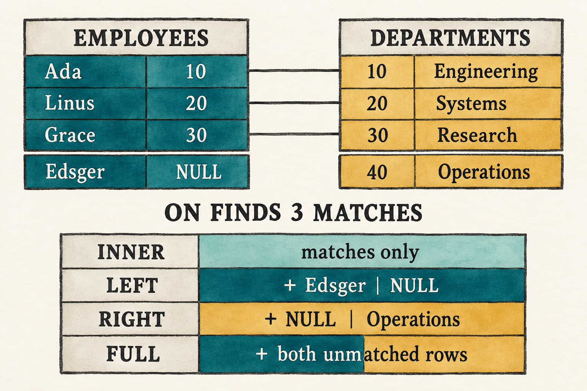
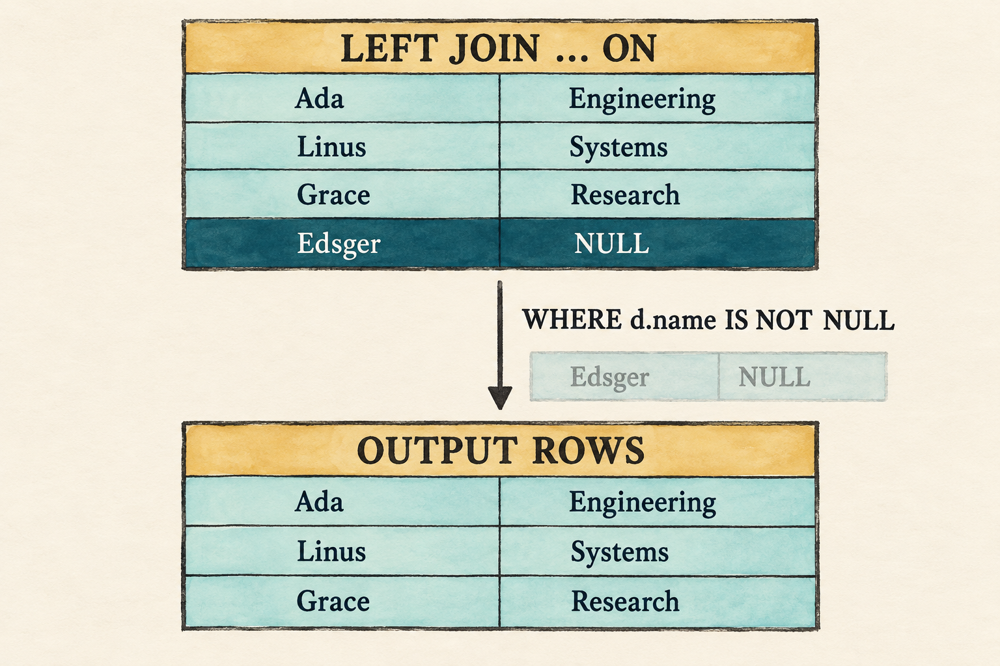

# 8. Outer Joins Preserve Unmatched Rows

<!--
Chapter contract

Continue from Chapter 7's comma-separated inputs and logical Join. Add explicit
INNER, LEFT, RIGHT, and FULL JOIN ... ON syntax. Bind each ON expression in the
scope of its two inputs and make row preservation visible through null-extended
rows. Keep nested loops as the only execution strategy.

Visible outcome

An inner join returns the three matched employee-department pairs. A left join
also retains one employee without a department, a right join retains one
department without an employee, and a full join retains both unmatched rows.
-->

> A join kind decides whether an unmatched row disappears or survives with
> `NULL`s for the absent side.

<figure class="book-illustration">
  
  <figcaption><code>ON</code> finds matching pairs first; the join kind then decides which unmatched rows survive with <code>NULL</code>s for the absent side.</figcaption>
</figure>

Chapter 7 created every possible pair and let `WHERE` discard the pairs that
do not match:

```sql
SELECT e.name AS employee_name, d.name AS department_name
FROM employees AS e, departments AS d
WHERE e.department_id = d.id;
```

That is enough for an inner join. A row without a match simply disappears. It
cannot express a different request: retain the employee even when no department
matches, and fill the missing department fields with `NULL`.

This chapter will make that distinction visible by adding one unmatched row to
each input:

```text
employees                              departments
Ada      department_id 10              10  Engineering
Linus    department_id 20              20  Systems
Grace    department_id 30              30  Research
Edsger   department_id NULL            40  Operations
```

Edsger has not been assigned to a department, while Operations has no
employees. These are valid missing relationships rather than a broken
department reference, and they leave one unmatched row on each side for the
outer joins to preserve.

The representative left join is:

```sql
SELECT e.name AS employee_name, d.name AS department_name
FROM employees AS e
LEFT JOIN departments AS d ON e.department_id = d.id;
```

It returns the three matches plus `{employee_name: "Edsger",
department_name: NULL}`. A right join instead preserves the unmatched
`Operations` department. A full join preserves both.

Supporting that result requires more than new keywords. The parser must attach
an `ON` expression to a particular join. The binder must resolve that
expression after both inputs are visible. The executor must distinguish a pair
that satisfies `ON` from an unmatched row that the join kind promises to keep.

This chapter makes those changes in four steps:

1. Extend the grammar and query AST to represent explicit join clauses and
   their `ON` expressions.
2. Bind each `ON` expression in the scope of the inputs available at that join.
3. Add the join kind and checked condition to the logical `Join` node.
4. Extend the nested loops to emit null-extended rows when the join kind
   preserves an unmatched side.

Before changing the program, begin from the completed Chapter 7 checkpoint:

```bash
git switch --create chapter-008 lesson-007
```

## 8.1 A filter cannot preserve a missing match

For inner joins, these two queries return the same rows:

```sql
SELECT e.name, d.name
FROM employees AS e, departments AS d
WHERE e.department_id = d.id;
```

```sql
SELECT e.name, d.name
FROM employees AS e
INNER JOIN departments AS d ON e.department_id = d.id;
```

Both forms retain only matching pairs. The second form places the matching rule
beside the operation that combines the tables, which becomes essential for an
outer join.

`WHERE` receives rows only after its input plan has produced them. If an
ordinary join has already discarded Edsger because no department matched,
placing a filter above that join cannot bring his row back. A left join must
notice the absence of a match while it is combining the two inputs and emit:

```text
employee values + NULL department values
```

That is **null extension**. It makes the preserved row the same width as an
ordinary joined row, so the existing slot-based expressions can still read it.

The distinction gives `ON` and `WHERE` separate jobs:

- `ON` decides whether a left and right row match.
- the join kind decides which unmatched rows are preserved;
- `WHERE`, when present, filters the rows produced by the join, including
  null-extended rows.

We will preserve that order in the grammar, AST, logical plan, and executor.

## 8.2 Extend the join grammar

### 8.2.1 Describe explicit joins

Chapter 7 treated `FROM` as a comma-separated list of simple table references.
The expanded grammar lets each table reference carry explicit joins.
[Appendix B](appendix-b-sql-grammar.md) places this addition in the larger SQL
grammar:

```text
query            = "SELECT" select_list
                   "FROM" table_reference ("," table_reference)*
                   ("WHERE" expression)? ";" ;

table_reference  = table_primary join_clause* ;
table_primary    = identifier alias? ;

join_clause      = ("INNER"
                   | "LEFT" "OUTER"?
                   | "RIGHT" "OUTER"?
                   | "FULL" "OUTER"?)?
                   "JOIN" table_primary "ON" expression ;
```

`table_primary` is still deliberately small: one catalog table with an
optional alias. Subqueries and parenthesized table expressions remain later
work.

The optional prefix makes bare `JOIN` mean `INNER JOIN`. `OUTER` is optional in
`LEFT OUTER JOIN`, `RIGHT OUTER JOIN`, and `FULL OUTER JOIN`; it does not change
their meaning.

### 8.2.2 Recognize the join words

Every new fixed word needs a token before the parser can recognize the new
productions.

`src/lexer.rs`: add the join tokens after `False`

```rust
Inner,
Left,
Right,
Full,
Outer,
Join,
On,
```

Classify those words alongside the existing SQL keywords.

`src/lexer.rs`: add to `word_token()`

```rust
"INNER" => Token::Inner,
"LEFT" => Token::Left,
"RIGHT" => Token::Right,
"FULL" => Token::Full,
"OUTER" => Token::Outer,
"JOIN" => Token::Join,
"ON" => Token::On,
```

The lexer now distinguishes join syntax from identifiers. The AST must retain
which kind was written, which table appears on the right, and which expression
follows `ON`.

## 8.3 Represent a chain of joins in the AST

The current `TableReference` stores only one table name and alias. It cannot
record that `departments AS d` is the right input of a left join or that the
following expression belongs to its `ON` clause.

Replace the single-table shape with a first input followed by the joins
attached to it.

`src/parser.rs`: replace `TableReference` and add the join types

```rust
#[derive(Debug, PartialEq, Eq)]
pub struct TableReference {
    pub first: TablePrimary,
    pub joins: Vec<JoinClause>,
}

#[derive(Debug, PartialEq, Eq)]
pub struct TablePrimary {
    pub name: String,
    pub alias: Option<String>,
}

#[derive(Debug, PartialEq, Eq)]
pub struct JoinClause {
    pub kind: JoinKind,
    pub right: TablePrimary,
    pub condition: Expr,
}

#[derive(Clone, Copy, Debug, PartialEq, Eq)]
pub enum JoinKind {
    Inner,
    Left,
    Right,
    Full,
}
```

For the representative query, `first` stores `employees AS e`. Its one
`JoinClause` stores `Left`, `departments AS d`, and the unresolved expression
tree for `e.department_id = d.id`.

The outer `Vec<TableReference>` remains useful. A comma between two table
references still requests the Cartesian combination introduced in Chapter 7;
an explicit join inside one table reference carries a join kind and condition.

This representation also permits a chain such as `a JOIN b ON ... JOIN c ON
...`: `first` stores `a`, and `joins` stores the clauses for `b` and `c` in
source order. We can now teach the parser to construct that shape.

## 8.4 Parse table primaries and join clauses

The three new parser methods follow the three productions introduced above. A
table reference may build a left-deep chain:

```sql
FROM employees AS e
LEFT JOIN departments AS d ON e.department_id = d.id
INNER JOIN locations AS l ON d.location_id = l.id
```

This chapter's demonstration uses two tables, but the AST does not need a
special two-table shape.

### 8.4.1 Parse one table reference

```text
table_reference = table_primary join_clause* ;
```

`parse_table_reference()` reads the required first table, then consumes every
join that follows it. Each loop iteration implements the `join_clause*` part
of the grammar.

`src/parser.rs`: replace `parse_table_reference()`

```rust
fn parse_table_reference(&mut self) -> Result<TableReference, ParseError> {
    let first = self.parse_table_primary()?;
    let mut joins = Vec::new();
    while matches!(
        self.peek(),
        Some(Token::Inner | Token::Left | Token::Right
            | Token::Full | Token::Join)
    ) {
        joins.push(self.parse_join_clause()?);
    }
    Ok(TableReference { first, joins })
}
```

### 8.4.2 Parse one table primary

```text
table_primary = identifier alias? ;
```

The `table_primary` production contains the name-and-alias behavior that the
old `parse_table_reference()` handled by itself.

`src/parser.rs`: add after `parse_table_reference()`

```rust
fn parse_table_primary(&mut self) -> Result<TablePrimary, ParseError> {
    Ok(TablePrimary {
        name: self.identifier("expected a table name")?,
        alias: self.parse_alias()?,
    })
}
```

### 8.4.3 Parse one join clause

```text
join_clause = ("INNER"
              | "LEFT" "OUTER"?
              | "RIGHT" "OUTER"?
              | "FULL" "OUTER"?)?
              "JOIN" table_primary "ON" expression ;
```

The join parser treats an omitted kind as `Inner`. For an outer join it also
accepts, but does not require, the noise word `OUTER`. After the right table it
requires `ON` and parses a complete expression tree.

`src/parser.rs`: add after `parse_table_primary()`

```rust
fn parse_join_clause(&mut self) -> Result<JoinClause, ParseError> {
    let kind = if self.consume(&Token::Inner) {
        JoinKind::Inner
    } else if self.consume(&Token::Left) {
        self.consume(&Token::Outer);
        JoinKind::Left
    } else if self.consume(&Token::Right) {
        self.consume(&Token::Outer);
        JoinKind::Right
    } else if self.consume(&Token::Full) {
        self.consume(&Token::Outer);
        JoinKind::Full
    } else {
        JoinKind::Inner
    };
    self.expect(Token::Join, "expected JOIN")?;
    let right = self.parse_table_primary()?;
    self.expect(Token::On, "expected ON after joined table")?;
    let condition = self.parse_expression()?;
    Ok(JoinClause { kind, right, condition })
}
```

### 8.4.4 Inspect the join AST

Changing `TableReference` temporarily makes the Chapter 7 binder stale. As in
the previous frontend checkpoint, isolate the parser before updating the
remaining stages.

The existing parser tests still inspect the old `TableReference` fields.
Remove the `#[cfg(test)] mod tests` block from `parser.rs` before running this
checkpoint. The completed lesson source contains the rewritten tests, but
reproducing them in the build-along would not add to the parsing explanation.

`src/main.rs`: temporarily replace the file

```rust
#[allow(dead_code)]
mod expression;
mod lexer;
mod parser;
#[allow(dead_code)]
mod row;

use parser::parse;

fn main() {
    let sql = "SELECT e.name AS employee_name, \
        d.name AS department_name \
        FROM employees AS e \
        LEFT JOIN departments AS d \
        ON e.department_id = d.id;";
    println!("{:#?}",
        parse(sql).expect("the checkpoint query should parse"));
}
```

Run the checkpoint:

```bash
cargo run --quiet
```

The printed AST makes three facts visible:

- `Left` belongs to the join clause;
- `departments AS d` is its right input;
- `e.department_id = d.id` remains an unresolved `Expr`.

That tree preserves the request. The binder must now decide which names and
types make the request valid.

## 8.5 Put matching and preservation in the logical plan

Chapter 7's logical `Join` meant "combine every left row with every right
row." The new node must also record which pairs match and which unmatched sides
survive.

Import the join kind, then replace the old two-child `Join` variant.

`src/plan.rs`: add with the imports

```rust
use crate::parser::JoinKind;
```

`src/plan.rs`: replace `Plan::Join`

```rust
Join {
    kind: JoinKind,
    condition: Option<BoundExpr>,
    left_columns: Vec<String>,
    right_columns: Vec<String>,
    left: Box<Plan>,
    right: Box<Plan>,
}
```

`condition` is absent only for Chapter 7's comma-separated Cartesian join.
Explicit joins carry their checked `ON` expression. `kind` tells execution
which unmatched sides, if any, it must preserve.

The column-name lists describe the shapes of the two inputs. When one side has
no match, the executor needs those names to construct the correct number of
labelled `NULL` values. It cannot infer that shape from the first row because
an input table may be empty.

The logical plan for the representative query becomes:

```text
Project(employee_name, department_name)
                 |
        Left Join(on: e.department_id = d.id)
               /     \
 Scan(employees)     Scan(departments)
```

There is no `Filter` unless the SQL also contains `WHERE`. The match condition
belongs to `Join` because row preservation depends on it. With this
representation in place, the binder can construct the new node.

## 8.6 Bind `ON` when both inputs are visible

### 8.6.1 Establish the binding order

Chapter 7 built one scope containing every comma-separated input before it
bound projection and `WHERE`. An explicit join needs a more precise moment for
its condition.

For:

```sql
FROM employees AS e
LEFT JOIN departments AS d ON e.department_id = d.id
```

binding proceeds in this order:

```text
add employees AS e to scope
        ↓
add departments AS d to scope
        ↓
bind e.department_id = d.id in that scope
        ↓
construct the checked Join
```

The right input must be visible before binding `ON`, but a table mentioned
later in `FROM` must not be used early by that condition. Building the scope
incrementally keeps that boundary explicit.

As with `WHERE`, the checked condition must produce `Boolean` or `Null`:

```text
error: ON expression must be Boolean
```

`NULL` is accepted as a condition type because SQL three-valued logic treats
it as not matching a pair. Name resolution, ambiguity checks, column slots, and
ordinary operator type checks remain the same as Chapter 7.

After the complete `FROM` input is bound, projection and the optional `WHERE`
expression use the full resulting scope.

### 8.6.2 Maintain the growing scope

The binder first needs the new AST types.

`src/catalog.rs`: replace the parser import

```rust
use crate::parser::{JoinKind, Query, SelectItem, TablePrimary};
```

Each join plan stores the column names expected from its left and right inputs.
`scope_columns()` captures the current left-input shape before another table
is added to the scope.

`src/catalog.rs`: add before `impl Catalog`

```rust
fn scope_columns(scope: &Scope<'_>) -> Vec<String> {
    scope.tables.iter()
        .flat_map(|table| table.columns.iter()
            .map(|column| column.name.clone()))
        .collect()
}
```

These names later let execution construct a correctly shaped null row even
when the corresponding input contains no rows.

The companion function resolves one table against the catalog, rejects a
repeated qualifier, and assigns the table the next available column offset.

`src/catalog.rs`: add after `scope_columns()`

```rust
fn add_table_to_scope<'a>(
    catalog: &'a Catalog,
    table_primary: TablePrimary,
    scope: &mut Scope<'a>,
) -> Result<&'a Table, String> {
    let table = catalog.tables.iter()
        .find(|table| table.name == table_primary.name)
        .ok_or_else(|| format!(
            "unknown table: {}", table_primary.name))?;
    let qualifier = table_primary.alias
        .unwrap_or(table_primary.name);
    if scope.tables.iter()
        .any(|table| table.qualifier == qualifier)
    {
        return Err(format!("duplicate table or alias: {qualifier}"));
    }
    let offset = scope.tables.iter()
        .map(|table| table.columns.len()).sum();
    scope.tables.push(ScopeTable {
        qualifier,
        columns: &table.columns,
        offset,
    });
    Ok(table)
}
```

The returned `Table` supplies the scan rows and right-input schema. The new
`ScopeTable` makes that table available to subsequent expression binding.

### 8.6.3 Build the first input and comma joins

Now change the beginning of `Catalog::bind()`. Destructuring `Query` separates
the input, projection, and optional-filter phases. The outer loop begins each
table reference with its first table.

`src/catalog.rs`: replace the beginning of `Catalog::bind()` through the start
of the old input-table loop

```rust
let Query { projections, tables, filter } = query;
let mut scope = Scope { tables: Vec::new() };
let mut input = None;

for table_reference in tables {
    let left_columns = scope_columns(&scope);
    let table = add_table_to_scope(
        self, table_reference.first, &mut scope)?;
    let right_columns: Vec<String> = table.columns.iter()
        .map(|column| column.name.clone()).collect();
    let scan = Plan::Scan { rows: table.rows.clone() };
    input = Some(match input {
        None => scan,
        Some(left) => Plan::Join {
            kind: JoinKind::Inner,
            condition: None,
            left_columns,
            right_columns,
            left: Box::new(left),
            right: Box::new(scan),
        },
    });
```

The first table becomes the first scan. A later comma-separated table becomes
an unconditional inner `Join`: `condition: None` tells execution that every
candidate pair matches.

### 8.6.4 Bind each explicit join

Still inside the outer loop, process each explicit join after its left input
exists. Capture the left shape first, add the right table, and only then bind
the `ON` expression in the enlarged scope.

`src/catalog.rs`: continue the table-reference loop

```rust
    for join in table_reference.joins {
        let left_columns = scope_columns(&scope);
        let table = add_table_to_scope(
            self, join.right, &mut scope)?;
        let right_columns = table.columns.iter()
            .map(|column| column.name.clone()).collect();
        let (condition, condition_type) =
            bind_expression(join.condition, &scope)?;
        if !matches!(condition_type,
            DataType::Boolean | DataType::Null)
        {
            return Err("ON expression must be Boolean".to_string());
        }
        input = Some(Plan::Join {
            kind: join.kind,
            condition: Some(condition),
            left_columns,
            right_columns,
            left: Box::new(input
                .expect("a join always has a left input")),
            right: Box::new(Plan::Scan {
                rows: table.rows.clone(),
            }),
        });
    }
}
```

An explicit join stores `Some(condition)`. Because later tables have not yet
entered the scope, an earlier `ON` expression cannot refer to them.

### 8.6.5 Finish projection and filter binding

The remainder of binding uses the renamed local fields. Iterate over
`projections` instead of `query.projections`, and match on `filter` instead of
`query.filter`. Replace the old code that assembled `input_tables` with:

```rust
let mut input = input
    .ok_or_else(|| "query requires at least one input table".to_string())?;
```

Projection and `WHERE` now see the completed scope, while each `ON` expression
saw exactly the inputs available at its join. The binder has produced a plan
whose join conditions are checked at the correct point.

## 8.7 Construct a null-extended row

`Row::combine()` already establishes the slot order: all left values followed
by all right values. Add a constructor that creates one `NULL` value for each
column name supplied by the plan.

`src/row.rs`: add to the second `impl Row`

```rust
pub fn nulls(columns: &[String]) -> Row {
    Row {
        values: columns.iter()
            .map(|column| (column.clone(), Value::Null))
            .collect(),
    }
}
```

For the departments input, that constructor produces:

```text
null row for departments
[(id, NULL), (name, NULL)]
```

Combining Edsger's employee row with that null row preserves the six-slot
layout predicted by binding:

```text
[4, Edsger, 65000, NULL] + [NULL, NULL]
```

`d.name` still reads the department-name slot. The value at that slot is now
`NULL` rather than missing, so projection and later expressions need no special
outer-join lookup rule.

The same mechanism creates null employee values when a right or full join
preserves the unmatched `Operations` department.

## 8.8 Execute `INNER JOIN` with the existing loops

The existing nested loops already visit every left-right pair. Inner-join
execution adds one decision inside those loops:

```text
combine left and right rows
        ↓
evaluate ON against the combined row
        ↓
TRUE: emit the row
FALSE or NULL: discard it
```

The three matching employee-department pairs survive. Edsger and Operations do
not appear because neither has a match.

This produces the same rows as Chapter 7's comma-plus-`WHERE` query. That
equivalence is useful, but it is limited to inner joins. Moving an outer join's
`ON` condition into `WHERE` changes which unmatched rows survive.

## 8.9 Preserve the left or right side

A left join remembers whether each left row matched at least one right row.
After the inner loop finishes:

- if a match occurred, the matching combined rows have already been emitted;
- if no match occurred, emit the left row combined with a null right row.

For the representative query, Edsger reaches the second branch.

A right join needs the mirror image, but the loop order need not change. Keep a
Boolean entry for each materialized right row. Whenever a pair matches, mark
that right position. After all left rows have been examined, emit a null left
row combined with each right row that was never marked.

The output remains deterministic:

1. matching pairs appear in left-row then right-row order;
2. unmatched right rows follow in right-input order.

The chapter keeps this straightforward materialized algorithm. It does not yet
choose another physical strategy.

## 8.10 Assemble all four join kinds

### 8.10.1 Compare their preservation rules

A full join combines the two preservation rules. It emits unmatched left rows
during the outer loop and remembers right-side matches for a final pass.

For the sample data, the result contains five rows:

```text
Ada      Engineering
Linus    Systems
Grace    Research
Edsger   NULL
NULL     Operations
```

This checkpoint should make the join kinds comparable:

| Join kind | Matched rows | Unmatched employees | Unmatched departments |
| --- | --- | --- | --- |
| `INNER` | keep | discard | discard |
| `LEFT` | keep | keep | discard |
| `RIGHT` | keep | discard | keep |
| `FULL` | keep | keep | keep |

The table describes row preservation, not a physical algorithm. All four forms
still use the same visible nested loops.

### 8.10.2 Prepare the inputs and match tracking

Replace the old `Plan::Join` execution arm in consecutive pieces. Begin by
executing both children and allocating the output. One Boolean per right row
records whether any left row has matched that position.

`src/plan.rs`: begin the new `Plan::Join` execution arm

```rust
Plan::Join {
    kind,
    condition,
    left_columns,
    right_columns,
    left,
    right,
} => {
    let left_rows = left.execute()?;
    let right_rows = right.execute()?;
    let mut output = Vec::new();
    let mut matched_right = vec![false; right_rows.len()];
```

The vector uses right-row positions rather than row values, so duplicate right
rows are tracked independently.

### 8.10.3 Match candidate pairs

The familiar nested loops combine each candidate pair before evaluating `ON`.
`TRUE` emits the pair and marks both sides as matched. `FALSE` and `NULL` both
mean that this candidate did not match. `None` belongs to a comma join, where
every candidate pair matches.

`src/plan.rs`: continue the `Plan::Join` arm

```rust
    for left_row in &left_rows {
        let mut matched_left = false;
        for (right_index, right_row) in
            right_rows.iter().enumerate()
        {
            let row = left_row.combine(right_row);
            let matches = match condition {
                Some(condition) => match condition.evaluate(&row)? {
                    Value::Boolean(value) => value,
                    Value::Null => false,
                    _ => return Err(
                        "ON expression did not produce a Boolean".into()),
                },
                None => true,
            };
            if matches {
                matched_left = true;
                matched_right[right_index] = true;
                output.push(row);
            }
        }
```

Binding has already required `ON` to produce `Boolean` or `Null`. The final
error arm protects that invariant at execution rather than silently accepting
an invalid plan assembled directly in Rust.

### 8.10.4 Preserve unmatched left rows

Only after one left row has tried every right row can `matched_left == false`
prove that it had no match. A left or full join then combines that row with a
null row shaped like the right input.

`src/plan.rs`: continue the outer loop

```rust
        if !matched_left
            && matches!(kind, JoinKind::Left | JoinKind::Full)
        {
            output.push(left_row.combine(&Row::nulls(right_columns)));
        }
    }
```

An empty right input naturally reaches this branch for every left row because
the inner loop never sets `matched_left`.

### 8.10.5 Preserve unmatched right rows

Right-side preservation must wait until every candidate pair has been tested.
Only then does a `false` entry in `matched_right` prove that no left row matched
that particular right row.

`src/plan.rs`: finish the `Plan::Join` arm

```rust
    if matches!(kind, JoinKind::Right | JoinKind::Full) {
        let null_left = Row::nulls(left_columns);
        for (matched, right_row) in
            matched_right.iter().zip(&right_rows)
        {
            if !matched {
                output.push(null_left.combine(right_row));
            }
        }
    }

    Ok(output)
}
```

The two column-name vectors let either preservation branch construct the
correct null row even when the opposite input is empty. Together, these five
pieces form the complete replacement arm.

## 8.11 Apply `WHERE` after row preservation

Add a filter to the representative left join:

```sql
SELECT e.name AS employee_name, d.name AS department_name
FROM employees AS e
LEFT JOIN departments AS d ON e.department_id = d.id
WHERE d.name IS NOT NULL;
```

<figure class="book-illustration book-diagram">
  
  <figcaption><code>ON</code> determines matching and preservation before <code>WHERE</code> filters the joined rows.</figcaption>
</figure>

The left join creates Edsger's null-extended row before `Filter` evaluates
`d.name IS NOT NULL` and removes it. The final result therefore looks like an
inner join, but the plan reached it through different semantics:

```text
Project
   |
Filter(d.name IS NOT NULL)
   |
Left Join(on: e.department_id = d.id)
```

This ordering explains why an outer-join rewrite requires more care than the
inner-join equivalence shown earlier. Moving conditions between `ON` and
`WHERE` can change the result.

## 8.12 Reconnect the application

### 8.12.1 Restore the application and extend its data

The AST checkpoint replaced the application. Restore the Chapter 7 version
before applying the final catalog and demonstration changes:

```bash
git restore --source lesson-007 -- src/main.rs
```

Update the row helper so an employee can be unassigned. A present identifier
becomes an integer value; `None` becomes SQL `NULL`.

`src/main.rs`: replace `employee()`

```rust
fn employee(id: i64, name: &str, salary: i64,
    department_id: Option<i64>) -> Row
{
    Row::new(vec![
        ("id", Value::Integer(id)),
        ("name", Value::Text(name.into())),
        ("salary", Value::Integer(salary)),
        ("department_id",
            department_id.map_or(Value::Null, Value::Integer)),
    ])
}
```

Change the existing employee calls to pass `Some(10)`, `Some(20)`, and
`Some(30)`, then add the unmatched rows to their respective catalog tables.

`src/main.rs`: replace the employee rows

```rust
rows: vec![
    employee(1, "Ada", 70_000, Some(10)),
    employee(2, "Linus", 50_000, Some(20)),
    employee(3, "Grace", 72_000, Some(30)),
    employee(4, "Edsger", 65_000, None),
],
```

`src/main.rs`: replace the department rows

```rust
rows: vec![
    department(10, "Engineering"),
    department(20, "Systems"),
    department(30, "Research"),
    department(40, "Operations"),
],
```

### 8.12.2 Run the representative left join

Finally, make the fixed demonstration run the representative left join. The
prompt already routes every statement through the same parse-bind-execute
path, so it needs no separate join-specific change.

`src/main.rs`: replace `run_demo()`

```rust
fn run_demo(catalog: &Catalog) {
    let sql = "SELECT e.name AS employee_name, \
        d.name AS department_name \
        FROM employees AS e \
        LEFT JOIN departments AS d \
        ON e.department_id = d.id;";
    let rows = execute_sql(sql, catalog)
        .expect("the lesson query should execute");
    println!("Employees and their departments:");
    for row in rows {
        println!("{row}");
    }
}
```

### 8.12.3 Check the connected path

The visible demonstration should print:

```bash
cargo fmt
cargo run --quiet
```

```text
Employees and their departments:
{employee_name: "Ada", department_name: "Engineering"}
{employee_name: "Linus", department_name: "Systems"}
{employee_name: "Grace", department_name: "Research"}
{employee_name: "Edsger", department_name: NULL}
```

Binding failures remain ordinary query errors. An unknown name in `ON`, an
ambiguous unqualified column, or a non-Boolean condition must fail before any
rows are scanned.

Run the prompt to compare the other forms:

```bash
cargo run --quiet -- --prompt
```

The completed `lesson-008` checkpoint contains parser, binding,
null-extension, row-preservation, empty-input, and end-to-end tests. Their
source remains in the Rust files rather than the build-along narration.

## 8.13 What we deliberately did not build

- Nested loops remain the only join execution strategy.
- The logical and physical plan representations are still combined.
- There is no hash join, merge join, join reordering, or cost-based choice.
- `NATURAL JOIN`, `USING`, lateral inputs, and semi/anti joins are absent.
- A table primary is still a catalog table, not a subquery or parenthesized
  table expression.
- Conditions are not pushed below joins.

These limits keep the chapter focused on one semantic distinction: matching a
pair and preserving an unmatched row are separate decisions.

## 8.14 Try it

Run the prompt and predict each result before executing it:

1. Replace `LEFT JOIN` with `INNER JOIN`.
2. Replace it with bare `JOIN`.
3. Use `RIGHT JOIN` and identify the null-extended row.
4. Use `FULL OUTER JOIN` and predict the complete row order.
5. Change `ON e.department_id = d.id` to `ON FALSE` for each join kind.
6. Restore the left join and add `WHERE d.name IS NOT NULL`.
7. Use `ON e.department_id + d.name` and predict which stage rejects it.

<details>
<summary>Check your reasoning</summary>

1. Only Ada, Linus, and Grace remain because an inner join discards both
   unmatched sides.
2. Bare `JOIN` has the same meaning as `INNER JOIN`.
3. The result includes `{employee_name: NULL, department_name: "Operations"}`.
4. The three matches appear first, followed by Edsger with `NULL`, then `NULL`
   with Operations.
5. `INNER` emits no rows, `LEFT` preserves every employee, `RIGHT` preserves
   every department, and `FULL` preserves every row from both inputs.
6. The join creates Edsger's null-extended row, then `WHERE` removes it.
7. Binding rejects the expression because arithmetic requires integers before
   it checks whether the complete `ON` result is Boolean.

</details>

## 8.15 Many rows can become one answer

The database can now express whether unmatched rows disappear or survive. Its
logical plan records the join kind and match condition, while one deliberately
simple nested-loop implementation executes all four forms.

The result is still one row per surviving pair. Questions such as “How many
employees belong to each department?” require a different operation: several
input rows must contribute to one output value. The next chapter introduces
aggregate functions, `GROUP BY`, and `HAVING` to make that many-to-one flow
visible.
