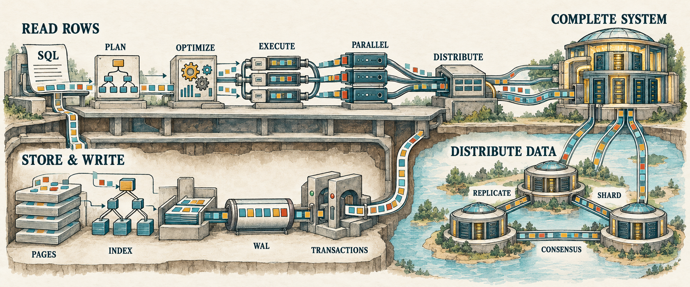

# Database: Zero to Distributed

Build a database from its first in-memory row to durable, distributed state.
Each chapter begins with a limitation in the current implementation, adds the
smallest concept needed to overcome it, and leaves behind a runnable checkpoint.

<figure class="book-illustration">
  
  <figcaption>The series follows the same rows through query processing, durable storage, distributed correctness, and one complete system.</figcaption>
</figure>

Start with [The Smallest Query Engine](001-smallest-query-engine.md), then
follow the chapters in order. Every completed chapter corresponds to a
verified `lesson-NNN` repository tag.

## Volume I: Read Rows

The first volume follows a query from SQL text to rows, then makes that work
faster and spreads it across threads and machines. Five seasons form one
continuous implementation.

### Season 1: Build the Smallest Query Engine

Begin with `Scan -> Filter -> Project`. Add SQL parsing, expression trees,
binding, richer projections, joins, aggregation, sorting, and subqueries until
the database can answer substantial read-only queries.

1. [The Smallest Query Engine](001-smallest-query-engine.md)
2. [Relational Algebra Without the Math](002-relational-algebra-without-the-math.md)
3. [SQL Is Just a Frontend](003-sql-is-just-a-frontend.md)
4. [Expressions Are Trees](004-expressions-are-trees.md)
5. [Binding Gives Names Meaning](005-binding-gives-names-meaning.md)
6. [Multiple Outputs](006-multiple-outputs.md)
7. [The First Join](007-the-first-join.md)
8. [Join Syntax and Row Preservation](008-join-syntax-and-row-preservation.md)

### Season 2: See How Query Engines Execute

Measure the cost of materializing every intermediate result, replace it with
iterator-based execution, and separate the logical request from the physical
algorithm that performs it.

### Season 3: Make Plans Better

Introduce meaning-preserving rewrites, statistics, costs, and join ordering.
The database will be able to explain why it chose one plan over another.

### Season 4: Use More Than One Core

Partition tables, turn plans into task graphs, and schedule parallel work while
keeping row movement and ordering visible.

### Season 5: Execute Across Machines

Move from local workers to processes and networked workers. Build exchange,
shuffle, distributed joins and aggregation, then confront failures, skew,
finite memory, and spill.

## Later volumes

- **Store and Write Rows Correctly** builds pages, heap files, indexes,
  write-ahead logging, recovery, concurrency control, and transactions.
- **Distribute Data and Correctness** adds replication, sharding, consensus,
  and cross-shard transactions.
- **Complete the Language and Bring Everything Together** expands SQL,
  integrates the full system, benchmarks it, and tests its failure behavior.

Future chapters receive links only when their implementation and manuscript
begin. The complete curriculum lives in
[`Roadmap.md`](https://github.com/shashankkhasare/database-zero-to-distributed/blob/master/Roadmap.md),
and current progress lives in
[`TODO.md`](https://github.com/shashankkhasare/database-zero-to-distributed/blob/master/TODO.md).

## Appendices

- [Appendix A: Enough Rust to Build a Database](appendix-a-enough-rust.md)
- [Appendix B: The SQL Grammar We Support](appendix-b-sql-grammar.md)
- [Appendix C: Values, Types, and Operators](appendix-c-values-types-operators.md)
